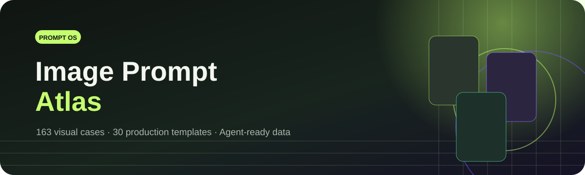

<p align="center">
  
</p>

<h3 align="center">把提示词做成可检索、可复用、可验证的视觉生产资产</h3>

<p align="center">
  <a href="https://github.com/hongforge/image-prompt-atlas/actions/workflows/ci.yml"></a>
  <a href="https://github.com/hongforge/image-prompt-atlas/stargazers"></a>
  <a href="LICENSE"></a>
  <a href="docs/gallery.md"></a>
  <a href="docs/templates.md"></a>
</p>

<p align="center">
  <strong>简体中文</strong> · <a href="README.en.md">English</a>
</p>

## 🌐 在线视觉画廊

访问 **[hongforge.github.io/image-prompt-atlas](https://hongforge.github.io/image-prompt-atlas/)**，可按分类、模型、工作流和关键词浏览案例；点击任意卡片即可查看大图、完整变量、封面对应值与生产级提示词。

<p align="center">
  <a href="https://hongforge.github.io/image-prompt-atlas/"></a>
  <a href="https://hongforge.github.io/image-prompt-atlas/"></a>
  <a href="https://hongforge.github.io/image-prompt-atlas/"></a>
</p>

## 📖 快速入口

| 入口 | 内容 | 适合谁 |
| --- | --- | --- |
| [完整案例画廊](docs/gallery.md) | 163 张效果图、案例说明与提示词入口 | 创作者、设计师 |
| [工业提示词模板](docs/templates.md) | 30 套必填字段、输出契约、质量门槛与避坑检查 | 生产团队、Agent |
| [在线浏览站点](https://hongforge.github.io/image-prompt-atlas/) | 搜索、筛选、卡片预览、提示词复制 | 所有使用者 |
| [Agent 可用 JSON](data/prompt-library.json) | 案例、模板、变量、分类与限制的统一数据 | Agent、自动化程序 |
| [Image Prompt Atlas Skill](skills/image-prompt-atlas/SKILL.md) | 检索案例并组合工业模板 | Codex、Claude Code、Cursor |
| [Img2Prompt Skill](skills/img2prompt/SKILL.md) | 将参考图拆解为模型无关的视觉规格 | 提示词工程师 |

## ⚡ 项目方法

本项目不是提示词堆积，而是一套面向真实制作流程的 **Prompt-as-Data 系统**：

```text
案例方向 + 封面对应值 + 可替换变量 + 工业模板 + 质量门槛 + Agent 数据
```

- **案例库**负责回答“想做成什么样”，每个案例都有独立效果图、分类、变量和限制。
- **工业模板**负责回答“如何稳定交付”，把需求拆成必填字段、成品结构、验收项和禁止项。
- **统一数据层**负责让网站、Markdown 画廊和 Agent Skill 使用同一份生成数据，避免多处手工维护。
- **原创优先**，案例、提示词、预览图与说明均为本项目内容，不混入外部项目文案或素材。

## 🗂️ 分类预览

<table>
  <tr>
    <td width="33%" align="center" valign="top"><a href="docs/gallery.md#ui-interface"></a><br><strong>🧩 UI 与界面</strong><br><sub>12 个主分类案例</sub></td>
    <td width="33%" align="center" valign="top"><a href="docs/gallery.md#product-commerce"></a><br><strong>🛍️ 商品与电商视觉</strong><br><sub>11 个主分类案例</sub></td>
    <td width="33%" align="center" valign="top"><a href="docs/gallery.md#architecture-space"></a><br><strong>🏛️ 建筑与空间</strong><br><sub>4 个主分类案例</sub></td>
  </tr>
  <tr>
    <td width="33%" align="center" valign="top"><a href="docs/gallery.md#aigc-creation"></a><br><strong>⚡ AICG 游戏与动漫</strong><br><sub>9 个主分类案例</sub></td>
    <td width="33%" align="center" valign="top"><a href="docs/gallery.md#comic-drama"></a><br><strong>🎞️ 漫剧关键帧</strong><br><sub>5 个主分类案例</sub></td>
    <td width="33%" align="center" valign="top"><a href="docs/gallery.md#portrait-character"></a><br><strong>🧍 人像与角色</strong><br><sub>19 个主分类案例</sub></td>
  </tr>
</table>

### 新增分类

<table>
  <tr>
    <td width="25%" align="center" valign="top"><a href="docs/gallery.md#film-storyboard"></a><br><strong>🎥 影视分镜与镜头</strong><br><sub>10 个案例</sub></td>
    <td width="25%" align="center" valign="top"><a href="docs/gallery.md#game-asset"></a><br><strong>🎮 游戏资产与道具</strong><br><sub>10 个案例</sub></td>
    <td width="25%" align="center" valign="top"><a href="docs/gallery.md#social-content"></a><br><strong>📱 社交媒体内容</strong><br><sub>10 个案例</sub></td>
    <td width="25%" align="center" valign="top"><a href="docs/gallery.md#surface-pattern"></a><br><strong>🧵 纹样与材质设计</strong><br><sub>10 个案例</sub></td>
  </tr>
</table>

| 分类 | 案例数 | 分类 | 案例数 |
| --- | ---: | --- | ---: |
| [UI 与界面](docs/gallery.md#ui-interface) | 12 | [图表与信息可视化](docs/gallery.md#infographic) | 10 |
| [海报与编辑设计](docs/gallery.md#poster-editorial) | 14 | [商品与电商视觉](docs/gallery.md#product-commerce) | 11 |
| [品牌与视觉识别](docs/gallery.md#brand-identity) | 3 | [建筑与空间](docs/gallery.md#architecture-space) | 4 |
| [人像与角色](docs/gallery.md#portrait-character) | 19 | [头像与表情](docs/gallery.md#avatar-expression) | 5 |
| [AICG 游戏与动漫](docs/gallery.md#aigc-creation) | 9 | [漫剧关键帧](docs/gallery.md#comic-drama) | 5 |
| [场景与叙事](docs/gallery.md#scene-storytelling) | 8 | [插画与艺术实验](docs/gallery.md#illustration-art) | 5 |
| [文档与出版](docs/gallery.md#document-publishing) | 8 | [教育与知识视觉](docs/gallery.md#educational-visual) | 10 |
| [影视分镜与镜头](docs/gallery.md#film-storyboard) | 10 | [游戏资产与道具](docs/gallery.md#game-asset) | 10 |
| [社交媒体内容](docs/gallery.md#social-content) | 10 | [纹样与材质设计](docs/gallery.md#surface-pattern) | 10 |

## 🧩 工业模板

模板不是“风格 + 高级感 + 8K”的关键词拼接。每套模板都包含：

```text
角色定义 → 必填需求字段 → 需求解析协议 → 输出契约 → 制作结构 → 质量门槛 → 常见失败
```

| 模板方向 | 示例能力 |
| --- | --- |
| [设计与信息](docs/templates.md#templates-ui-interface) | UI 任务流、数据工作台、决策图、字体海报 |
| [商业与品牌](docs/templates.md#templates-product-commerce) | 商品对比、包装、品牌规范、活动视觉 |
| [人物与叙事](docs/templates.md#templates-portrait-character) | 人物特写、角色系统、分镜与系列一致性 |
| [空间与编辑](docs/templates.md#templates-architecture-space) | 材质动线、空间提案、局部重绘与合成 |

## 🤖 Agent 可用

```text
library/cases + library/templates
  ├─ data/prompt-library.json       # Agent 与自动化
  ├─ site/src/catalog.generated.ts  # 在线画廊
  ├─ docs/gallery*.md               # GitHub 案例画廊
  └─ docs/templates*.md             # GitHub 模板手册
```

Agent 可以按五维分类检索：成品类型、视觉媒介、生成工作流、能力重点和兼容模型。推荐流程是先选案例，再选择兼容模板，最后用需求值替换变量。

当前模型维度覆盖 GPT Image、Nano Banana、Midjourney 与 Stable Diffusion，同时保留通用模型提示词。

## 🚀 本地运行

```bash
npm install
npm run dev
```

打开 `http://127.0.0.1:5173`。修改案例或模板后运行 `npm run generate:catalog`，会同步更新网站数据、Agent JSON 与中英文 GitHub 文档。

## 🤝 参与贡献

提交前请阅读 [贡献指南](CONTRIBUTING.md)、[行为准则](CODE_OF_CONDUCT.md)、[治理规则](GOVERNANCE.md)和[安全策略](SECURITY.md)。新增案例必须使用原创提示词与原创或项目生成的预览图，并通过：

```bash
npm test
npm run build
```

## 许可证

项目代码与文档采用 [MIT License](LICENSE)。
