<!-- Generated by scripts/generate-docs.ts. Do not edit manually. -->

# Case Gallery

[Project home](../README.en.md) · [中文](gallery.md) · [Industrial templates](templates.en.md) · [Live gallery](https://hongforge.github.io/image-prompt-atlas/)

Browse 163 original cases. Covers communicate the visual direction; each case file contains complete variables, cover-specific values, a production prompt, and limitations.

## Category navigation

- [🧩 UI & Interfaces (12)](#ui-interface)
- [📊 Charts & Infographics (10)](#infographic)
- [📰 Posters & Editorial (14)](#poster-editorial)
- [🛍️ Products & Commerce (11)](#product-commerce)
- [🏷️ Brand & Identity (3)](#brand-identity)
- [🏛️ Architecture & Spaces (4)](#architecture-space)
- [🧍 Portraits & Characters (19)](#portrait-character)
- [😀 Avatars & Expressions (5)](#avatar-expression)
- [⚡ AIGC Games & Anime (9)](#aigc-creation)
- [🎞️ Comic Drama Keyframes (5)](#comic-drama)
- [🎥 Film Storyboards & Shots (10)](#film-storyboard)
- [🎮 Game Assets & Props (10)](#game-asset)
- [📱 Social Media Content (10)](#social-content)
- [🧵 Patterns & Surface Design (10)](#surface-pattern)
- [🎬 Scenes & Storytelling (8)](#scene-storytelling)
- [🎨 Illustration & Art (5)](#illustration-art)
- [📚 Documents & Publishing (8)](#document-publishing)
- [🧠 Education & Knowledge Visuals (10)](#educational-visual)

---

## 🧩 UI & Interfaces

> 12 cases. Select a cover to open its prompt file.

<table>
<tr>
<td width="33%" valign="top" align="center">
 
<strong>AI SaaS Landing Page</strong> 
Design a high-converting SaaS landing page for {{product_name}}. 
universal · gpt-image · text-to-image 
<a href="../library/cases/ui/ai-saas-landing-page/prompt.md">Open prompt and variables</a>
</td>
<td width="33%" valign="top" align="center">
 
<strong>Focus Mobile App</strong> 
Create a calm mobile app home screen for {{app_name}}, centered on a single daily focus session and the goal {{daily_goal}}. 
universal · gpt-image · text-to-image 
<a href="../library/cases/ui/focus-mobile-app/prompt.md">Open prompt and variables</a>
</td>
<td width="33%" valign="top" align="center">
 
<strong>Personal Finance Overview</strong> 
Design a personal finance overview for {{financial_goal}} over {{time_horizon}}. 
universal · gpt-image · text-to-image 
<a href="../library/cases/finance/personal-finance-overview/prompt.md">Open prompt and variables</a>
</td>
</tr>
<tr>
<td width="33%" valign="top" align="center">
 
<strong>Course Learning Portal</strong> 
Create an online learning portal for {{learner_name}} enrolled in {{course_title}}. 
universal · gpt-image · text-to-image 
<a href="../library/cases/ui/course-learning-portal/prompt.md">Open prompt and variables</a>
</td>
<td width="33%" valign="top" align="center">
 
<strong>Market Trend Report</strong> 
Create a market trend report cover and data visual system for {{market_sector}} about {{trend_theme}}. 
universal · gpt-image · text-to-image 
<a href="../library/cases/finance/market-trend-report/prompt.md">Open prompt and variables</a>
</td>
<td width="33%" valign="top" align="center">
 
<strong>Developer Ops Console</strong> 
Design an operations console for {{service_name}} in the {{environment}} environment. 
universal · gpt-image · text-to-image 
<a href="../library/cases/ui/developer-ops-console/prompt.md">Open prompt and variables</a>
</td>
</tr>
<tr>
<td width="33%" valign="top" align="center">
 
<strong>Real Estate Listing Hero</strong> 
Create a premium real-estate listing hero for a {{property_type}} with a {{location_mood}} atmosphere. 
universal · gpt-image · text-to-image 
<a href="../library/cases/finance/real-estate-listing-hero/prompt.md">Open prompt and variables</a>
</td>
<td width="33%" valign="top" align="center">
 
<strong>Investment Portfolio Story</strong> 
Create an investment portfolio story visual for {{portfolio_style}} pursuing {{investment_goal}}. 
universal · gpt-image · text-to-image 
<a href="../library/cases/finance/investment-portfolio-story/prompt.md">Open prompt and variables</a>
</td>
<td width="33%" valign="top" align="center">
 
<strong>Travel Booking Flow</strong> 
Design a travel booking interface for {{destination}} tailored to {{travel_style}} travelers. 
universal · gpt-image · text-to-image 
<a href="../library/cases/ui/travel-booking-flow/prompt.md">Open prompt and variables</a>
</td>
</tr>
<tr>
<td width="33%" valign="top" align="center">
 
<strong>Ecommerce Product Detail Page</strong> 
Create a premium e-commerce product detail page for a {{product_type}} by {{brand_name}}. 
universal · gpt-image · text-to-image 
<a href="../library/cases/ui/ecommerce-product-detail-page/prompt.md">Open prompt and variables</a>
</td>
<td width="33%" valign="top" align="center">
 
<strong>Mortgage Comparison Tool</strong> 
Design a mortgage comparison tool for {{loan_type}} focused on {{decision_focus}}. 
universal · gpt-image · text-to-image 
<a href="../library/cases/finance/mortgage-comparison-tool/prompt.md">Open prompt and variables</a>
</td>
<td width="33%" valign="top" align="center">
 
<strong>Fintech Analytics Dashboard</strong> 
Design a polished dark-mode analytics dashboard for {{product_name}}. 
universal · gpt-image · text-to-image 
<a href="../library/cases/ui/fintech-analytics-dashboard/prompt.md">Open prompt and variables</a>
</td>
</tr>
</table>

[Back to category navigation](#category-navigation)

---

## 📊 Charts & Infographics

> 10 cases. Select a cover to open its prompt file.

<table>
<tr>
<td width="33%" valign="top" align="center">
 
<strong>Product Roadmap Timeline</strong> 
Create a horizontal product roadmap for {{product_name}} in {{planning_year}}. 
universal · gpt-image · text-to-image 
<a href="../library/cases/data/product-roadmap-timeline/prompt.md">Open prompt and variables</a>
</td>
<td width="33%" valign="top" align="center">
 
<strong>Supply Chain Map</strong> 
Create a supply-chain process map for {{industry}} focused on {{delivery_goal}}. 
universal · gpt-image · text-to-image 
<a href="../library/cases/visuals/supply-chain-map/prompt.md">Open prompt and variables</a>
</td>
<td width="33%" valign="top" align="center">
 
<strong>Decision Tree Diagram</strong> 
Create a decision-tree diagram for {{decision_topic}} based on {{key_criteria}}. 
universal · gpt-image · text-to-image 
<a href="../library/cases/visuals/decision-tree-diagram/prompt.md">Open prompt and variables</a>
</td>
</tr>
<tr>
<td width="33%" valign="top" align="center">
 
<strong>City Guide Map</strong> 
Create an illustrated city guide map for {{city_theme}} focused on {{travel_interest}}. 
universal · gpt-image · text-to-image 
<a href="../library/cases/visuals/city-guide-map/prompt.md">Open prompt and variables</a>
</td>
<td width="33%" valign="top" align="center">
 
<strong>Circular Economy Explainer</strong> 
Design a vertical editorial infographic titled {{topic}}. 
universal · gpt-image · text-to-image 
<a href="../library/cases/design/circular-economy-explainer/prompt.md">Open prompt and variables</a>
</td>
<td width="33%" valign="top" align="center">
 
<strong>Travel Itinerary Board</strong> 
Design a travel itinerary board for a {{destination_style}} trip lasting {{trip_length}}. 
universal · gpt-image · text-to-image 
<a href="../library/cases/visuals/travel-itinerary-board/prompt.md">Open prompt and variables</a>
</td>
</tr>
<tr>
<td width="33%" valign="top" align="center">
 
<strong>Climate Heat Map</strong> 
Create an editorial climate heat map for {{region}} during {{time_period}}. 
universal · gpt-image · text-to-image 
<a href="../library/cases/data/climate-heat-map/prompt.md">Open prompt and variables</a>
</td>
<td width="33%" valign="top" align="center">
 
<strong>Customer Journey Map</strong> 
Design a customer journey map for {{service_type}} helping users achieve {{user_goal}}. 
universal · gpt-image · text-to-image 
<a href="../library/cases/visuals/customer-journey-map/prompt.md">Open prompt and variables</a>
</td>
<td width="33%" valign="top" align="center">
 
<strong>Science Process Poster</strong> 
Design a vertical educational poster explaining {{phenomenon}} through {{key_stages}}. 
universal · gpt-image · text-to-image 
<a href="../library/cases/data/science-process-poster/prompt.md">Open prompt and variables</a>
</td>
</tr>
<tr>
<td width="33%" valign="top" align="center">
 
<strong>System Architecture Explainer</strong> 
Design a clean system architecture explainer for {{system_name}}. 
universal · gpt-image · text-to-image 
<a href="../library/cases/data/system-architecture-explainer/prompt.md">Open prompt and variables</a>
</td>
<td width="33%"></td>
<td width="33%"></td>
</tr>
</table>

[Back to category navigation](#category-navigation)

---

## 📰 Posters & Editorial

> 14 cases. Select a cover to open its prompt file.

<table>
<tr>
<td width="33%" valign="top" align="center">
 
<strong>Creator Media Kit</strong> 
Design a media-kit one-pager for a {{creator_niche}} creator focused on {{audience_focus}}. 
universal · gpt-image · text-to-image 
<a href="../library/cases/social/creator-media-kit/prompt.md">Open prompt and variables</a>
</td>
<td width="33%" valign="top" align="center">
 
<strong>Podcast Cover Art</strong> 
Create square podcast cover art for {{podcast_topic}} with a {{mood}} mood. 
universal · gpt-image · text-to-image 
<a href="../library/cases/social/podcast-cover-art/prompt.md">Open prompt and variables</a>
</td>
<td width="33%" valign="top" align="center">
 
<strong>Literary Book Cover</strong> 
Design a literary book cover for {{book_title}} using {{central_metaphor}} as the central visual idea. 
universal · gpt-image · midjourney · text-to-image 
<a href="../library/cases/posters/literary-book-cover/prompt.md">Open prompt and variables</a>
</td>
</tr>
<tr>
<td width="33%" valign="top" align="center">
 
<strong>Fashion Lookbook Cover</strong> 
Create a fashion lookbook cover for {{season_theme}} with {{styling_direction}}. 
universal · gpt-image · midjourney · text-to-image 
<a href="../library/cases/fashion/fashion-lookbook-cover/prompt.md">Open prompt and variables</a>
</td>
<td width="33%" valign="top" align="center">
 
<strong>Fashion Editorial Collage</strong> 
Create a fashion editorial collage inspired by {{style_era}} with {{color_story}}. 
universal · gpt-image · midjourney · text-to-image 
<a href="../library/cases/fashion/fashion-editorial-collage/prompt.md">Open prompt and variables</a>
</td>
<td width="33%" valign="top" align="center">
 
<strong>Live Stream Overlay</strong> 
Design a live-stream overlay for {{stream_topic}} with a {{visual_mood}} direction. 
universal · gpt-image · text-to-image 
<a href="../library/cases/social/live-stream-overlay/prompt.md">Open prompt and variables</a>
</td>
</tr>
<tr>
<td width="33%" valign="top" align="center">
 
<strong>Social Quote Card</strong> 
Create a square social media quote card for the statement {{quote}} by {{author_role}}. 
universal · gpt-image · midjourney · text-to-image 
<a href="../library/cases/posters/social-quote-card/prompt.md">Open prompt and variables</a>
</td>
<td width="33%" valign="top" align="center">
 
<strong>Community Event Card</strong> 
Create a square community event card for {{event_type}} with a {{community_vibe}} vibe. 
universal · gpt-image · text-to-image 
<a href="../library/cases/social/community-event-card/prompt.md">Open prompt and variables</a>
</td>
<td width="33%" valign="top" align="center">
 
<strong>Tech Conference Poster</strong> 
Create a sophisticated technology conference poster for {{event_name}} about {{theme}}. 
universal · gpt-image · midjourney · text-to-image 
<a href="../library/cases/posters/tech-conference-poster/prompt.md">Open prompt and variables</a>
</td>
</tr>
<tr>
<td width="33%" valign="top" align="center">
 
<strong>Boutique Window Display</strong> 
Design a boutique window display for {{product_category}} with a {{display_mood}} mood. 
universal · gpt-image · midjourney · text-to-image 
<a href="../library/cases/fashion/boutique-window-display/prompt.md">Open prompt and variables</a>
</td>
<td width="33%" valign="top" align="center">
 
<strong>Watch Campaign Image</strong> 
Create a luxury campaign image for a {{watch_style}} watch in {{setting}}. 
universal · gpt-image · midjourney · text-to-image 
<a href="../library/cases/fashion/watch-campaign-image/prompt.md">Open prompt and variables</a>
</td>
<td width="33%" valign="top" align="center">
 
<strong>Streetwear Drop Poster</strong> 
Create an original streetwear drop poster for {{drop_theme}} with {{accent_color}}. 
universal · gpt-image · midjourney · text-to-image 
<a href="../library/cases/fashion/streetwear-drop-poster/prompt.md">Open prompt and variables</a>
</td>
</tr>
<tr>
<td width="33%" valign="top" align="center">
 
<strong>Newsletter Hero Banner</strong> 
Create a wide newsletter hero banner for {{newsletter_theme}} using {{visual_metaphor}}. 
universal · gpt-image · text-to-image 
<a href="../library/cases/social/newsletter-hero-banner/prompt.md">Open prompt and variables</a>
</td>
<td width="33%" valign="top" align="center">
 
<strong>Music Festival Poster</strong> 
Create a bold vertical music festival poster for {{festival_name}}. 
universal · gpt-image · midjourney · text-to-image 
<a href="../library/cases/posters/music-festival-poster/prompt.md">Open prompt and variables</a>
</td>
<td width="33%"></td>
</tr>
</table>

[Back to category navigation](#category-navigation)

---

## 🛍️ Products & Commerce

> 11 cases. Select a cover to open its prompt file.

<table>
<tr>
<td width="33%" valign="top" align="center">
 
<strong>Farm To Table Story</strong> 
Create a farm-to-table editorial story image featuring {{ingredient}} from {{farm_setting}}. 
universal · gpt-image · nano-banana · text-to-image 
<a href="../library/cases/food/farm-to-table-story/prompt.md">Open prompt and variables</a>
</td>
<td width="33%" valign="top" align="center">
 
<strong>Furniture Lifestyle Scene</strong> 
Create an editorial lifestyle image featuring a {{furniture_piece}} in a {{interior_style}} home. 
universal · gpt-image · nano-banana · text-to-image 
<a href="../library/cases/commerce/furniture-lifestyle-scene/prompt.md">Open prompt and variables</a>
</td>
<td width="33%" valign="top" align="center">
 
<strong>Bakery Social Series</strong> 
Create a square social-media visual series for {{pastry_type}} using {{color_palette}}. 
universal · gpt-image · nano-banana · text-to-image 
<a href="../library/cases/food/bakery-social-series/prompt.md">Open prompt and variables</a>
</td>
</tr>
<tr>
<td width="33%" valign="top" align="center">
 
<strong>Jewelry Macro Detail</strong> 
Create a luxury macro product image of a {{jewelry_piece}} with a {{metal_finish}} finish. 
universal · gpt-image · nano-banana · text-to-image 
<a href="../library/cases/commerce/jewelry-macro-detail/prompt.md">Open prompt and variables</a>
</td>
<td width="33%" valign="top" align="center">
 
<strong>Cosmetics Flat Lay</strong> 
Create a premium flat-lay beauty campaign for {{product_family}} using a {{palette}} color story. 
universal · gpt-image · nano-banana · text-to-image 
<a href="../library/cases/commerce/cosmetics-flat-lay/prompt.md">Open prompt and variables</a>
</td>
<td width="33%" valign="top" align="center">
 
<strong>Tea Ceremony Editorial</strong> 
Create a quiet tea ceremony editorial image featuring {{tea_type}} on {{surface_material}}. 
universal · gpt-image · nano-banana · text-to-image 
<a href="../library/cases/food/tea-ceremony-editorial/prompt.md">Open prompt and variables</a>
</td>
</tr>
<tr>
<td width="33%" valign="top" align="center">
 
<strong>Tea Hero Still Life</strong> 
Create a premium studio key visual for {{product_name}}. 
universal · gpt-image · nano-banana · text-to-image 
<a href="../library/cases/commerce/tea-hero-still-life/prompt.md">Open prompt and variables</a>
</td>
<td width="33%" valign="top" align="center">
 
<strong>Sneaker Launch Hero</strong> 
Create a dynamic commercial hero image for a {{shoe_style}} sneaker with {{accent_color}} accents. 
universal · gpt-image · nano-banana · text-to-image 
<a href="../library/cases/commerce/sneaker-launch-hero/prompt.md">Open prompt and variables</a>
</td>
<td width="33%" valign="top" align="center">
 
<strong>Food Packaging Launch</strong> 
Create a vibrant packaging launch visual for {{food_product}} with a {{flavor_note}} flavor direction. 
universal · gpt-image · nano-banana · text-to-image 
<a href="../library/cases/commerce/food-packaging-launch/prompt.md">Open prompt and variables</a>
</td>
</tr>
<tr>
<td width="33%" valign="top" align="center">
 
<strong>Restaurant Menu Cover</strong> 
Design a menu cover for a {{cuisine_style}} restaurant with a {{restaurant_mood}} mood. 
universal · gpt-image · nano-banana · text-to-image 
<a href="../library/cases/food/restaurant-menu-cover/prompt.md">Open prompt and variables</a>
</td>
<td width="33%" valign="top" align="center">
 
<strong>Cocktail Campaign Shot</strong> 
Create a premium cocktail campaign image for a {{cocktail_style}} drink using {{hero_color}}. 
universal · gpt-image · nano-banana · text-to-image 
<a href="../library/cases/food/cocktail-campaign-shot/prompt.md">Open prompt and variables</a>
</td>
<td width="33%"></td>
</tr>
</table>

[Back to category navigation](#category-navigation)

---

## 🏷️ Brand & Identity

> 3 cases. Select a cover to open its prompt file.

<table>
<tr>
<td width="33%" valign="top" align="center">
 
<strong>Coffee Packaging System</strong> 
Design a coffee packaging system for {{coffee_brand}} inspired by {{origin_story}}. 
universal · gpt-image · midjourney · text-to-image 
<a href="../library/cases/brand/coffee-packaging-system/prompt.md">Open prompt and variables</a>
</td>
<td width="33%" valign="top" align="center">
 
<strong>Skincare Brand System</strong> 
Create a refined visual identity board for {{brand_name}}, positioned as {{brand_positioning}}. 
universal · gpt-image · midjourney · text-to-image 
<a href="../library/cases/brand/skincare-brand-system/prompt.md">Open prompt and variables</a>
</td>
<td width="33%" valign="top" align="center">
 
<strong>Logo Concept Board</strong> 
Create a logo concept presentation board for {{brand_name}} based on {{brand_values}}. 
universal · gpt-image · midjourney · text-to-image 
<a href="../library/cases/brand/logo-concept-board/prompt.md">Open prompt and variables</a>
</td>
</tr>
</table>

[Back to category navigation](#category-navigation)

---

## 🏛️ Architecture & Spaces

> 4 cases. Select a cover to open its prompt file.

<table>
<tr>
<td width="33%" valign="top" align="center">
 
<strong>Landscape Pavilion</strong> 
Create a contemporary public pavilion in {{landscape_setting}} built from {{structural_material}}. 
universal · midjourney · stable-diffusion · text-to-image 
<a href="../library/cases/spaces/landscape-pavilion/prompt.md">Open prompt and variables</a>
</td>
<td width="33%" valign="top" align="center">
 
<strong>Minimalist Loft Interior</strong> 
Create a wide architectural interior of a minimalist loft {{room_function}} using {{material_palette}}. 
universal · midjourney · stable-diffusion · text-to-image 
<a href="../library/cases/spaces/minimalist-loft-interior/prompt.md">Open prompt and variables</a>
</td>
<td width="33%" valign="top" align="center">
 
<strong>Eco Hotel Exterior</strong> 
Create an architectural exterior for an eco hotel in {{location_type}}. 
universal · midjourney · stable-diffusion · text-to-image 
<a href="../library/cases/spaces/eco-hotel-exterior/prompt.md">Open prompt and variables</a>
</td>
</tr>
<tr>
<td width="33%" valign="top" align="center">
 
<strong>Retail Interior Concept</strong> 
Design an immersive retail interior for a {{store_type}} with a {{brand_mood}} atmosphere. 
universal · midjourney · stable-diffusion · text-to-image 
<a href="../library/cases/spaces/retail-interior-concept/prompt.md">Open prompt and variables</a>
</td>
<td width="33%"></td>
<td width="33%"></td>
</tr>
</table>

[Back to category navigation](#category-navigation)

---

## 🧍 Portraits & Characters

> 19 cases. Select a cover to open its prompt file.

<table>
<tr>
<td width="33%" valign="top" align="center">
 
<strong>East Asian Creative Closeup</strong> 
Create a polished, photorealistic studio close-up of {{subject_description}}, a confident East Asian woman. 
universal · gpt-image · nano-banana · text-to-image 
<a href="../library/cases/portrait/east-asian-creative-closeup/prompt.md">Open prompt and variables</a>
</td>
<td width="33%" valign="top" align="center">
 
<strong>Friendly Mascot System</strong> 
Design a friendly original {{mascot_species}} mascot that communicates {{brand_trait}}. 
universal · midjourney · stable-diffusion · text-to-image · series-consistency 
<a href="../library/cases/characters/friendly-mascot-system/prompt.md">Open prompt and variables</a>
</td>
<td width="33%" valign="top" align="center">
 
<strong>Product Background Replace</strong> 
Change only the background behind {{product}} to {{new_background}}. 
gpt-image · nano-banana · stable-diffusion · image-to-image · inpainting · compositing 
<a href="../library/cases/editing/product-background-replace/prompt.md">Open prompt and variables</a>
</td>
</tr>
<tr>
<td width="33%" valign="top" align="center">
 
<strong>Product Cutout Transparency</strong> 
Extract {{product_description}} onto a genuinely transparent background. 
gpt-image · nano-banana · stable-diffusion · image-to-image · inpainting · compositing 
<a href="../library/cases/editing/product-cutout-transparency/prompt.md">Open prompt and variables</a>
</td>
<td width="33%" valign="top" align="center">
 
<strong>East Asian Neon Closeup</strong> 
Create a stylish but photorealistic night close-up of {{subject_description}}, an East Asian woman. 
universal · gpt-image · nano-banana · text-to-image 
<a href="../library/cases/portrait/east-asian-neon-closeup/prompt.md">Open prompt and variables</a>
</td>
<td width="33%" valign="top" align="center">
 
<strong>Fantasy Character Sheet</strong> 
Create a professional character design sheet for a {{character_role}} shaped by {{world_rule}}. 
universal · midjourney · stable-diffusion · text-to-image · series-consistency 
<a href="../library/cases/characters/fantasy-character-sheet/prompt.md">Open prompt and variables</a>
</td>
</tr>
<tr>
<td width="33%" valign="top" align="center">
 
<strong>Seasonal Scene Conversion</strong> 
Transform this scene from {{source_season}} to {{target_season}} while preserving the exact location, architecture, people, camera angle, composition, and time of day. 
gpt-image · nano-banana · stable-diffusion · image-to-image · inpainting · compositing 
<a href="../library/cases/editing/seasonal-scene-conversion/prompt.md">Open prompt and variables</a>
</td>
<td width="33%" valign="top" align="center">
 
<strong>Interior Furniture Replace</strong> 
Replace only {{existing_item}} with {{replacement_item}} in the interior. 
gpt-image · nano-banana · stable-diffusion · image-to-image · inpainting · compositing 
<a href="../library/cases/editing/interior-furniture-replace/prompt.md">Open prompt and variables</a>
</td>
<td width="33%" valign="top" align="center">
 
<strong>Collectible Toy Concept</strong> 
Create a collectible designer-toy concept based on {{character_theme}} with a {{material_finish}} finish. 
universal · midjourney · stable-diffusion · text-to-image · series-consistency 
<a href="../library/cases/characters/collectible-toy-concept/prompt.md">Open prompt and variables</a>
</td>
</tr>
<tr>
<td width="33%" valign="top" align="center">
 
<strong>Wardrobe Recolor</strong> 
Edit only the {{garment}} worn by the subject. 
gpt-image · nano-banana · stable-diffusion · image-to-image · inpainting 
<a href="../library/cases/editing/wardrobe-recolor/prompt.md">Open prompt and variables</a>
</td>
<td width="33%" valign="top" align="center">
 
<strong>Automotive Campaign Shot</strong> 
Create a cinematic automotive campaign image of a {{vehicle_type}} moving through {{landscape}}. 
universal · gpt-image · nano-banana · text-to-image 
<a href="../library/cases/photography/automotive-campaign-shot/prompt.md">Open prompt and variables</a>
</td>
<td width="33%" valign="top" align="center">
 
<strong>East Asian Pearls Closeup</strong> 
Create a photorealistic head-and-shoulders close-up portrait of {{subject_description}}, an elegant East Asian woman with a small pearl earring. 
universal · gpt-image · nano-banana · text-to-image 
<a href="../library/cases/portrait/east-asian-pearls-closeup/prompt.md">Open prompt and variables</a>
</td>
</tr>
<tr>
<td width="33%" valign="top" align="center">
 
<strong>Object Removal Cleanup</strong> 
Remove only {{object_to_remove}} from this {{scene_type}} image. 
gpt-image · nano-banana · stable-diffusion · image-to-image · inpainting · compositing 
<a href="../library/cases/editing/object-removal-cleanup/prompt.md">Open prompt and variables</a>
</td>
<td width="33%" valign="top" align="center">
 
<strong>Food Editorial Closeup</strong> 
Create an editorial food close-up of {{dish_name}} served in {{serving_style}}. 
universal · gpt-image · nano-banana · text-to-image 
<a href="../library/cases/photography/food-editorial-closeup/prompt.md">Open prompt and variables</a>
</td>
<td width="33%" valign="top" align="center">
 
<strong>East Asian Tea Closeup</strong> 
Create a serene, photorealistic close-up portrait of {{subject_description}}, an East Asian woman in a minimal tea-room setting with {{setting_detail}}. 
universal · gpt-image · nano-banana · text-to-image 
<a href="../library/cases/portrait/east-asian-tea-closeup/prompt.md">Open prompt and variables</a>
</td>
</tr>
<tr>
<td width="33%" valign="top" align="center">
 
<strong>Street Fashion Editorial</strong> 
Create a street-fashion editorial photograph featuring {{outfit_direction}} in {{city_setting}}. 
universal · gpt-image · nano-banana · text-to-image 
<a href="../library/cases/photography/street-fashion-editorial/prompt.md">Open prompt and variables</a>
</td>
<td width="33%" valign="top" align="center">
 
<strong>Character Turnaround</strong> 
Create a clean three-view turnaround for {{character_concept}} wearing {{costume_material}}. 
universal · midjourney · stable-diffusion · text-to-image · series-consistency 
<a href="../library/cases/characters/character-turnaround/prompt.md">Open prompt and variables</a>
</td>
<td width="33%" valign="top" align="center">
 
<strong>Silver Age Closeup</strong> 
Create a respectful, photorealistic close-up portrait of {{subject_description}} in {{setting}}. 
universal · gpt-image · nano-banana · text-to-image 
<a href="../library/cases/portrait/silver-age-closeup/prompt.md">Open prompt and variables</a>
</td>
</tr>
<tr>
<td width="33%" valign="top" align="center">
 
<strong>East Asian Rain Street Closeup</strong> 
Make a realistic editorial close-up portrait of {{subject_description}}, an East Asian woman in {{city_context}} just after rain. 
universal · gpt-image · nano-banana · text-to-image 
<a href="../library/cases/portrait/east-asian-rain-street-closeup/prompt.md">Open prompt and variables</a>
</td>
<td width="33%"></td>
<td width="33%"></td>
</tr>
</table>

[Back to category navigation](#category-navigation)

---

## 😀 Avatars & Expressions

> 5 cases. Select a cover to open its prompt file.

<table>
<tr>
<td width="33%" valign="top" align="center">
 
<strong>Streamer Expression Avatar</strong> 
Create a high-fidelity illustrated avatar of {{character_description}} for a creator profile. 
gpt-image · nano-banana · midjourney · text-to-image · series-consistency 
<a href="../library/cases/avatar-expression/streamer-expression-avatar/prompt.md">Open prompt and variables</a>
</td>
<td width="33%" valign="top" align="center">
 
<strong>Reaction Closeup</strong> 
Create one close-up reaction avatar of {{character_description}} experiencing {{emotion}}. 
gpt-image · nano-banana · midjourney · text-to-image · series-consistency 
<a href="../library/cases/avatar-expression/reaction-closeup/prompt.md">Open prompt and variables</a>
</td>
<td width="33%" valign="top" align="center">
 
<strong>Lifestyle Avatar</strong> 
Create a photorealistic lifestyle profile avatar of {{subject_description}} in {{setting}}. 
universal · gpt-image · nano-banana · text-to-image 
<a href="../library/cases/avatar-expression/lifestyle-avatar/prompt.md">Open prompt and variables</a>
</td>
</tr>
<tr>
<td width="33%" valign="top" align="center">
 
<strong>Expression Sticker Pack</strong> 
Create a clean 3-by-3 expression sticker sheet for {{character_description}}. 
gpt-image · nano-banana · midjourney · text-to-image · series-consistency 
<a href="../library/cases/avatar-expression/expression-sticker-pack/prompt.md">Open prompt and variables</a>
</td>
<td width="33%" valign="top" align="center">
 
<strong>Professional Avatar</strong> 
Create a photorealistic professional avatar of {{subject_description}}. 
universal · gpt-image · nano-banana · text-to-image 
<a href="../library/cases/avatar-expression/professional-avatar/prompt.md">Open prompt and variables</a>
</td>
<td width="33%"></td>
</tr>
</table>

[Back to category navigation](#category-navigation)

---

## ⚡ AIGC Games & Anime

> 9 cases. Select a cover to open its prompt file.

<table>
<tr>
<td width="33%" valign="top" align="center">
 
<strong>Aigc Oriental Blade Hero Card</strong> 
Create one vertical character-card key visual for an original {{character_archetype}}. 
gpt-image · nano-banana · midjourney · text-to-image · series-consistency 
<a href="../library/cases/aigc-creation/oriental-blade-hero-card/prompt.md">Open prompt and variables</a>
</td>
<td width="33%" valign="top" align="center">
 
<strong>Aigc Legendary Weapon Card</strong> 
Create one premium vertical collectible weapon-card key visual for an original {{weapon_type}}. 
gpt-image · nano-banana · midjourney · text-to-image · series-consistency 
<a href="../library/cases/aigc-creation/legendary-weapon-card/prompt.md">Open prompt and variables</a>
</td>
<td width="33%" valign="top" align="center">
 
<strong>Aigc Anime World Scene</strong> 
Create an original anime world-building scene based on {{world_concept}}. 
gpt-image · nano-banana · midjourney · text-to-image · series-consistency 
<a href="../library/cases/aigc-creation/anime-world-scene/prompt.md">Open prompt and variables</a>
</td>
</tr>
<tr>
<td width="33%" valign="top" align="center">
 
<strong>Aigc Anime Action Keyframe</strong> 
Create one original anime action keyframe of {{protagonist}} performing {{action}} against {{opponent_or_obstacle}} in {{location}}. 
gpt-image · nano-banana · midjourney · text-to-image · series-consistency 
<a href="../library/cases/aigc-creation/anime-action-keyframe/prompt.md">Open prompt and variables</a>
</td>
<td width="33%" valign="top" align="center">
 
<strong>Aigc Anime Character Portrait</strong> 
Create a polished original anime character portrait of {{character_description}} with a {{emotion}} expression. 
gpt-image · nano-banana · midjourney · text-to-image · series-consistency 
<a href="../library/cases/aigc-creation/anime-character-portrait/prompt.md">Open prompt and variables</a>
</td>
<td width="33%" valign="top" align="center">
 
<strong>Aigc Arcane Character Card</strong> 
Create one vertical character-card illustration for an original {{character_class}}. 
gpt-image · nano-banana · midjourney · text-to-image · series-consistency 
<a href="../library/cases/aigc-creation/arcane-character-card/prompt.md">Open prompt and variables</a>
</td>
</tr>
<tr>
<td width="33%" valign="top" align="center">
 
<strong>Aigc Mech Vanguard Character Card</strong> 
Create one premium vertical character-card key visual for an original {{mech_role}} and {{pilot_identity}}. 
gpt-image · nano-banana · midjourney · text-to-image · series-consistency 
<a href="../library/cases/aigc-creation/mech-vanguard-character-card/prompt.md">Open prompt and variables</a>
</td>
<td width="33%" valign="top" align="center">
 
<strong>Aigc Game Boss Arena</strong> 
Create a cinematic original game boss-arena keyframe. 
gpt-image · nano-banana · midjourney · text-to-image · series-consistency 
<a href="../library/cases/aigc-creation/game-boss-arena/prompt.md">Open prompt and variables</a>
</td>
<td width="33%" valign="top" align="center">
 
<strong>Aigc Game Key Art</strong> 
Create one premium game key-art image for an original {{game_genre}} game. 
gpt-image · nano-banana · midjourney · text-to-image · series-consistency 
<a href="../library/cases/aigc-creation/game-key-art/prompt.md">Open prompt and variables</a>
</td>
</tr>
</table>

[Back to category navigation](#category-navigation)

---

## 🎞️ Comic Drama Keyframes

> 5 cases. Select a cover to open its prompt file.

<table>
<tr>
<td width="33%" valign="top" align="center">
 
<strong>Comic Drama Protagonist Style Lock</strong> 
Create a vertical 9:16 comic-drama character lock keyframe for {{character_description}}. 
gpt-image · nano-banana · midjourney · text-to-image · series-consistency 
<a href="../library/cases/comic-drama/protagonist-style-lock/prompt.md">Open prompt and variables</a>
</td>
<td width="33%" valign="top" align="center">
 
<strong>Comic Drama Turning Point Scene</strong> 
Create one vertical 9:16 comic-drama turning-point scene in {{location}}. 
gpt-image · nano-banana · midjourney · text-to-image · series-consistency 
<a href="../library/cases/comic-drama/turning-point-scene/prompt.md">Open prompt and variables</a>
</td>
<td width="33%" valign="top" align="center">
 
<strong>Comic Drama Episode Hook Keyframe</strong> 
Create one vertical 9:16 comic-drama opening keyframe. 
gpt-image · nano-banana · midjourney · text-to-image · series-consistency 
<a href="../library/cases/comic-drama/episode-hook-keyframe/prompt.md">Open prompt and variables</a>
</td>
</tr>
<tr>
<td width="33%" valign="top" align="center">
 
<strong>Comic Drama Conflict Closeup</strong> 
Create a vertical 9:16 comic-drama confrontation close-up. 
gpt-image · nano-banana · midjourney · text-to-image · series-consistency 
<a href="../library/cases/comic-drama/conflict-closeup/prompt.md">Open prompt and variables</a>
</td>
<td width="33%" valign="top" align="center">
 
<strong>Comic Drama Episode Ending Cover</strong> 
Create a polished vertical 9:16 comic-drama episode-ending cover. 
gpt-image · nano-banana · midjourney · text-to-image · series-consistency 
<a href="../library/cases/comic-drama/episode-ending-cover/prompt.md">Open prompt and variables</a>
</td>
<td width="33%"></td>
</tr>
</table>

[Back to category navigation](#category-navigation)

---

## 🎥 Film Storyboards & Shots

> 10 cases. Select a cover to open its prompt file.

<table>
<tr>
<td width="33%" valign="top" align="center">
<a href="../library/cases/film/midnight-kitchen-dialogue-shot/prompt.md">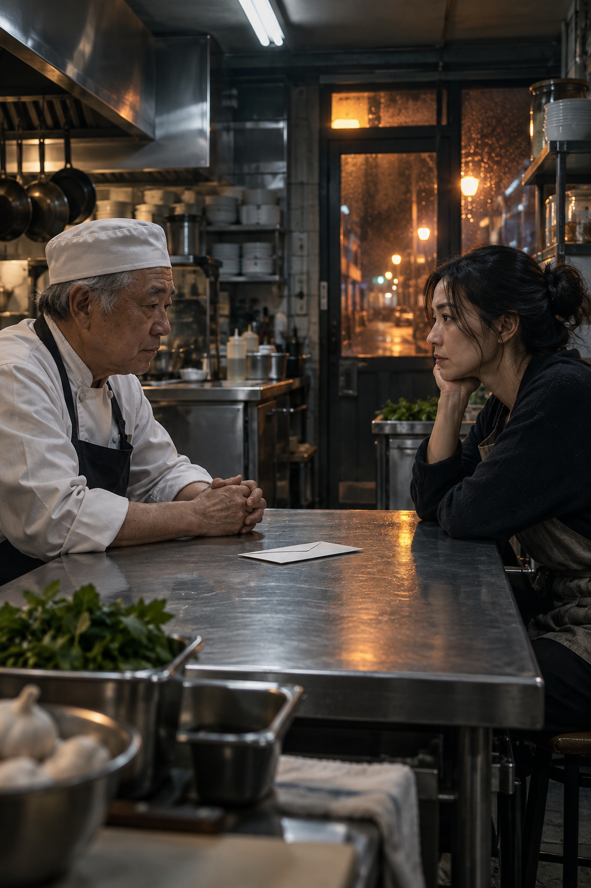</a> 
<strong>Midnight Kitchen Dialogue Shot</strong> 
制作一张克制的双人对白电影镜头。人物与关键道具为 {{shot_subject}}，空间和视线严格遵循 {{scene_geography}}，摄影采用 {{camera_light}}。重点呈现停顿、回避目光和未说出口的冲突，不使用夸张动作；保持人物脸部、服装、座位、信封位置和光向，便于生成同轴正反打。竖版 2:3，写实电影剧照，不要字幕、对白气泡、品牌或 
universal · gpt-image · midjourney · text-to-image · series-consistency 
<a href="../library/cases/film/midnight-kitchen-dialogue-shot/prompt.md">Open prompt and variables</a>
</td>
<td width="33%" valign="top" align="center">
<a href="../library/cases/film/practical-creature-workshop-shot/prompt.md">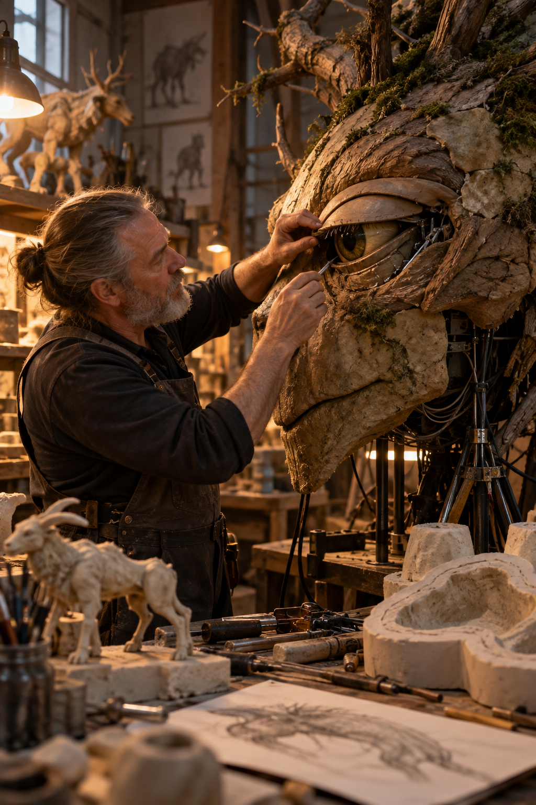</a> 
<strong>Practical Creature Workshop Shot</strong> 
制作一张记录实体特效制作过程的电影幕后镜头。核心工作动作是 {{shot_subject}}，工坊空间依照 {{scene_geography}}，摄影与灯光采用 {{camera_light}}。清楚区分树皮、硅胶、树脂、金属和布线材质，工具握持与机械连接必须可信；画面聚焦一次精密调试，而不是道具陈列拼贴。竖版 2:3，不要文字标签、影视 IP、品牌或水印 
universal · gpt-image · midjourney · text-to-image 
<a href="../library/cases/film/practical-creature-workshop-shot/prompt.md">Open prompt and variables</a>
</td>
<td width="33%" valign="top" align="center">
 
<strong>Courtroom Reveal Keyframe</strong> 
制作一张“证物被打开”的剧情揭示关键帧。核心事件为 {{shot_subject}}，人物和席位严格遵循 {{scene_geography}}，采用 {{camera_light}}。通过证物亮度、人物视线和反应强弱建立由前至后的信息层级；保持律师、法官、陪审席与证物位置，便于延伸反应镜头。竖版 2:3，写实法庭电影剧照，不要字幕、法律徽章、可读文件、品牌 
universal · gpt-image · midjourney · text-to-image · series-consistency 
<a href="../library/cases/film/courtroom-reveal-keyframe/prompt.md">Open prompt and variables</a>
</td>
</tr>
<tr>
<td width="33%" valign="top" align="center">
<a href="../library/cases/film/underwater-station-suspense-shot/prompt.md">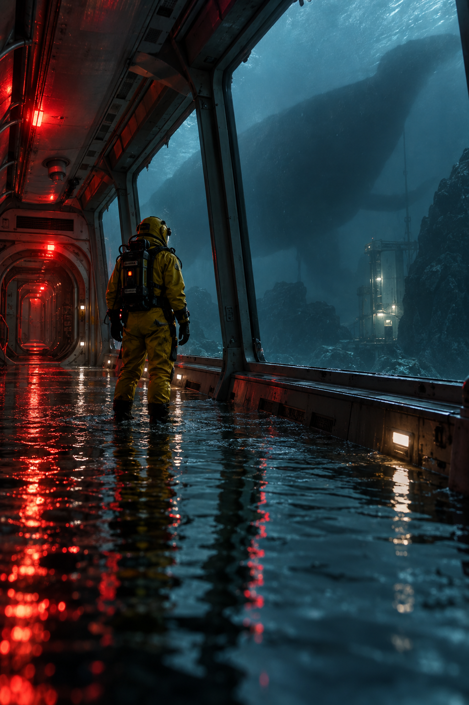</a> 
<strong>Underwater Station Suspense Shot</strong> 
制作一张可继续拆分前后镜头的电影悬疑关键帧。主体为 {{shot_subject}}；空间严格按照 {{scene_geography}} 建立前景、中景与远景，所有积水、舱门、窗框和视线方向保持物理一致；采用 {{camera_light}}。画面必须在缩略图中先读出人物、巨影和逃生方向，保留服装、工具与空间锚点供连续镜头复用。竖版 2:3，单张完整电影画 
universal · gpt-image · midjourney · text-to-image · series-consistency 
<a href="../library/cases/film/underwater-station-suspense-shot/prompt.md">Open prompt and variables</a>
</td>
<td width="33%" valign="top" align="center">
 
<strong>Lighthouse Storm Climax Shot</strong> 
制作一张风暴中横穿灯塔栈桥的高潮镜头。主体动作采用 {{shot_subject}}，场景空间遵循 {{scene_geography}}，摄影和灯光采用 {{camera_light}}。雨线、浪花、衣摆和人物重心必须遵循同一风向，栈桥连接关系与安全栏杆保持可读；巨浪负责制造压力，不得遮挡核心动作。竖版 2:3，不要文字、标识、品牌或水印。 
universal · gpt-image · midjourney · text-to-image · series-consistency 
<a href="../library/cases/film/lighthouse-storm-climax-shot/prompt.md">Open prompt and variables</a>
</td>
<td width="33%" valign="top" align="center">
 
<strong>Desert Caravan Aerial Shot</strong> 
制作一张表现远征尺度与目的地关系的航拍建立镜头。核心行动为 {{shot_subject}}，地理布局必须遵循 {{scene_geography}}，让车辙、山口和聚落形成连续可理解的行进路线；摄影与光线采用 {{camera_light}}。车辆数量、间距、阴影方向和地貌尺度必须可信，确保后续地面镜头能够沿同一轴线展开。竖版 2:3，单张完整电影画面，不 
universal · gpt-image · midjourney · text-to-image · series-consistency 
<a href="../library/cases/film/desert-caravan-aerial-shot/prompt.md">Open prompt and variables</a>
</td>
</tr>
<tr>
<td width="33%" valign="top" align="center">
<a href="../library/cases/film/orbital-garden-zero-gravity-shot/prompt.md">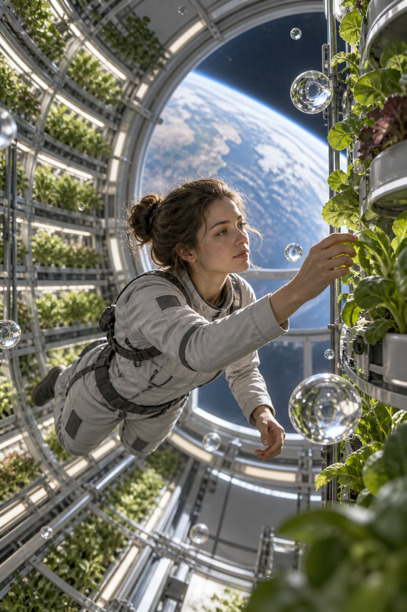</a> 
<strong>Orbital Garden Zero Gravity Shot</strong> 
制作一张具有可信失重逻辑的轨道温室电影镜头。主体动作采用 {{shot_subject}}，空间依照 {{scene_geography}}，摄影和色彩采用 {{camera_light}}。水球、头发、衣褶、叶片和工具都要呈现一致的失重方向，地球窗景只作为尺度锚点，不抢占人物焦点。竖版 2:3，单张完整画面，不要界面文字、太空机构标识、品牌或水印。 
universal · gpt-image · midjourney · text-to-image · series-consistency 
<a href="../library/cases/film/orbital-garden-zero-gravity-shot/prompt.md">Open prompt and variables</a>
</td>
<td width="33%" valign="top" align="center">
<a href="../library/cases/film/cinematic-chase-keyframe/prompt.md">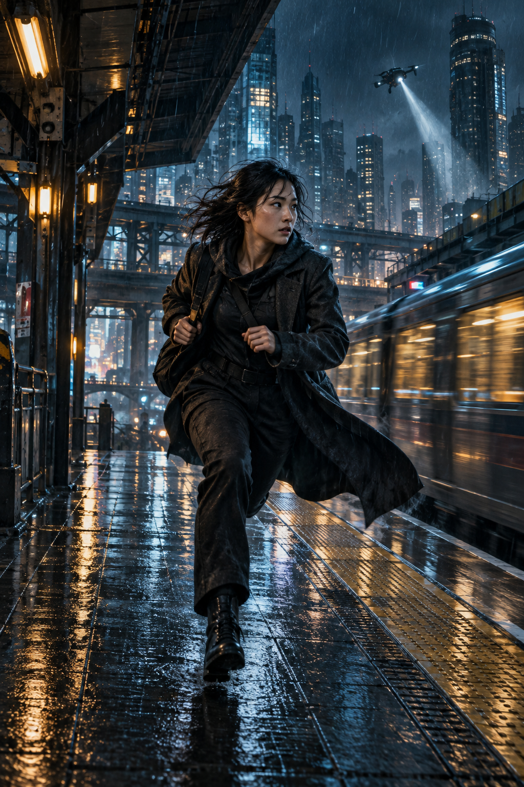</a> 
<strong>Cinematic Chase Keyframe</strong> 
Create one cinematic chase keyframe featuring {{character_identity}} at {{chase_location}}, reacting to {{pursuing_threat}}. 
universal · gpt-image · midjourney · text-to-image · series-consistency 
<a href="../library/cases/film/cinematic-chase-keyframe/prompt.md">Open prompt and variables</a>
</td>
<td width="33%" valign="top" align="center">
 
<strong>Observatory Storm Establishing Shot</strong> 
Create one historical drama establishing shot set in {{historical_setting}} at {{narrative_moment}}. 
universal · gpt-image · midjourney · text-to-image 
<a href="../library/cases/film/observatory-storm-establishing-shot/prompt.md">Open prompt and variables</a>
</td>
</tr>
<tr>
<td width="33%" valign="top" align="center">
 
<strong>Alpine Rescue Climax Shot</strong> 
制作一张动作关系明确的高山救援高潮关键帧。核心接触动作是 {{shot_subject}}，场景必须严格遵循 {{scene_geography}}，使用 {{camera_light}}。让手臂抓握、安全绳受力、直升机气流、碎雪方向和人物重心互相一致；优先保证动作可读性，不以云雾遮盖结构错误。竖版 2:3，单张电影画面，不要文字、标志、品牌或水印。 
universal · gpt-image · midjourney · text-to-image · series-consistency 
<a href="../library/cases/film/alpine-rescue-climax-shot/prompt.md">Open prompt and variables</a>
</td>
<td width="33%"></td>
<td width="33%"></td>
</tr>
</table>

[Back to category navigation](#category-navigation)

---

## 🎮 Game Assets & Props

> 10 cases. Select a cover to open its prompt file.

<table>
<tr>
<td width="33%" valign="top" align="center">
<a href="../library/cases/game-assets/legendary-potion-game-prop/prompt.md">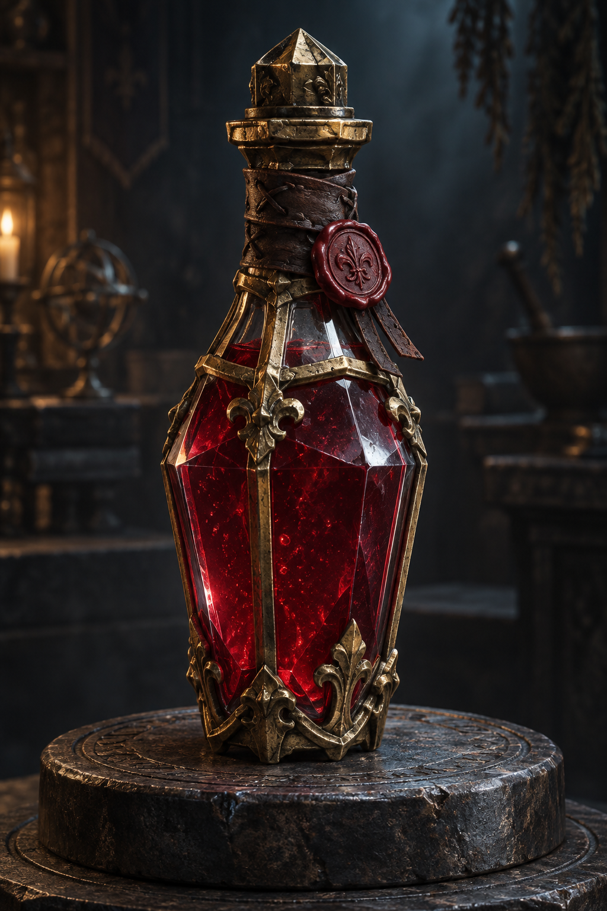</a> 
<strong>Legendary Potion Game Prop</strong> 
Design one production-ready fantasy game prop for {{prop_function}} using {{material_stack}}. 
universal · gpt-image · midjourney · stable-diffusion · text-to-image 
<a href="../library/cases/game-assets/legendary-potion-game-prop/prompt.md">Open prompt and variables</a>
</td>
<td width="33%" valign="top" align="center">
<a href="../library/cases/game-assets/frost-mage-staff-game-prop/prompt.md">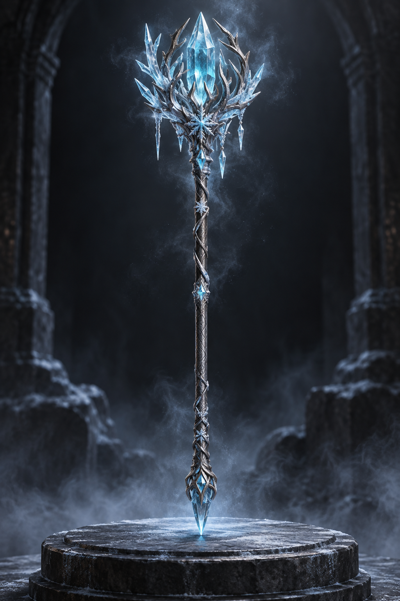</a> 
<strong>Frost Mage Staff Game Prop</strong> 
设计一个可进入游戏资产流程的单件武器道具。资产身份为 {{asset_identity}}，所有部件按照 {{construction_logic}} 形成可解释、可制造的连接关系，材质和展示遵循 {{material_presentation}}。完整显示顶端、握持区与末端，保证远距离轮廓可辨、近距离材质分区清楚；磨损只出现在握持和碰撞位置。竖版 2:3， 
universal · gpt-image · midjourney · text-to-image 
<a href="../library/cases/game-assets/frost-mage-staff-game-prop/prompt.md">Open prompt and variables</a>
</td>
<td width="33%" valign="top" align="center">
<a href="../library/cases/game-assets/alien-flora-resource-cluster/prompt.md">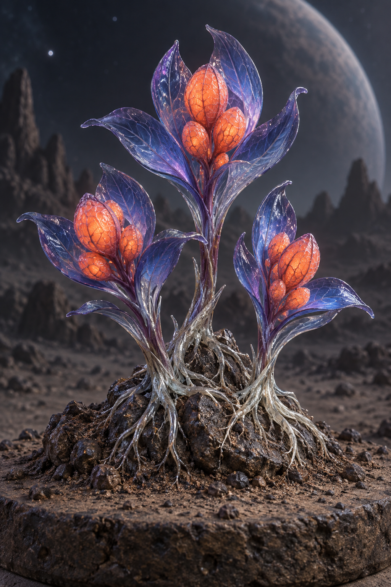</a> 
<strong>Alien Flora Resource Cluster</strong> 
设计一个可用于开放世界采集点的异星植物资产。身份为 {{asset_identity}}，生长结构遵循 {{construction_logic}}，材质和光照采用 {{material_presentation}}。完整显示地上部分、根系和附着岩石，保证采集部位一眼可辨且生物结构自洽；发光只来自叶脉和种荚内部。竖版 2:3，单一资源簇，不要角色、文字、界面 
universal · gpt-image · midjourney · text-to-image 
<a href="../library/cases/game-assets/alien-flora-resource-cluster/prompt.md">Open prompt and variables</a>
</td>
</tr>
<tr>
<td width="33%" valign="top" align="center">
<a href="../library/cases/game-assets/forest-guardian-creature-asset/prompt.md">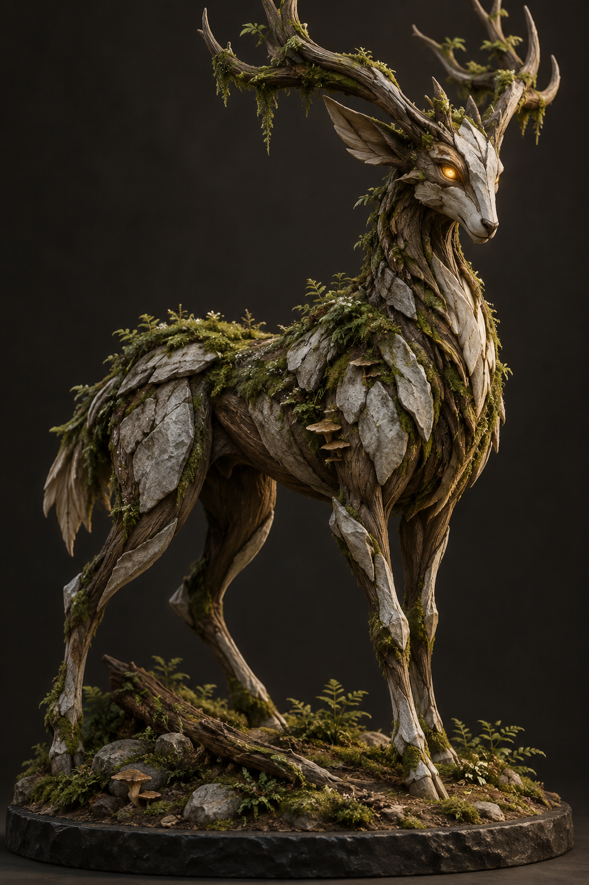</a> 
<strong>Forest Guardian Creature Asset</strong> 
设计一个可用于绑定和动画评估的原创四足生物。身份锚点为 {{asset_identity}}，身体结构遵循 {{construction_logic}}，材质展示使用 {{material_presentation}}。完整显示头、角、四肢、躯干与尾部，保证关节活动空间、承重关系和前后轮廓清楚；植物附着不能遮挡解剖结构。竖版 2:3，单一全身角色资产，不要文 
universal · gpt-image · midjourney · text-to-image · series-consistency 
<a href="../library/cases/game-assets/forest-guardian-creature-asset/prompt.md">Open prompt and variables</a>
</td>
<td width="33%" valign="top" align="center">
<a href="../library/cases/game-assets/modular-sci-fi-cargo-crate/prompt.md">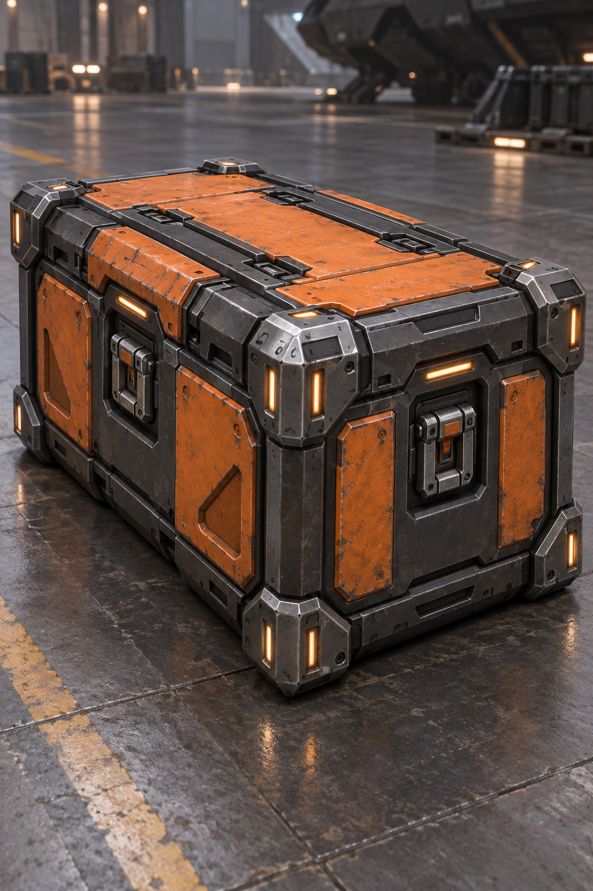</a> 
<strong>Modular Sci Fi Cargo Crate</strong> 
设计一个生产可信的模块化场景道具。资产为 {{asset_identity}}，结构必须遵循 {{construction_logic}}，材质与磨损采用 {{material_presentation}}。使用三分之四视角完整显示箱盖、锁扣、护角和底部搬运结构；所有分缝、铰链与受力点必须可解释。竖版 2:3，单件硬表面资产，不要文字、编号、图标、品牌、界面 
universal · gpt-image · midjourney · text-to-image 
<a href="../library/cases/game-assets/modular-sci-fi-cargo-crate/prompt.md">Open prompt and variables</a>
</td>
<td width="33%" valign="top" align="center">
<a href="../library/cases/game-assets/desert-temple-environment-kit/prompt.md">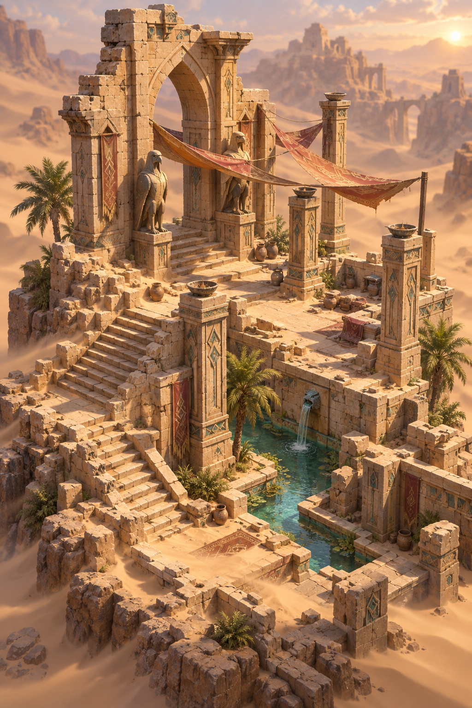</a> 
<strong>Desert Temple Environment Kit</strong> 
设计一个组装完成、同时可反推模块拆分的游戏环境样板。环境身份为 {{asset_identity}}，空间和模块规则遵循 {{construction_logic}}，材质与风化采用 {{material_presentation}}。使用等距三分之四视角显示入口、路径、高差和水渠循环，避免不可到达的平台与无支撑构件。竖版 2:3，单一场景样板，不要接触表、 
universal · gpt-image · midjourney · text-to-image 
<a href="../library/cases/game-assets/desert-temple-environment-kit/prompt.md">Open prompt and variables</a>
</td>
</tr>
<tr>
<td width="33%" valign="top" align="center">
<a href="../library/cases/game-assets/ceremonial-warrior-helmet-asset/prompt.md">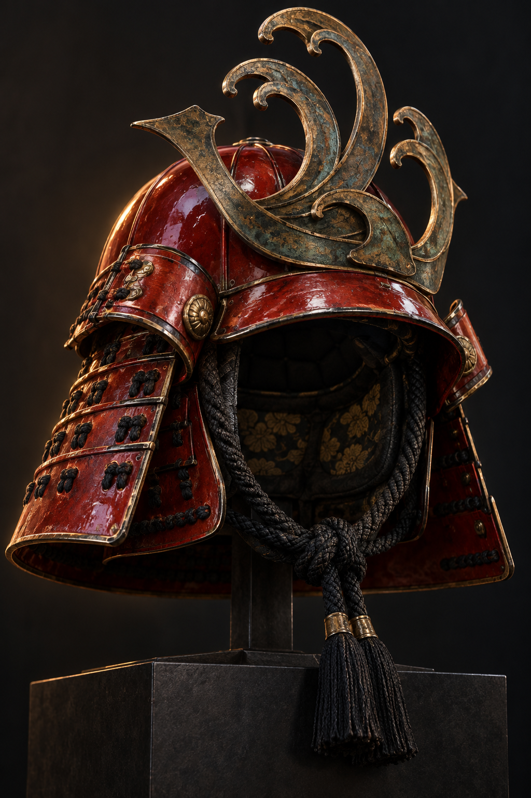</a> 
<strong>Ceremonial Warrior Helmet Asset</strong> 
设计一件具有原创文化气质的游戏头盔资产。外形身份为 {{asset_identity}}，连接关系依照 {{construction_logic}}，材质呈现采用 {{material_presentation}}。以略低的三分之四视角同时展示冠饰、盔体、护颈与内部衬垫；装饰必须服从结构，不使用真实家纹、军徽或既有角色元素。竖版 2:3，单件资产，不要人物、 
universal · gpt-image · midjourney · text-to-image 
<a href="../library/cases/game-assets/ceremonial-warrior-helmet-asset/prompt.md">Open prompt and variables</a>
</td>
<td width="33%" valign="top" align="center">
<a href="../library/cases/game-assets/tidal-energy-shield-game-prop/prompt.md">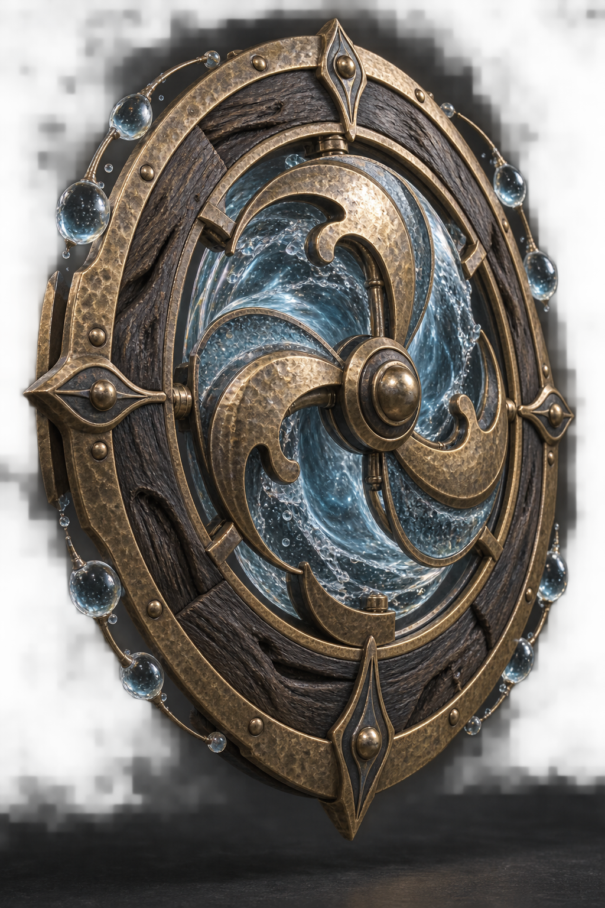</a> 
<strong>Tidal Energy Shield Game Prop</strong> 
设计一件结构和魔法机制都可解释的盾牌资产。身份图形采用 {{asset_identity}}，组件关系遵循 {{construction_logic}}，材质展示使用 {{material_presentation}}。采用正面略偏三分之四视角，完整显示外圈、中心机构、厚度与握持空间；特效不得遮住连接点和轮廓。竖版 2:3，单件道具，不要角色、文字、符文、徽 
universal · gpt-image · midjourney · text-to-image 
<a href="../library/cases/game-assets/tidal-energy-shield-game-prop/prompt.md">Open prompt and variables</a>
</td>
<td width="33%" valign="top" align="center">
 
<strong>Steampunk Survey Airship Asset</strong> 
设计一艘结构可信的原创轻型飞艇资产。载具身份为 {{asset_identity}}，承重和操纵结构遵循 {{construction_logic}}，材质展示使用 {{material_presentation}}。完整显示头尾、气囊、舱体、动力和控制面，保证重心、吊挂、推进方向与维护入口合理。竖版 2:3，单一载具，不要驾驶员、文字、徽章、既有 IP、品 
universal · gpt-image · midjourney · text-to-image 
<a href="../library/cases/game-assets/steampunk-survey-airship-asset/prompt.md">Open prompt and variables</a>
</td>
</tr>
<tr>
<td width="33%" valign="top" align="center">
<a href="../library/cases/game-assets/desert-scout-hoverbike/prompt.md">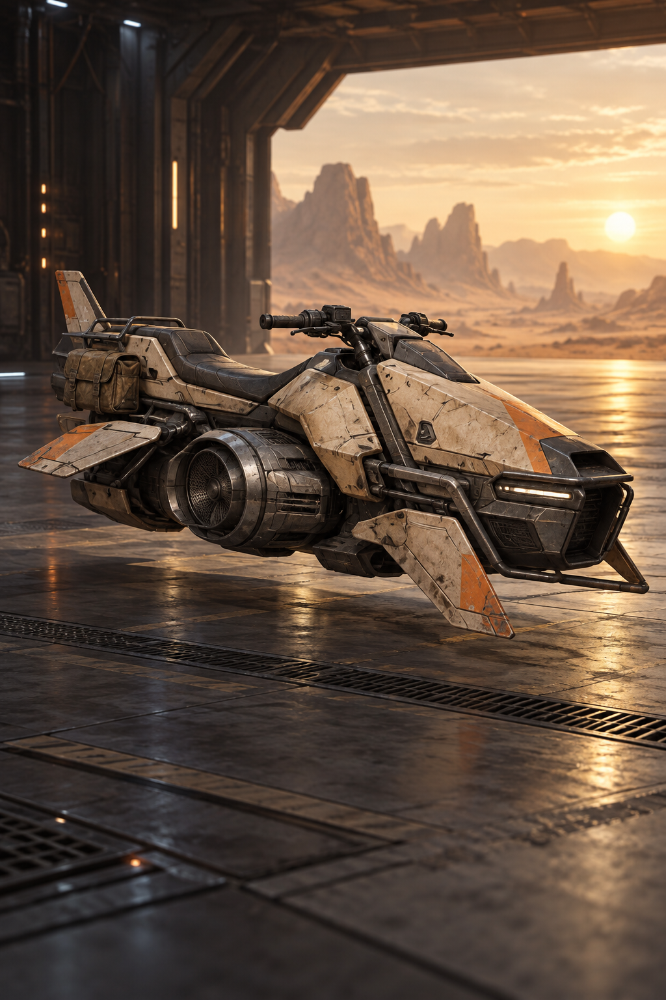</a> 
<strong>Desert Scout Hoverbike</strong> 
Design one original {{vehicle_role}} whose form is driven by {{engineering_features}}. 
universal · gpt-image · midjourney · stable-diffusion · text-to-image 
<a href="../library/cases/game-assets/desert-scout-hoverbike/prompt.md">Open prompt and variables</a>
</td>
<td width="33%"></td>
<td width="33%"></td>
</tr>
</table>

[Back to category navigation](#category-navigation)

---

## 📱 Social Media Content

> 10 cases. Select a cover to open its prompt file.

<table>
<tr>
<td width="33%" valign="top" align="center">
 
<strong>Winter Coffee Seasonal Post</strong> 
制作一张冬季咖啡时令社交视觉。主角静物为 {{campaign_subject}}，材质和季节氛围采用 {{visual_system}}，版式遵循 {{mobile_layout}}。陶杯口沿、把手、液面、接触阴影和蒸汽必须真实，香料用于支持风味而不能形成杂乱堆砌；排版空间保持干净。不要包装文字、品牌、价格、平台界面或水印。 
universal · gpt-image · midjourney · text-to-image 
<a href="../library/cases/social/winter-coffee-seasonal-post/prompt.md">Open prompt and variables</a>
</td>
<td width="33%" valign="top" align="center">
<a href="../library/cases/social/urban-fitness-challenge-story/prompt.md">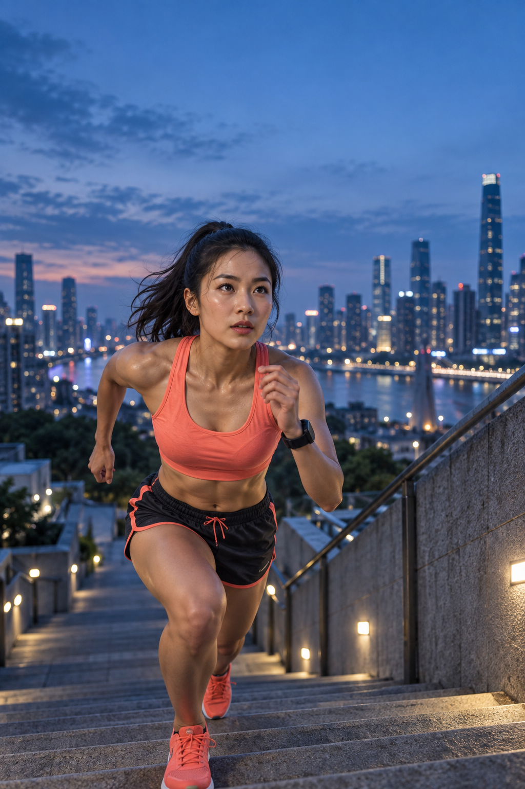</a> 
<strong>Urban Fitness Challenge Story</strong> 
制作一张竖屏城市体能挑战封面。人物与动作采用 {{campaign_subject}}，色彩和环境遵循 {{visual_system}}，裁切与安全区使用 {{mobile_layout}}。保持脸部真实清晰，手臂、腿部、鞋底接触和上楼重心符合运动逻辑；背景城市仅提供速度与地点感，不抢人物。不要标语、品牌服饰、平台界面、数字指标或水印。 
universal · gpt-image · midjourney · text-to-image 
<a href="../library/cases/social/urban-fitness-challenge-story/prompt.md">Open prompt and variables</a>
</td>
<td width="33%" valign="top" align="center">
<a href="../library/cases/social/pet-adoption-community-story/prompt.md">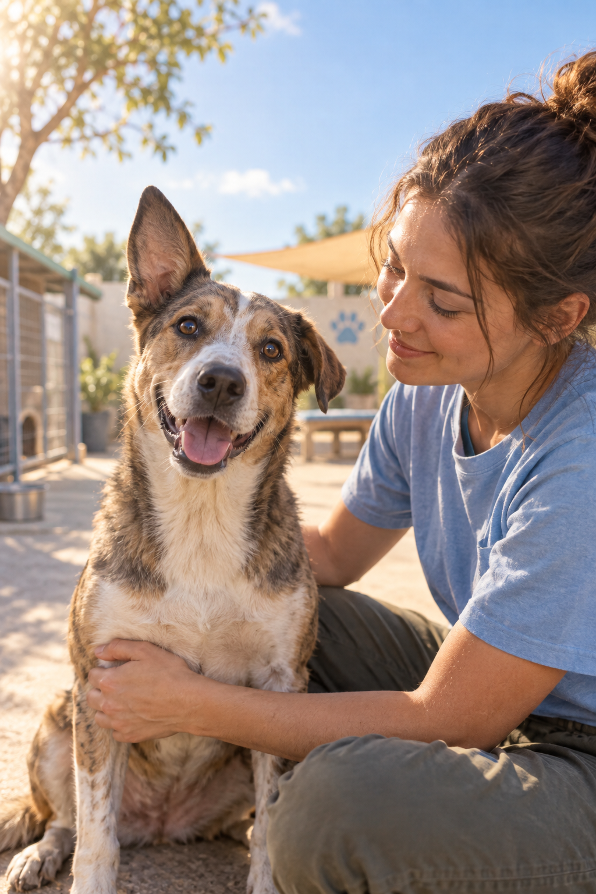</a> 
<strong>Pet Adoption Community Story</strong> 
制作一张真实、尊重且有希望感的宠物领养故事封面。人物与动物关系采用 {{campaign_subject}}，色彩和光线遵循 {{visual_system}}，构图使用 {{mobile_layout}}。犬只眼神、耳朵特征、毛色和志愿者手部接触必须自然；避免悲情夸张，以直接眼神建立信任。不要文字、收容机构标志、平台界面、互动数据或水印。 
universal · gpt-image · midjourney · text-to-image 
<a href="../library/cases/social/pet-adoption-community-story/prompt.md">Open prompt and variables</a>
</td>
</tr>
<tr>
<td width="33%" valign="top" align="center">
<a href="../library/cases/social/artisan-dessert-social-story/prompt.md">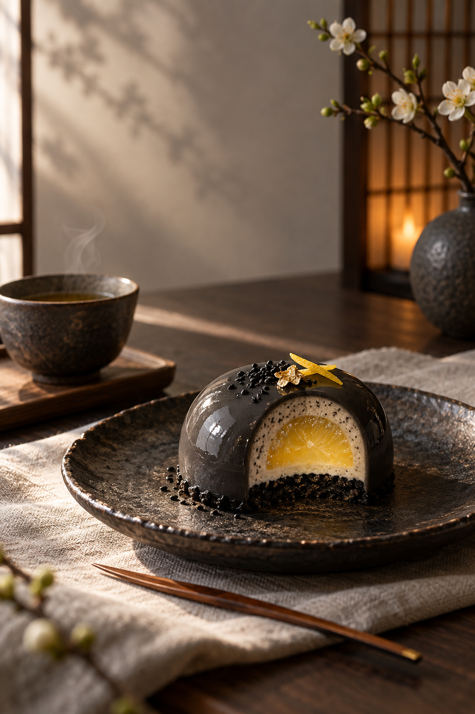</a> 
<strong>Artisan Dessert Social Story</strong> 
Create one vertical social story image featuring {{hero_dessert}} in {{hospitality_setting}}. 
universal · gpt-image · midjourney · text-to-image 
<a href="../library/cases/social/artisan-dessert-social-story/prompt.md">Open prompt and variables</a>
</td>
<td width="33%" valign="top" align="center">
<a href="../library/cases/social/foldable-audio-device-launch-post/prompt.md">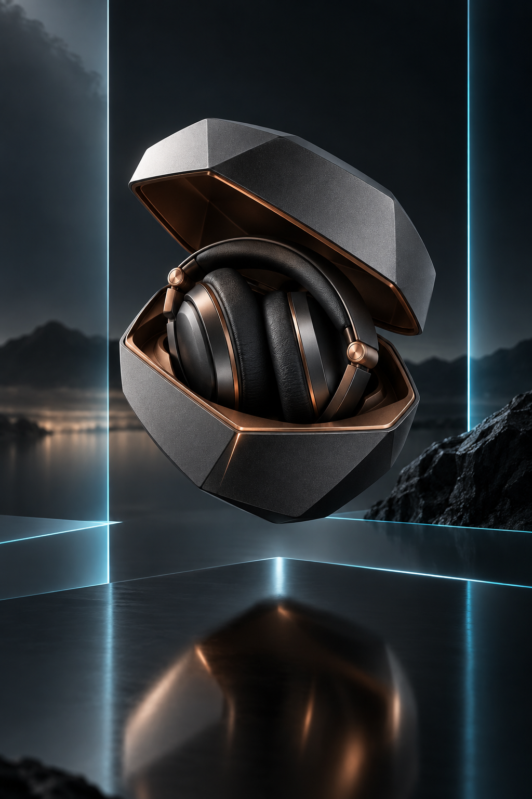</a> 
<strong>Foldable Audio Device Launch Post</strong> 
制作一张消费电子新品发布社交视觉。产品结构采用 {{campaign_subject}}，色彩和布光使用 {{visual_system}}，移动端版式遵循 {{mobile_layout}}。耳机左右结构、折叠转轴、耳垫厚度、盒体卡槽与开合关系必须准确；光线只帮助解释体块，不用光效遮盖结构。不要型号文字、品牌、伪界面、价格、互动数据或水印。 
universal · gpt-image · midjourney · text-to-image 
<a href="../library/cases/social/foldable-audio-device-launch-post/prompt.md">Open prompt and variables</a>
</td>
<td width="33%" valign="top" align="center">
<a href="../library/cases/social/skincare-reel-cover/prompt.md">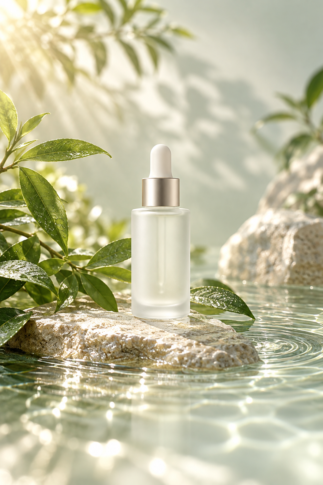</a> 
<strong>Skincare Reel Cover</strong> 
制作一张移动端优先的护肤短视频封面。核心产品为 {{campaign_subject}}，色彩、环境与触感遵循 {{visual_system}}，版式严格采用 {{mobile_layout}}。产品轮廓、滴管结构、玻璃厚度、折射和接触阴影必须可信；只保留一个主焦点和可供后期排字的空白。不要标签、文字、品牌、平台界面、互动数据或水印。 
universal · gpt-image · midjourney · text-to-image 
<a href="../library/cases/social/skincare-reel-cover/prompt.md">Open prompt and variables</a>
</td>
</tr>
<tr>
<td width="33%" valign="top" align="center">
<a href="../library/cases/social/island-travel-carousel-cover/prompt.md">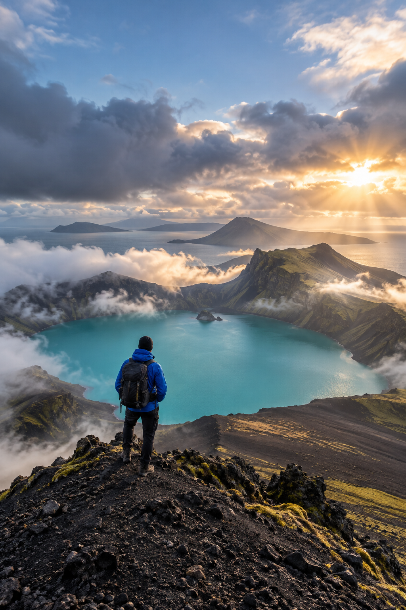</a> 
<strong>Island Travel Carousel Cover</strong> 
制作一张旅行轮播内容的第一张封面图。人物主体为 {{campaign_subject}}，景观色彩与天气采用 {{visual_system}}，移动端层级严格遵循 {{mobile_layout}}。让人物、山脊、湖面和远岛形成四层纵深，保持云层光向、地形尺度和人物站姿可信；标题区只保留留白，不生成文字。不要平台界面、定位图标、品牌或水印。 
universal · gpt-image · midjourney · text-to-image 
<a href="../library/cases/social/island-travel-carousel-cover/prompt.md">Open prompt and variables</a>
</td>
<td width="33%" valign="top" align="center">
 
<strong>Independent Bookstore Social Card</strong> 
制作一张讲述社区书店日常的社交卡片底图。人物事件为 {{campaign_subject}}，环境与色彩采用 {{visual_system}}，构图遵循 {{mobile_layout}}。让手部整理动作、书本堆叠、台灯照明和窗外雨景彼此可信，主次清楚且不过度摆拍；书脊和排版区不得生成乱码。不要可读书名、品牌、平台界面或水印。 
universal · gpt-image · midjourney · text-to-image 
<a href="../library/cases/social/independent-bookstore-social-card/prompt.md">Open prompt and variables</a>
</td>
<td width="33%" valign="top" align="center">
<a href="../library/cases/social/indie-music-festival-social-poster/prompt.md">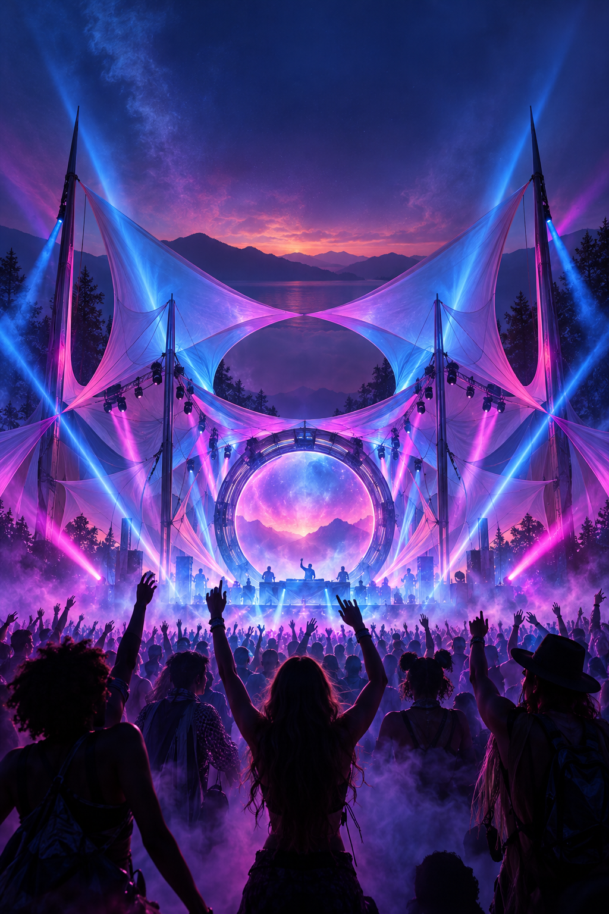</a> 
<strong>Indie Music Festival Social Poster</strong> 
制作一张高能但层级清楚的音乐节社交海报底图。活动场景为 {{campaign_subject}}，灯光系统采用 {{visual_system}}，构图遵循 {{mobile_layout}}。观众、舞台和天空分层明确，光束方向统一，主舞台必须在缩略图中优先被读到；信息区只保留空间，不直接生成阵容或日期文字。不要艺人肖像、品牌、平台界面、互动数据或水印。 
universal · gpt-image · midjourney · text-to-image 
<a href="../library/cases/social/indie-music-festival-social-poster/prompt.md">Open prompt and variables</a>
</td>
</tr>
<tr>
<td width="33%" valign="top" align="center">
<a href="../library/cases/social/streetwear-social-story/prompt.md">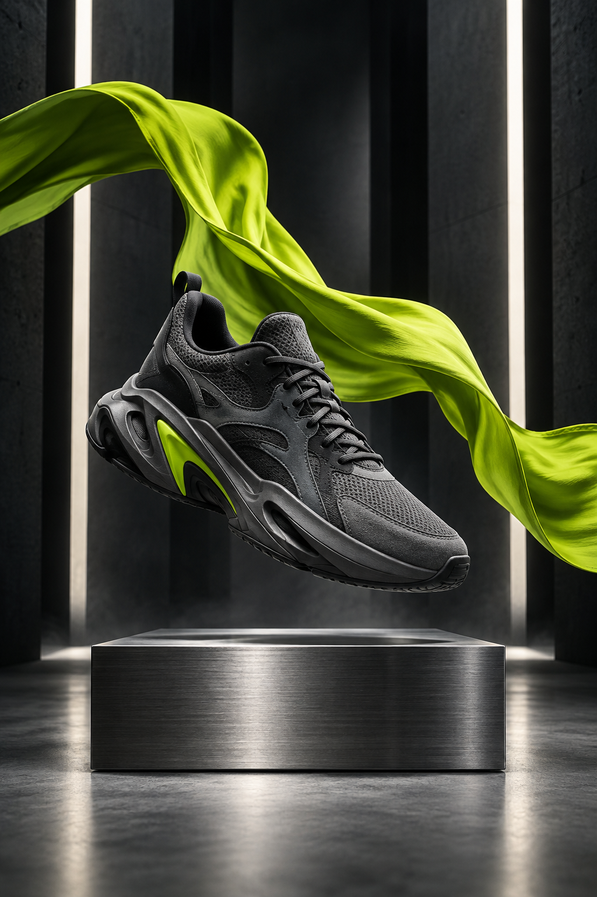</a> 
<strong>Streetwear Social Story</strong> 
Create one mobile-first social campaign cover for {{campaign_product}}, using {{motion_element}} as the only dynamic accent. 
universal · gpt-image · midjourney · text-to-image 
<a href="../library/cases/social/streetwear-social-story/prompt.md">Open prompt and variables</a>
</td>
<td width="33%"></td>
<td width="33%"></td>
</tr>
</table>

[Back to category navigation](#category-navigation)

---

## 🧵 Patterns & Surface Design

> 10 cases. Select a cover to open its prompt file.

<table>
<tr>
<td width="33%" valign="top" align="center">
 
<strong>Dichroic Glass Gradient Library</strong> 
制作一张可用于视觉系统与材质参考的二向色玻璃表面。色带和波脊按 {{motif_system}}，光学响应采用 {{surface_behavior}}，输出约束遵循 {{production_constraints}}。使用受控棚拍光呈现反射、透射、折射和焦散的区别，避免用纯色渐变冒充玻璃。画面填满竖版 2:3，不做器物或建筑样机，不要边框、文字、品牌或水 
universal · gpt-image · midjourney · text-to-image 
<a href="../library/cases/surface/dichroic-glass-gradient-library/prompt.md">Open prompt and variables</a>
</td>
<td width="33%" valign="top" align="center">
<a href="../library/cases/surface/embroidered-cloud-motif-repeat/prompt.md">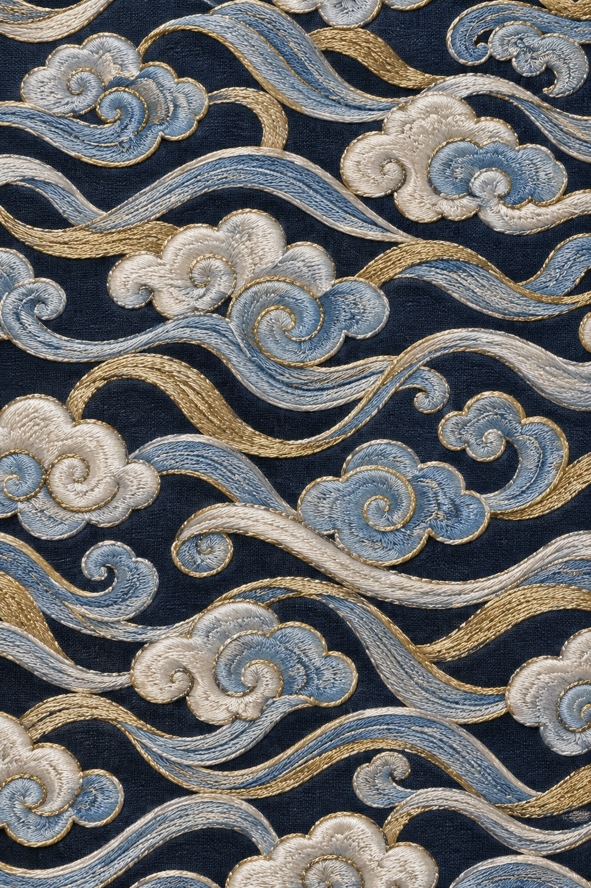</a> 
<strong>Embroidered Cloud Motif Repeat</strong> 
制作一张真实可绣制的连续织物纹样。母题组织为 {{motif_system}}，线材和针迹表现采用 {{surface_behavior}}，生产规则遵循 {{production_constraints}}。清楚呈现底布经纬、针脚方向、线层高度和边缘收针，检查四边连续与母题密度；输出平铺材质，不做服装样机。竖版 2:3，不要文字、徽章、品牌或水印。 
universal · gpt-image · midjourney · text-to-image · series-consistency 
<a href="../library/cases/surface/embroidered-cloud-motif-repeat/prompt.md">Open prompt and variables</a>
</td>
<td width="33%" valign="top" align="center">
<a href="../library/cases/surface/children-space-pattern-repeat/prompt.md">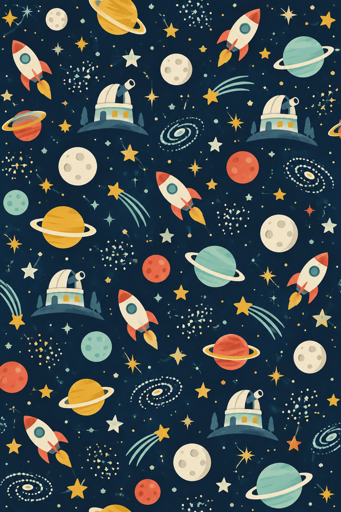</a> 
<strong>Children Space Pattern Repeat</strong> 
制作一张适合儿童用品的太空连续纹样。母题系统采用 {{motif_system}}，视觉质感使用 {{surface_behavior}}，生产约束遵循 {{production_constraints}}。保持所有图形友好、原创、轮廓简单，建立主母题与填充星点的密度层级，并检查四边接缝。输出平面竖版 2:3，不做床品或服装样机，不要文字、数字、品牌、既有动 
universal · gpt-image · midjourney · text-to-image · series-consistency 
<a href="../library/cases/surface/children-space-pattern-repeat/prompt.md">Open prompt and variables</a>
</td>
</tr>
<tr>
<td width="33%" valign="top" align="center">
<a href="../library/cases/surface/recycled-terrazzo-surface-study/prompt.md">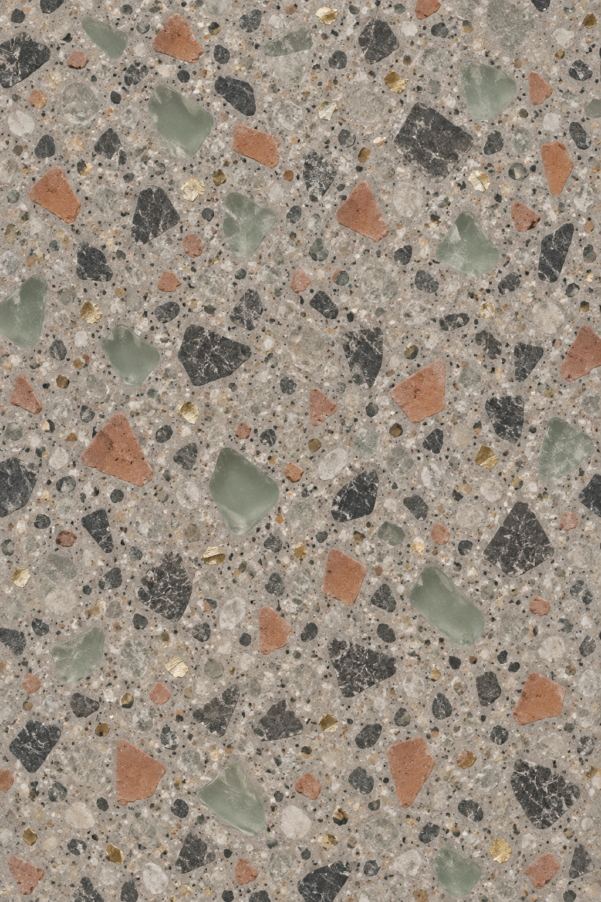</a> 
<strong>Recycled Terrazzo Surface Study</strong> 
制作一张正交俯视的再生水磨石材质样板。骨料组成按 {{motif_system}}，表面响应采用 {{surface_behavior}}，制造限制遵循 {{production_constraints}}。保持骨料嵌入深度、边缘磨圆和基底密度真实，使用均匀漫射光，避免靠阴影制造假凹凸。画面填满竖版 2:3，不做台面或房间样机，不要物品、文字、品牌或水印。 
universal · gpt-image · midjourney · text-to-image 
<a href="../library/cases/surface/recycled-terrazzo-surface-study/prompt.md">Open prompt and variables</a>
</td>
<td width="33%" valign="top" align="center">
<a href="../library/cases/surface/botanical-leather-emboss-surface/prompt.md">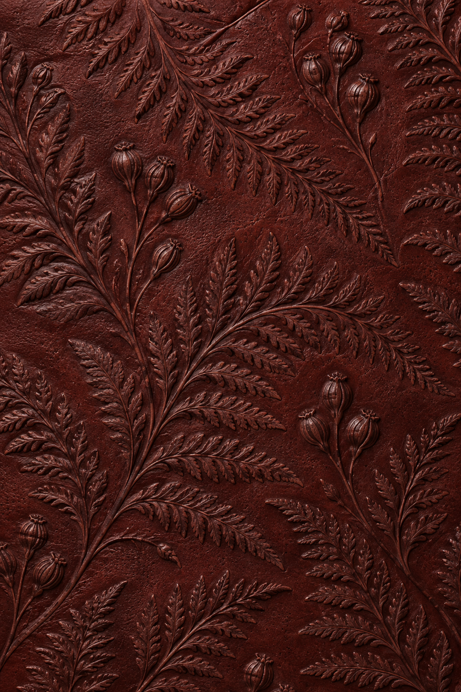</a> 
<strong>Botanical Leather Emboss Surface</strong> 
制作一张可用于压花工艺评估的连续皮革表面。植物母题按 {{motif_system}}，皮革和浮雕表现采用 {{surface_behavior}}，生产限制严格遵循 {{production_constraints}}。使用斜向柔光说明高低关系，同时保留天然毛孔、细微折痕和植鞣色差；检查四边连续和最小沟槽。画面填满竖版 2:3，不做皮具样机，不要文字、品牌 
universal · gpt-image · midjourney · text-to-image 
<a href="../library/cases/surface/botanical-leather-emboss-surface/prompt.md">Open prompt and variables</a>
</td>
<td width="33%" valign="top" align="center">
<a href="../library/cases/surface/coastal-mosaic-tile-pattern/prompt.md">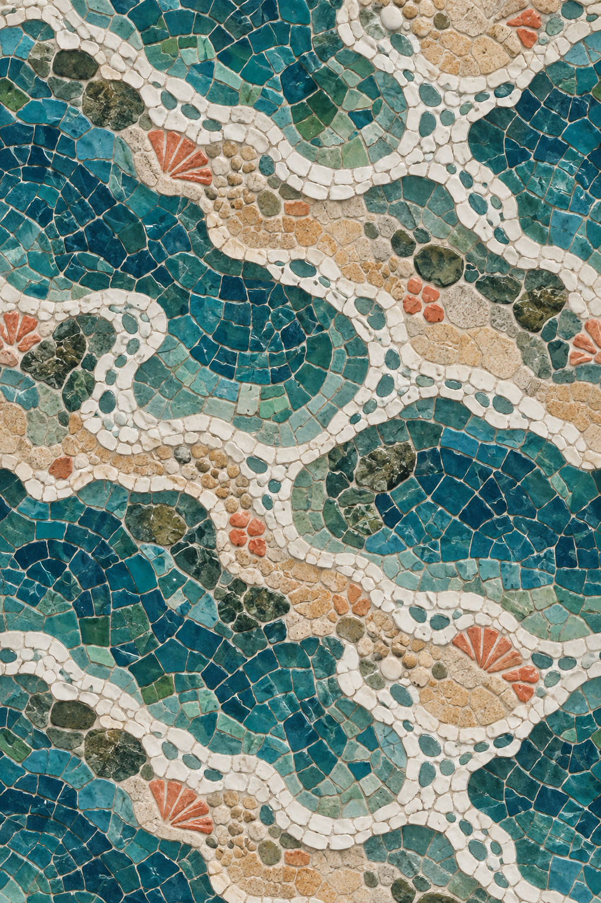</a> 
<strong>Coastal Mosaic Tile Pattern</strong> 
制作一张可用于建筑铺装的连续马赛克表面。母题组织为 {{motif_system}}，瓷片与灰缝表现采用 {{surface_behavior}}，施工限制遵循 {{production_constraints}}。正交俯视完整显示陶片切割、灰缝和潮池节奏，检查四边拼接和局部可施工性。画面填满竖版 2:3，不做泳池或室内样机，不要边框、文字、品牌或水印。 
universal · gpt-image · midjourney · text-to-image 
<a href="../library/cases/surface/coastal-mosaic-tile-pattern/prompt.md">Open prompt and variables</a>
</td>
</tr>
<tr>
<td width="33%" valign="top" align="center">
<a href="../library/cases/surface/brushed-metal-finish-library/prompt.md">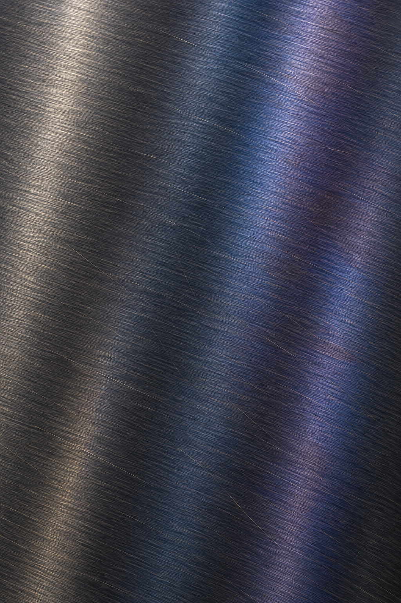</a> 
<strong>Brushed Metal Finish Library</strong> 
制作一张用于材质库的连续拉丝金属表面。图形分布按 {{motif_system}}，物理响应采用 {{surface_behavior}}，输出限制遵循 {{production_constraints}}。使用大面积柔光显示各向异性，不让环境倒影或物体混入材质；保持金属基底连续且可判断粗糙度。画面填满竖版 2:3，不做产品样机，不要分栏、标签、文字、品牌或 
universal · gpt-image · midjourney · text-to-image 
<a href="../library/cases/surface/brushed-metal-finish-library/prompt.md">Open prompt and variables</a>
</td>
<td width="33%" valign="top" align="center">
<a href="../library/cases/surface/mineral-surface-library/prompt.md">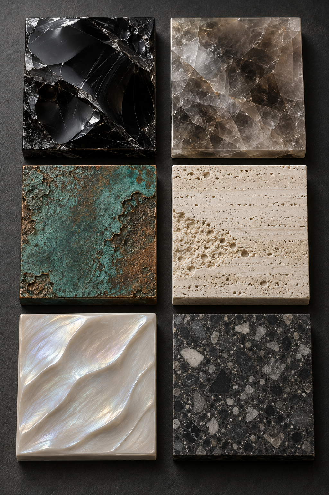</a> 
<strong>Mineral Surface Library</strong> 
Create one coherent architectural material study containing {{surface_family}}. 
universal · gpt-image · midjourney · stable-diffusion · text-to-image 
<a href="../library/cases/surface/mineral-surface-library/prompt.md">Open prompt and variables</a>
</td>
<td width="33%" valign="top" align="center">
<a href="../library/cases/surface/ginkgo-textile-repeat/prompt.md">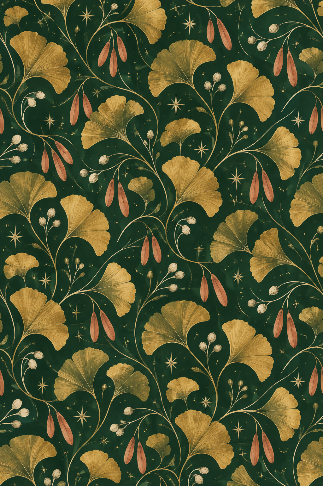</a> 
<strong>Ginkgo Textile Repeat</strong> 
Create one original seamless textile design using {{motif_family}} arranged through {{repeat_structure}}. 
universal · gpt-image · midjourney · stable-diffusion · text-to-image · series-consistency 
<a href="../library/cases/surface/ginkgo-textile-repeat/prompt.md">Open prompt and variables</a>
</td>
</tr>
<tr>
<td width="33%" valign="top" align="center">
<a href="../library/cases/surface/koi-geometric-wallpaper-repeat/prompt.md">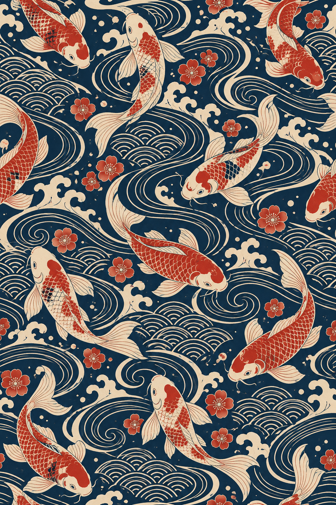</a> 
<strong>Koi Geometric Wallpaper Repeat</strong> 
制作一张可测试重复的壁纸纹样。母题系统为 {{motif_system}}，表面视觉采用 {{surface_behavior}}，生产约束严格遵循 {{production_constraints}}。让主要锦鲤、次级水流和小型花朵形成明确层级，检查上下左右边缘连续、母题间距和旋转节奏；输出整幅纹样平面，不做室内样机。竖版 2:3，不要边框、文字、品牌或水 
universal · gpt-image · midjourney · text-to-image · series-consistency 
<a href="../library/cases/surface/koi-geometric-wallpaper-repeat/prompt.md">Open prompt and variables</a>
</td>
<td width="33%"></td>
<td width="33%"></td>
</tr>
</table>

[Back to category navigation](#category-navigation)

---

## 🎬 Scenes & Storytelling

> 8 cases. Select a cover to open its prompt file.

<table>
<tr>
<td width="33%" valign="top" align="center">
 
<strong>Childrens Book Spread</strong> 
Create a warm children’s book double-page spread showing {{main_character}} during {{story_moment}}. 
universal · midjourney · stable-diffusion · text-to-image · series-consistency 
<a href="../library/cases/storytelling/childrens-book-spread/prompt.md">Open prompt and variables</a>
</td>
<td width="33%" valign="top" align="center">
 
<strong>Card Game Deck Concept</strong> 
Design an original card-game deck concept for {{game_theme}} using {{rarity_palette}}. 
universal · midjourney · stable-diffusion · text-to-image · series-consistency 
<a href="../library/cases/game/card-game-deck-concept/prompt.md">Open prompt and variables</a>
</td>
<td width="33%" valign="top" align="center">
 
<strong>Cozy Game Cabin</strong> 
Create a cozy original game scene of a cabin during {{season}}, focused on {{cabin_activity}}. 
universal · midjourney · stable-diffusion · text-to-image · series-consistency 
<a href="../library/cases/game/cozy-game-cabin/prompt.md">Open prompt and variables</a>
</td>
</tr>
<tr>
<td width="33%" valign="top" align="center">
 
<strong>Cinematic Storyboard Sequence</strong> 
Create a six-panel cinematic storyboard for {{scene_premise}} ending with {{emotional_turn}}. 
universal · midjourney · stable-diffusion · text-to-image · series-consistency 
<a href="../library/cases/storytelling/cinematic-storyboard-sequence/prompt.md">Open prompt and variables</a>
</td>
<td width="33%" valign="top" align="center">
 
<strong>Sci Fi Ecosystem Scene</strong> 
Wide cinematic establishing shot of a {{biome}} on a distant world at {{time_of_day}}. 
universal · midjourney · stable-diffusion · text-to-image 
<a href="../library/cases/education/sci-fi-ecosystem-scene/prompt.md">Open prompt and variables</a>
</td>
<td width="33%" valign="top" align="center">
 
<strong>Isometric Game Environment</strong> 
Create an original isometric game environment in {{biome}} featuring {{landmark}}. 
universal · midjourney · stable-diffusion · text-to-image · series-consistency 
<a href="../library/cases/game/isometric-game-environment/prompt.md">Open prompt and variables</a>
</td>
</tr>
<tr>
<td width="33%" valign="top" align="center">
 
<strong>Documentary Scene Concept</strong> 
Create a documentary-style still in {{subject_place}} focused on {{human_activity}}. 
universal · midjourney · stable-diffusion · text-to-image · series-consistency 
<a href="../library/cases/storytelling/documentary-scene-concept/prompt.md">Open prompt and variables</a>
</td>
<td width="33%" valign="top" align="center">
 
<strong>Racing Game Garage</strong> 
Create a racing-game garage scene for a {{car_style}} vehicle with a {{garage_mood}} atmosphere. 
universal · midjourney · stable-diffusion · text-to-image · series-consistency 
<a href="../library/cases/game/racing-game-garage/prompt.md">Open prompt and variables</a>
</td>
<td width="33%"></td>
</tr>
</table>

[Back to category navigation](#category-navigation)

---

## 🎨 Illustration & Art

> 5 cases. Select a cover to open its prompt file.

<table>
<tr>
<td width="33%" valign="top" align="center">
 
<strong>Kinetic Typography Poster</strong> 
Create a kinetic typography poster concept expressing {{event_energy}} through {{color_contrast}}. 
universal · midjourney · stable-diffusion · text-to-image 
<a href="../library/cases/creative/kinetic-typography-poster/prompt.md">Open prompt and variables</a>
</td>
<td width="33%" valign="top" align="center">
 
<strong>Abstract Material Study</strong> 
Create an abstract material study combining {{material_pair}} with a {{color_mood}} color mood. 
universal · midjourney · stable-diffusion · text-to-image 
<a href="../library/cases/creative/abstract-material-study/prompt.md">Open prompt and variables</a>
</td>
<td width="33%" valign="top" align="center">
 
<strong>Nature Macro Abstraction</strong> 
Create a macro abstract image inspired by {{natural_subject}} under {{light_condition}}. 
universal · midjourney · stable-diffusion · text-to-image 
<a href="../library/cases/creative/nature-macro-abstraction/prompt.md">Open prompt and variables</a>
</td>
</tr>
<tr>
<td width="33%" valign="top" align="center">
 
<strong>Surreal Fashion Scene</strong> 
Create a surreal fashion editorial scene with {{fashion_element}} in {{surreal_setting}}. 
universal · midjourney · stable-diffusion · text-to-image 
<a href="../library/cases/creative/surreal-fashion-scene/prompt.md">Open prompt and variables</a>
</td>
<td width="33%" valign="top" align="center">
 
<strong>Ceramic Sculpture Study</strong> 
Create a studio study of original ceramic sculptures using {{sculpture_language}} and {{glaze_palette}}. 
universal · midjourney · stable-diffusion · text-to-image 
<a href="../library/cases/creative/ceramic-sculpture-study/prompt.md">Open prompt and variables</a>
</td>
<td width="33%"></td>
</tr>
</table>

[Back to category navigation](#category-navigation)

---

## 📚 Documents & Publishing

> 8 cases. Select a cover to open its prompt file.

<table>
<tr>
<td width="33%" valign="top" align="center">
 
<strong>Sustainability Report Spread</strong> 
Create a sustainability report double-page spread about {{impact_area}} in {{reporting_year}}. 
universal · gpt-image · text-to-image 
<a href="../library/cases/business/sustainability-report-spread/prompt.md">Open prompt and variables</a>
</td>
<td width="33%" valign="top" align="center">
 
<strong>Team Offsite Agenda</strong> 
Design a team offsite agenda for {{offsite_theme}} lasting {{duration}}. 
universal · gpt-image · text-to-image 
<a href="../library/cases/business/team-offsite-agenda/prompt.md">Open prompt and variables</a>
</td>
<td width="33%" valign="top" align="center">
 
<strong>Annual Report Cover</strong> 
Design a sophisticated annual report cover for a {{organization_type}} in {{report_year}}. 
universal · gpt-image · text-to-image 
<a href="../library/cases/publishing/annual-report-cover/prompt.md">Open prompt and variables</a>
</td>
</tr>
<tr>
<td width="33%" valign="top" align="center">
 
<strong>Recruitment Campaign Page</strong> 
Design a recruitment campaign page for a {{company_type}} seeking {{talent_theme}}. 
universal · gpt-image · text-to-image 
<a href="../library/cases/business/recruitment-campaign-page/prompt.md">Open prompt and variables</a>
</td>
<td width="33%" valign="top" align="center">
 
<strong>Editorial Magazine Spread</strong> 
Create a contemporary magazine double-page spread about {{article_topic}} using {{image_direction}}. 
universal · gpt-image · text-to-image 
<a href="../library/cases/publishing/editorial-magazine-spread/prompt.md">Open prompt and variables</a>
</td>
<td width="33%" valign="top" align="center">
 
<strong>Whitepaper Cover System</strong> 
Design a technical whitepaper cover system for {{report_topic}} aimed at {{audience}}. 
universal · gpt-image · text-to-image 
<a href="../library/cases/publishing/whitepaper-cover-system/prompt.md">Open prompt and variables</a>
</td>
</tr>
<tr>
<td width="33%" valign="top" align="center">
 
<strong>Investor Pitch Deck Cover</strong> 
Create an investor pitch deck cover for {{company_theme}} at {{investment_stage}}. 
universal · gpt-image · text-to-image 
<a href="../library/cases/business/investor-pitch-deck-cover/prompt.md">Open prompt and variables</a>
</td>
<td width="33%" valign="top" align="center">
 
<strong>Sales Pipeline Dashboard</strong> 
Design a sales pipeline dashboard for {{sales_team}} pursuing {{revenue_goal}}. 
universal · gpt-image · text-to-image 
<a href="../library/cases/business/sales-pipeline-dashboard/prompt.md">Open prompt and variables</a>
</td>
<td width="33%"></td>
</tr>
</table>

[Back to category navigation](#category-navigation)

---

## 🧠 Education & Knowledge Visuals

> 10 cases. Select a cover to open its prompt file.

<table>
<tr>
<td width="33%" valign="top" align="center">
 
<strong>Medical Anatomy Poster</strong> 
Create an educational anatomy poster explaining {{body_system}} for {{audience_age}}. 
universal · gpt-image · text-to-image 
<a href="../library/cases/health/medical-anatomy-poster/prompt.md">Open prompt and variables</a>
</td>
<td width="33%" valign="top" align="center">
 
<strong>Wellness Habit Tracker</strong> 
Design a friendly wellness habit tracker for {{habit_focus}} with {{daily_target}}. 
universal · gpt-image · text-to-image 
<a href="../library/cases/health/wellness-habit-tracker/prompt.md">Open prompt and variables</a>
</td>
<td width="33%" valign="top" align="center">
 
<strong>Museum Exhibit Panel</strong> 
Design a museum exhibit information panel about {{exhibit_theme}} in {{historical_period}}. 
universal · gpt-image · text-to-image 
<a href="../library/cases/education/museum-exhibit-panel/prompt.md">Open prompt and variables</a>
</td>
</tr>
<tr>
<td width="33%" valign="top" align="center">
 
<strong>Student Portfolio Cover</strong> 
Design a portfolio cover for a {{discipline}} student named {{student_name}}. 
universal · gpt-image · text-to-image 
<a href="../library/cases/education/student-portfolio-cover/prompt.md">Open prompt and variables</a>
</td>
<td width="33%" valign="top" align="center">
 
<strong>Interactive Workshop Board</strong> 
Create an interactive workshop board for {{workshop_topic}} with {{team_size}} participants. 
universal · gpt-image · text-to-image 
<a href="../library/cases/education/interactive-workshop-board/prompt.md">Open prompt and variables</a>
</td>
<td width="33%" valign="top" align="center">
 
<strong>Mental Health Resource Page</strong> 
Design a supportive mental health resource page about {{support_theme}}. 
universal · gpt-image · text-to-image 
<a href="../library/cases/health/mental-health-resource-page/prompt.md">Open prompt and variables</a>
</td>
</tr>
<tr>
<td width="33%" valign="top" align="center">
 
<strong>Patient Care Dashboard</strong> 
Design a calm clinical care dashboard for {{clinic_name}} in {{care_unit}}. 
universal · gpt-image · text-to-image 
<a href="../library/cases/health/patient-care-dashboard/prompt.md">Open prompt and variables</a>
</td>
<td width="33%" valign="top" align="center">
 
<strong>Math Concept Explainer</strong> 
Create an approachable math explainer for {{math_topic}} using {{real_world_example}}. 
universal · gpt-image · text-to-image 
<a href="../library/cases/education/math-concept-explainer/prompt.md">Open prompt and variables</a>
</td>
<td width="33%" valign="top" align="center">
 
<strong>Pharmacy Packaging Guide</strong> 
Create a packaging guidance board for {{medicine_category}} with an emphasis on {{safety_message}}. 
universal · gpt-image · text-to-image 
<a href="../library/cases/health/pharmacy-packaging-guide/prompt.md">Open prompt and variables</a>
</td>
</tr>
<tr>
<td width="33%" valign="top" align="center">
 
<strong>Language Learning Cards</strong> 
Create a set of language-learning flashcards for {{language_pair}} about {{topic}}. 
universal · gpt-image · text-to-image 
<a href="../library/cases/education/language-learning-cards/prompt.md">Open prompt and variables</a>
</td>
<td width="33%"></td>
<td width="33%"></td>
</tr>
</table>

[Back to category navigation](#category-navigation)
