<!-- Generated by scripts/generate-docs.ts. Do not edit manually. -->

# 案例画廊

[返回项目首页](../README.md) · [English](gallery.en.md) · [工业模板](templates.md) · [在线浏览](https://hongforge.github.io/image-prompt-atlas/)

这里展示 193 个原创案例。封面用于快速判断视觉方向，案例文件提供完整变量、对应封面值、生产级提示词与限制说明。

## 分类导航

- [🧩 UI 与界面（12）](#ui-interface)
- [📊 图表与信息可视化（10）](#infographic)
- [📰 海报与编辑设计（14）](#poster-editorial)
- [🛍️ 商品与电商视觉（11）](#product-commerce)
- [🏷️ 品牌与视觉识别（3）](#brand-identity)
- [🏛️ 建筑与空间（4）](#architecture-space)
- [🧍 人像与角色（19）](#portrait-character)
- [😀 头像与表情（5）](#avatar-expression)
- [⚡ AICG 游戏与动漫（9）](#aigc-creation)
- [🎞️ 漫剧关键帧（5）](#comic-drama)
- [🎥 影视分镜与镜头（10）](#film-storyboard)
- [🎮 游戏资产与道具（10）](#game-asset)
- [📱 社交媒体内容（10）](#social-content)
- [🧵 纹样与材质设计（10）](#surface-pattern)
- [📦 包装与包装系统（10）](#packaging-design)
- [🍽️ 餐饮与美食视觉（10）](#food-beverage)
- [👗 时尚造型与编辑片（10）](#fashion-editorial)
- [🎬 场景与叙事（8）](#scene-storytelling)
- [🎨 插画与艺术实验（5）](#illustration-art)
- [📚 文档与出版（8）](#document-publishing)
- [🧠 教育与知识视觉（10）](#educational-visual)

---

## 🧩 UI 与界面

> 12 个案例；点击封面进入对应提示词文件。

<table>
<tr>
<td width="33%" valign="top" align="center">
 
<strong>AI SaaS 落地页</strong> 
强调产品价值、可信度与清晰转化路径的营销首页。 
universal · gpt-image · text-to-image 
<a href="../library/cases/ui/ai-saas-landing-page/prompt.md">查看提示词与变量</a>
</td>
<td width="33%" valign="top" align="center">
 
<strong>专注习惯移动应用</strong> 
以单一任务和温和进度反馈为核心的移动端界面。 
universal · gpt-image · text-to-image 
<a href="../library/cases/ui/focus-mobile-app/prompt.md">查看提示词与变量</a>
</td>
<td width="33%" valign="top" align="center">
 
<strong>个人财务总览</strong> 
将收入、支出和储蓄目标整合为清晰个人财务界面。 
universal · gpt-image · text-to-image 
<a href="../library/cases/finance/personal-finance-overview/prompt.md">查看提示词与变量</a>
</td>
</tr>
<tr>
<td width="33%" valign="top" align="center">
 
<strong>在线课程学习门户</strong> 
将课程进度、视频学习与作业反馈整合在一起的学习平台。 
universal · gpt-image · text-to-image 
<a href="../library/cases/ui/course-learning-portal/prompt.md">查看提示词与变量</a>
</td>
<td width="33%" valign="top" align="center">
 
<strong>市场趋势报告</strong> 
以图表、指标与封面视觉呈现市场趋势洞察。 
universal · gpt-image · text-to-image 
<a href="../library/cases/finance/market-trend-report/prompt.md">查看提示词与变量</a>
</td>
<td width="33%" valign="top" align="center">
 
<strong>开发运维控制台</strong> 
面向工程团队的服务健康与部署状态控制台。 
universal · gpt-image · text-to-image 
<a href="../library/cases/ui/developer-ops-console/prompt.md">查看提示词与变量</a>
</td>
</tr>
<tr>
<td width="33%" valign="top" align="center">
 
<strong>房产展示主视觉</strong> 
用空间、光线和居住想象呈现高端房产展示。 
universal · gpt-image · text-to-image 
<a href="../library/cases/finance/real-estate-listing-hero/prompt.md">查看提示词与变量</a>
</td>
<td width="33%" valign="top" align="center">
 
<strong>投资组合叙事图</strong> 
通过资产分布与长期目标表达投资组合策略。 
universal · gpt-image · text-to-image 
<a href="../library/cases/finance/investment-portfolio-story/prompt.md">查看提示词与变量</a>
</td>
<td width="33%" valign="top" align="center">
 
<strong>旅行预订流程</strong> 
覆盖目的地发现、日期选择和订单摘要的预订界面。 
universal · gpt-image · text-to-image 
<a href="../library/cases/ui/travel-booking-flow/prompt.md">查看提示词与变量</a>
</td>
</tr>
<tr>
<td width="33%" valign="top" align="center">
 
<strong>电商商品详情页</strong> 
突出商品信息、规格选择与购买决策的商品页。 
universal · gpt-image · text-to-image 
<a href="../library/cases/ui/ecommerce-product-detail-page/prompt.md">查看提示词与变量</a>
</td>
<td width="33%" valign="top" align="center">
 
<strong>贷款方案对比工具</strong> 
帮助用户在不同房贷方案之间进行清晰比较。 
universal · gpt-image · text-to-image 
<a href="../library/cases/finance/mortgage-comparison-tool/prompt.md">查看提示词与变量</a>
</td>
<td width="33%" valign="top" align="center">
 
<strong>金融分析仪表盘</strong> 
面向专业用户的深色金融数据监控界面。 
universal · gpt-image · text-to-image 
<a href="../library/cases/ui/fintech-analytics-dashboard/prompt.md">查看提示词与变量</a>
</td>
</tr>
</table>

[返回分类导航](#分类导航)

---

## 📊 图表与信息可视化

> 10 个案例；点击封面进入对应提示词文件。

<table>
<tr>
<td width="33%" valign="top" align="center">
 
<strong>产品路线图时间线</strong> 
展示季度目标、里程碑与依赖关系的产品路线图。 
universal · gpt-image · text-to-image 
<a href="../library/cases/data/product-roadmap-timeline/prompt.md">查看提示词与变量</a>
</td>
<td width="33%" valign="top" align="center">
 
<strong>供应链流程图</strong> 
展示从原料到交付的多环节供应链关系。 
universal · gpt-image · text-to-image 
<a href="../library/cases/visuals/supply-chain-map/prompt.md">查看提示词与变量</a>
</td>
<td width="33%" valign="top" align="center">
 
<strong>决策树图解</strong> 
将复杂选择拆解成清晰可执行的判断路径。 
universal · gpt-image · text-to-image 
<a href="../library/cases/visuals/decision-tree-diagram/prompt.md">查看提示词与变量</a>
</td>
</tr>
<tr>
<td width="33%" valign="top" align="center">
 
<strong>城市旅行导览图</strong> 
将路线、地标和推荐地点组织为可读城市导览。 
universal · gpt-image · text-to-image 
<a href="../library/cases/visuals/city-guide-map/prompt.md">查看提示词与变量</a>
</td>
<td width="33%" valign="top" align="center">
 
<strong>循环经济信息图</strong> 
将六步系统转化为清晰视觉闭环的编辑风格信息图。 
universal · gpt-image · text-to-image 
<a href="../library/cases/design/circular-economy-explainer/prompt.md">查看提示词与变量</a>
</td>
<td width="33%" valign="top" align="center">
 
<strong>旅行行程规划板</strong> 
将每日路线、活动和住宿节奏整理为旅行行程板。 
universal · gpt-image · text-to-image 
<a href="../library/cases/visuals/travel-itinerary-board/prompt.md">查看提示词与变量</a>
</td>
</tr>
<tr>
<td width="33%" valign="top" align="center">
 
<strong>气候热力地图</strong> 
将区域温度变化转化为可读热力地图的科普视觉。 
universal · gpt-image · text-to-image 
<a href="../library/cases/data/climate-heat-map/prompt.md">查看提示词与变量</a>
</td>
<td width="33%" valign="top" align="center">
 
<strong>用户旅程地图</strong> 
通过触点、情绪和机会点描绘完整用户体验路径。 
universal · gpt-image · text-to-image 
<a href="../library/cases/visuals/customer-journey-map/prompt.md">查看提示词与变量</a>
</td>
<td width="33%" valign="top" align="center">
 
<strong>科学过程海报</strong> 
用分步骤图示解释科学现象的教育海报。 
universal · gpt-image · text-to-image 
<a href="../library/cases/data/science-process-poster/prompt.md">查看提示词与变量</a>
</td>
</tr>
<tr>
<td width="33%" valign="top" align="center">
 
<strong>系统架构图解</strong> 
帮助非技术读者理解服务关系与数据流的架构图。 
universal · gpt-image · text-to-image 
<a href="../library/cases/data/system-architecture-explainer/prompt.md">查看提示词与变量</a>
</td>
<td width="33%"></td>
<td width="33%"></td>
</tr>
</table>

[返回分类导航](#分类导航)

---

## 📰 海报与编辑设计

> 14 个案例；点击封面进入对应提示词文件。

<table>
<tr>
<td width="33%" valign="top" align="center">
 
<strong>创作者媒体包</strong> 
展示创作者数据、合作内容和视觉调性的媒体包。 
universal · gpt-image · text-to-image 
<a href="../library/cases/social/creator-media-kit/prompt.md">查看提示词与变量</a>
</td>
<td width="33%" valign="top" align="center">
 
<strong>播客封面视觉</strong> 
通过强识别图形与氛围建立播客节目的封面。 
universal · gpt-image · text-to-image 
<a href="../library/cases/social/podcast-cover-art/prompt.md">查看提示词与变量</a>
</td>
<td width="33%" valign="top" align="center">
 
<strong>文学书籍封面</strong> 
以隐喻图像与克制排版传达文学气质的封面。 
universal · gpt-image · midjourney · text-to-image 
<a href="../library/cases/posters/literary-book-cover/prompt.md">查看提示词与变量</a>
</td>
</tr>
<tr>
<td width="33%" valign="top" align="center">
 
<strong>时尚型录封面</strong> 
以强造型和排版留白呈现季节性时尚主题。 
universal · gpt-image · midjourney · text-to-image 
<a href="../library/cases/fashion/fashion-lookbook-cover/prompt.md">查看提示词与变量</a>
</td>
<td width="33%" valign="top" align="center">
 
<strong>时尚编辑拼贴</strong> 
将人物、材质与图形元素组合为潮流编辑拼贴。 
universal · gpt-image · midjourney · text-to-image 
<a href="../library/cases/fashion/fashion-editorial-collage/prompt.md">查看提示词与变量</a>
</td>
<td width="33%" valign="top" align="center">
 
<strong>直播互动叠层</strong> 
为直播画面提供弹幕、互动和嘉宾信息的叠层设计。 
universal · gpt-image · text-to-image 
<a href="../library/cases/social/live-stream-overlay/prompt.md">查看提示词与变量</a>
</td>
</tr>
<tr>
<td width="33%" valign="top" align="center">
 
<strong>社交媒体语录卡片</strong> 
适合发布与转发的简洁观点语录视觉。 
universal · gpt-image · midjourney · text-to-image 
<a href="../library/cases/posters/social-quote-card/prompt.md">查看提示词与变量</a>
</td>
<td width="33%" valign="top" align="center">
 
<strong>社群活动宣传卡</strong> 
用友好且高辨识度的构图传播社群线下活动。 
universal · gpt-image · text-to-image 
<a href="../library/cases/social/community-event-card/prompt.md">查看提示词与变量</a>
</td>
<td width="33%" valign="top" align="center">
 
<strong>科技会议海报</strong> 
结合技术主题、演讲信息和高辨识度视觉符号的会议海报。 
universal · gpt-image · midjourney · text-to-image 
<a href="../library/cases/posters/tech-conference-poster/prompt.md">查看提示词与变量</a>
</td>
</tr>
<tr>
<td width="33%" valign="top" align="center">
 
<strong>精品店橱窗陈列</strong> 
以戏剧化光线和层叠商品打造高识别度橱窗。 
universal · gpt-image · midjourney · text-to-image 
<a href="../library/cases/fashion/boutique-window-display/prompt.md">查看提示词与变量</a>
</td>
<td width="33%" valign="top" align="center">
 
<strong>腕表广告主视觉</strong> 
通过微距材质和时间感营造高端腕表广告。 
universal · gpt-image · midjourney · text-to-image 
<a href="../library/cases/fashion/watch-campaign-image/prompt.md">查看提示词与变量</a>
</td>
<td width="33%" valign="top" align="center">
 
<strong>街头服饰发售海报</strong> 
用强节奏的视觉语言表现街头服饰新品发售。 
universal · gpt-image · midjourney · text-to-image 
<a href="../library/cases/fashion/streetwear-drop-poster/prompt.md">查看提示词与变量</a>
</td>
</tr>
<tr>
<td width="33%" valign="top" align="center">
 
<strong>邮件通讯头图</strong> 
以简洁主题视觉增强邮件通讯的打开率与识别度。 
universal · gpt-image · text-to-image 
<a href="../library/cases/social/newsletter-hero-banner/prompt.md">查看提示词与变量</a>
</td>
<td width="33%" valign="top" align="center">
 
<strong>音乐节海报</strong> 
以强烈节奏和信息层级呈现演出阵容的活动海报。 
universal · gpt-image · midjourney · text-to-image 
<a href="../library/cases/posters/music-festival-poster/prompt.md">查看提示词与变量</a>
</td>
<td width="33%"></td>
</tr>
</table>

[返回分类导航](#分类导航)

---

## 🛍️ 商品与电商视觉

> 11 个案例；点击封面进入对应提示词文件。

<table>
<tr>
<td width="33%" valign="top" align="center">
 
<strong>农场到餐桌叙事图</strong> 
通过食材、人物与产地串起从农场到餐桌的故事。 
universal · gpt-image · nano-banana · text-to-image 
<a href="../library/cases/food/farm-to-table-story/prompt.md">查看提示词与变量</a>
</td>
<td width="33%" valign="top" align="center">
 
<strong>家具生活方式场景</strong> 
在真实居住场景中突出单件家具的材质与尺度。 
universal · gpt-image · nano-banana · text-to-image 
<a href="../library/cases/commerce/furniture-lifestyle-scene/prompt.md">查看提示词与变量</a>
</td>
<td width="33%" valign="top" align="center">
 
<strong>烘焙社媒系列</strong> 
为烘焙新品打造统一色调的社媒内容系列。 
universal · gpt-image · nano-banana · text-to-image 
<a href="../library/cases/food/bakery-social-series/prompt.md">查看提示词与变量</a>
</td>
</tr>
<tr>
<td width="33%" valign="top" align="center">
 
<strong>珠宝微距细节图</strong> 
利用精确高光与背景虚化表现珠宝工艺细节。 
universal · gpt-image · nano-banana · text-to-image 
<a href="../library/cases/commerce/jewelry-macro-detail/prompt.md">查看提示词与变量</a>
</td>
<td width="33%" valign="top" align="center">
 
<strong>美妆产品平铺</strong> 
通过秩序、材质和色彩组织展示美妆系列。 
universal · gpt-image · nano-banana · text-to-image 
<a href="../library/cases/commerce/cosmetics-flat-lay/prompt.md">查看提示词与变量</a>
</td>
<td width="33%" valign="top" align="center">
 
<strong>茶席编辑摄影</strong> 
以器物、蒸汽和自然材料建立克制的东方茶席画面。 
universal · gpt-image · nano-banana · text-to-image 
<a href="../library/cases/food/tea-ceremony-editorial/prompt.md">查看提示词与变量</a>
</td>
</tr>
<tr>
<td width="33%" valign="top" align="center">
 
<strong>茶饮主视觉静物</strong> 
具有可控反射与文案留白区的高端茶饮商品主视觉。 
universal · gpt-image · nano-banana · text-to-image 
<a href="../library/cases/commerce/tea-hero-still-life/prompt.md">查看提示词与变量</a>
</td>
<td width="33%" valign="top" align="center">
 
<strong>运动鞋发布主视觉</strong> 
以动态姿态和材质细节凸显鞋款性能的广告视觉。 
universal · gpt-image · nano-banana · text-to-image 
<a href="../library/cases/commerce/sneaker-launch-hero/prompt.md">查看提示词与变量</a>
</td>
<td width="33%" valign="top" align="center">
 
<strong>食品包装发布图</strong> 
为食品新品构建干净明快的包装与食材主视觉。 
universal · gpt-image · nano-banana · text-to-image 
<a href="../library/cases/commerce/food-packaging-launch/prompt.md">查看提示词与变量</a>
</td>
</tr>
<tr>
<td width="33%" valign="top" align="center">
 
<strong>餐厅菜单封面</strong> 
用材质、色彩与留白建立餐厅菜单第一印象。 
universal · gpt-image · nano-banana · text-to-image 
<a href="../library/cases/food/restaurant-menu-cover/prompt.md">查看提示词与变量</a>
</td>
<td width="33%" valign="top" align="center">
 
<strong>鸡尾酒广告摄影</strong> 
以玻璃、高光与果香元素塑造精致鸡尾酒主视觉。 
universal · gpt-image · nano-banana · text-to-image 
<a href="../library/cases/food/cocktail-campaign-shot/prompt.md">查看提示词与变量</a>
</td>
<td width="33%"></td>
</tr>
</table>

[返回分类导航](#分类导航)

---

## 🏷️ 品牌与视觉识别

> 3 个案例；点击封面进入对应提示词文件。

<table>
<tr>
<td width="33%" valign="top" align="center">
 
<strong>咖啡包装系统</strong> 
为单品咖啡建立系列化包装与货架识别方向。 
universal · gpt-image · midjourney · text-to-image 
<a href="../library/cases/brand/coffee-packaging-system/prompt.md">查看提示词与变量</a>
</td>
<td width="33%" valign="top" align="center">
 
<strong>护肤品牌识别</strong> 
展示护肤品牌色彩、包装与视觉语言的识别系统。 
universal · gpt-image · midjourney · text-to-image 
<a href="../library/cases/brand/skincare-brand-system/prompt.md">查看提示词与变量</a>
</td>
<td width="33%" valign="top" align="center">
 
<strong>标志概念板</strong> 
通过形状、应用场景和色彩展示品牌标志探索方向。 
universal · gpt-image · midjourney · text-to-image 
<a href="../library/cases/brand/logo-concept-board/prompt.md">查看提示词与变量</a>
</td>
</tr>
</table>

[返回分类导航](#分类导航)

---

## 🏛️ 建筑与空间

> 4 个案例；点击封面进入对应提示词文件。

<table>
<tr>
<td width="33%" valign="top" align="center">
 
<strong>景观亭建筑</strong> 
用轻盈结构与步行动线连接自然景观的公共亭子。 
universal · midjourney · stable-diffusion · text-to-image 
<a href="../library/cases/spaces/landscape-pavilion/prompt.md">查看提示词与变量</a>
</td>
<td width="33%" valign="top" align="center">
 
<strong>极简阁楼室内</strong> 
以自然光、材料层次和留白展现现代居住空间。 
universal · midjourney · stable-diffusion · text-to-image 
<a href="../library/cases/spaces/minimalist-loft-interior/prompt.md">查看提示词与变量</a>
</td>
<td width="33%" valign="top" align="center">
 
<strong>生态酒店外观</strong> 
将可持续材料与自然地形结合的酒店建筑概念。 
universal · midjourney · stable-diffusion · text-to-image 
<a href="../library/cases/spaces/eco-hotel-exterior/prompt.md">查看提示词与变量</a>
</td>
</tr>
<tr>
<td width="33%" valign="top" align="center">
 
<strong>零售店室内概念</strong> 
以清晰动线和商品焦点打造沉浸式零售空间。 
universal · midjourney · stable-diffusion · text-to-image 
<a href="../library/cases/spaces/retail-interior-concept/prompt.md">查看提示词与变量</a>
</td>
<td width="33%"></td>
<td width="33%"></td>
</tr>
</table>

[返回分类导航](#分类导航)

---

## 🧍 人像与角色

> 19 个案例；点击封面进入对应提示词文件。

<table>
<tr>
<td width="33%" valign="top" align="center">
 
<strong>创意工作室东方女性特写</strong> 
以干净现代的工作室光线呈现自信东方女性近景，适合职业与创意人物视觉。 
universal · gpt-image · nano-banana · text-to-image 
<a href="../library/cases/portrait/east-asian-creative-closeup/prompt.md">查看提示词与变量</a>
</td>
<td width="33%" valign="top" align="center">
 
<strong>友好吉祥物系统</strong> 
通过姿势与表情建立可用于产品沟通的吉祥物形象。 
universal · midjourney · stable-diffusion · text-to-image · series-consistency 
<a href="../library/cases/characters/friendly-mascot-system/prompt.md">查看提示词与变量</a>
</td>
<td width="33%" valign="top" align="center">
 
<strong>商品背景替换</strong> 
仅更换商品环境，同时保留边缘、光影与商品外观。 
gpt-image · nano-banana · stable-diffusion · image-to-image · inpainting · compositing 
<a href="../library/cases/editing/product-background-replace/prompt.md">查看提示词与变量</a>
</td>
</tr>
<tr>
<td width="33%" valign="top" align="center">
 
<strong>商品透明背景抠图</strong> 
为电商与设计合成提取干净完整的商品主体。 
gpt-image · nano-banana · stable-diffusion · image-to-image · inpainting · compositing 
<a href="../library/cases/editing/product-cutout-transparency/prompt.md">查看提示词与变量</a>
</td>
<td width="33%" valign="top" align="center">
 
<strong>夜景霓虹东方女性特写</strong> 
以克制霓虹反射拍摄时髦真实的东方女性夜景近景，确保面部轮廓和双眼始终清晰。 
universal · gpt-image · nano-banana · text-to-image 
<a href="../library/cases/portrait/east-asian-neon-closeup/prompt.md">查看提示词与变量</a>
</td>
<td width="33%" valign="top" align="center">
 
<strong>奇幻角色设定表</strong> 
展示服装、道具、表情与材质细节的完整角色设定。 
universal · midjourney · stable-diffusion · text-to-image · series-consistency 
<a href="../library/cases/characters/fantasy-character-sheet/prompt.md">查看提示词与变量</a>
</td>
</tr>
<tr>
<td width="33%" valign="top" align="center">
 
<strong>季节场景转换</strong> 
转换季节氛围，同时保护地点、建筑和人物构图。 
gpt-image · nano-banana · stable-diffusion · image-to-image · inpainting · compositing 
<a href="../library/cases/editing/seasonal-scene-conversion/prompt.md">查看提示词与变量</a>
</td>
<td width="33%" valign="top" align="center">
 
<strong>室内家具替换</strong> 
替换指定家具并保持空间透视、比例和光线一致。 
gpt-image · nano-banana · stable-diffusion · image-to-image · inpainting · compositing 
<a href="../library/cases/editing/interior-furniture-replace/prompt.md">查看提示词与变量</a>
</td>
<td width="33%" valign="top" align="center">
 
<strong>收藏玩具概念图</strong> 
为原创角色建立可生产的收藏玩具造型与包装氛围。 
universal · midjourney · stable-diffusion · text-to-image · series-consistency 
<a href="../library/cases/characters/collectible-toy-concept/prompt.md">查看提示词与变量</a>
</td>
</tr>
<tr>
<td width="33%" valign="top" align="center">
 
<strong>服装局部改色</strong> 
仅改变服装色彩，同时保护人物主体与环境不变的受控图片编辑。 
gpt-image · nano-banana · stable-diffusion · image-to-image · inpainting 
<a href="../library/cases/editing/wardrobe-recolor/prompt.md">查看提示词与变量</a>
</td>
<td width="33%" valign="top" align="center">
 
<strong>汽车广告摄影</strong> 
以环境尺度与高光控制突出汽车造型的广告摄影。 
universal · gpt-image · nano-banana · text-to-image 
<a href="../library/cases/photography/automotive-campaign-shot/prompt.md">查看提示词与变量</a>
</td>
<td width="33%" valign="top" align="center">
 
<strong>珍珠耳饰东方女性特写</strong> 
以柔和自然窗光拍摄优雅东方女性近景，突出清晰眼神、珍珠细节与真实肤质。 
universal · gpt-image · nano-banana · text-to-image 
<a href="../library/cases/portrait/east-asian-pearls-closeup/prompt.md">查看提示词与变量</a>
</td>
</tr>
<tr>
<td width="33%" valign="top" align="center">
 
<strong>画面杂物移除</strong> 
在不破坏场景结构的前提下移除指定干扰物。 
gpt-image · nano-banana · stable-diffusion · image-to-image · inpainting · compositing 
<a href="../library/cases/editing/object-removal-cleanup/prompt.md">查看提示词与变量</a>
</td>
<td width="33%" valign="top" align="center">
 
<strong>美食编辑特写</strong> 
以光影、质地与细节呈现食物的真实诱人状态。 
universal · gpt-image · nano-banana · text-to-image 
<a href="../library/cases/photography/food-editorial-closeup/prompt.md">查看提示词与变量</a>
</td>
<td width="33%" valign="top" align="center">
 
<strong>茶室柔光东方女性特写</strong> 
在极简茶室柔光中拍摄沉静东方女性近景，呈现干净眼神与温和真实肤色。 
universal · gpt-image · nano-banana · text-to-image 
<a href="../library/cases/portrait/east-asian-tea-closeup/prompt.md">查看提示词与变量</a>
</td>
</tr>
<tr>
<td width="33%" valign="top" align="center">
 
<strong>街头时尚编辑片</strong> 
通过城市空间、动作和造型呈现当代街头时尚。 
universal · gpt-image · nano-banana · text-to-image 
<a href="../library/cases/photography/street-fashion-editorial/prompt.md">查看提示词与变量</a>
</td>
<td width="33%" valign="top" align="center">
 
<strong>角色三视图</strong> 
为三维建模或系列插画提供稳定比例的角色三视图。 
universal · midjourney · stable-diffusion · text-to-image · series-consistency 
<a href="../library/cases/characters/character-turnaround/prompt.md">查看提示词与变量</a>
</td>
<td width="33%" valign="top" align="center">
 
<strong>银发人物真实特写</strong> 
呈现银发人物丰富但自然的皮肤纹理与温和神情，强调清晰、可信的人物面部。 
universal · gpt-image · nano-banana · text-to-image 
<a href="../library/cases/portrait/silver-age-closeup/prompt.md">查看提示词与变量</a>
</td>
</tr>
<tr>
<td width="33%" valign="top" align="center">
 
<strong>雨后街头东方女性特写</strong> 
在雨后城市的柔和反射光中拍摄真实东方女性近景，保留自然神情与皮肤细节。 
universal · gpt-image · nano-banana · text-to-image 
<a href="../library/cases/portrait/east-asian-rain-street-closeup/prompt.md">查看提示词与变量</a>
</td>
<td width="33%"></td>
<td width="33%"></td>
</tr>
</table>

[返回分类导航](#分类导航)

---

## 😀 头像与表情

> 5 个案例；点击封面进入对应提示词文件。

<table>
<tr>
<td width="33%" valign="top" align="center">
 
<strong>主播情绪头像</strong> 
为直播、短视频与社群活动生成情绪清晰、识别稳定的角色化头像。 
gpt-image · nano-banana · midjourney · text-to-image · series-consistency 
<a href="../library/cases/avatar-expression/streamer-expression-avatar/prompt.md">查看提示词与变量</a>
</td>
<td width="33%" valign="top" align="center">
 
<strong>情绪反应特写</strong> 
用可辨识的眼神、眉眼和嘴角变化呈现单一情绪，适合剧情卡片与社交互动素材。 
gpt-image · nano-banana · midjourney · text-to-image · series-consistency 
<a href="../library/cases/avatar-expression/reaction-closeup/prompt.md">查看提示词与变量</a>
</td>
<td width="33%" valign="top" align="center">
 
<strong>生活方式头像</strong> 
用自然环境和柔和光线生成亲和、真实且可用于社交主页的个人头像。 
universal · gpt-image · nano-banana · text-to-image 
<a href="../library/cases/avatar-expression/lifestyle-avatar/prompt.md">查看提示词与变量</a>
</td>
</tr>
<tr>
<td width="33%" valign="top" align="center">
 
<strong>统一表情包</strong> 
在同一角色和视觉规范下输出多种小尺寸情绪头像，方便聊天、直播和社群复用。 
gpt-image · nano-banana · midjourney · text-to-image · series-consistency 
<a href="../library/cases/avatar-expression/expression-sticker-pack/prompt.md">查看提示词与变量</a>
</td>
<td width="33%" valign="top" align="center">
 
<strong>职业头像</strong> 
生成清晰可信的职业头肩头像，适用于个人主页、团队页面和专家档案。 
universal · gpt-image · nano-banana · text-to-image 
<a href="../library/cases/avatar-expression/professional-avatar/prompt.md">查看提示词与变量</a>
</td>
<td width="33%"></td>
</tr>
</table>

[返回分类导航](#分类导航)

---

## ⚡ AICG 游戏与动漫

> 9 个案例；点击封面进入对应提示词文件。

<table>
<tr>
<td width="33%" valign="top" align="center">
 
<strong>AIGC 东方女剑客角色卡</strong> 
为原创东方幻想女剑客建立脸部、服装、武器与阵营色均可连续复用的角色主卡。 
gpt-image · nano-banana · midjourney · text-to-image · series-consistency 
<a href="../library/cases/aigc-creation/oriental-blade-hero-card/prompt.md">查看提示词与变量</a>
</td>
<td width="33%" valign="top" align="center">
 
<strong>AIGC 传说武器卡</strong> 
为原创游戏武器生成材质逻辑清晰、能量机制可信且适合作为收藏卡展示的主视觉。 
gpt-image · nano-banana · midjourney · text-to-image · series-consistency 
<a href="../library/cases/aigc-creation/legendary-weapon-card/prompt.md">查看提示词与变量</a>
</td>
<td width="33%" valign="top" align="center">
 
<strong>AIGC 动漫世界观场景</strong> 
用环境、人物尺度和叙事线索呈现可延展的原创动漫世界观场景。 
gpt-image · nano-banana · midjourney · text-to-image · series-consistency 
<a href="../library/cases/aigc-creation/anime-world-scene/prompt.md">查看提示词与变量</a>
</td>
</tr>
<tr>
<td width="33%" valign="top" align="center">
 
<strong>AIGC 动漫动作关键帧</strong> 
用清晰动作线、空间关系和视觉重心生成适合 PV、漫剧和社媒传播的动漫战斗关键帧。 
gpt-image · nano-banana · midjourney · text-to-image · series-consistency 
<a href="../library/cases/aigc-creation/anime-action-keyframe/prompt.md">查看提示词与变量</a>
</td>
<td width="33%" valign="top" align="center">
 
<strong>AIGC 动漫角色肖像</strong> 
为原创动漫角色生成脸部识别稳定、气质明确、可作为系列视觉锚点的近景肖像。 
gpt-image · nano-banana · midjourney · text-to-image · series-consistency 
<a href="../library/cases/aigc-creation/anime-character-portrait/prompt.md">查看提示词与变量</a>
</td>
<td width="33%" valign="top" align="center">
 
<strong>AIGC 奥术法师角色卡</strong> 
为原创魔法角色建立可辨认的脸部、法器、服装层级和法术视觉语言。 
gpt-image · nano-banana · midjourney · text-to-image · series-consistency 
<a href="../library/cases/aigc-creation/arcane-character-card/prompt.md">查看提示词与变量</a>
</td>
</tr>
<tr>
<td width="33%" valign="top" align="center">
 
<strong>AIGC 机甲先锋角色卡</strong> 
为原创机甲角色建立驾驶员、机体轮廓、核心装备与战斗环境可追踪的一张主卡。 
gpt-image · nano-banana · midjourney · text-to-image · series-consistency 
<a href="../library/cases/aigc-creation/mech-vanguard-character-card/prompt.md">查看提示词与变量</a>
</td>
<td width="33%" valign="top" align="center">
 
<strong>AIGC 游戏 Boss 场景</strong> 
以明确空间尺度、战斗关系和环境机制生成高张力的原创 Boss 战关键场景。 
gpt-image · nano-banana · midjourney · text-to-image · series-consistency 
<a href="../library/cases/aigc-creation/game-boss-arena/prompt.md">查看提示词与变量</a>
</td>
<td width="33%" valign="top" align="center">
 
<strong>AIGC 游戏主视觉</strong> 
为原创游戏建立可用于商店页、发布页和广告投放的高完成度主视觉画面。 
gpt-image · nano-banana · midjourney · text-to-image · series-consistency 
<a href="../library/cases/aigc-creation/game-key-art/prompt.md">查看提示词与变量</a>
</td>
</tr>
</table>

[返回分类导航](#分类导航)

---

## 🎞️ 漫剧关键帧

> 5 个案例；点击封面进入对应提示词文件。

<table>
<tr>
<td width="33%" valign="top" align="center">
 
<strong>漫剧主角定妆关键帧</strong> 
锁定主角的脸部识别、服装锚点和情绪气质，为后续多集连续画面建立基准。 
gpt-image · nano-banana · midjourney · text-to-image · series-consistency 
<a href="../library/cases/comic-drama/protagonist-style-lock/prompt.md">查看提示词与变量</a>
</td>
<td width="33%" valign="top" align="center">
 
<strong>漫剧剧情转折场景</strong> 
在一个明确动作和空间关系中呈现人物决定、身份反转或线索出现的关键转折。 
gpt-image · nano-banana · midjourney · text-to-image · series-consistency 
<a href="../library/cases/comic-drama/turning-point-scene/prompt.md">查看提示词与变量</a>
</td>
<td width="33%" valign="top" align="center">
 
<strong>漫剧开场钩子关键帧</strong> 
用一张竖屏关键帧建立主角、危机和悬念，让观众在首秒读懂本集冲突。 
gpt-image · nano-banana · midjourney · text-to-image · series-consistency 
<a href="../library/cases/comic-drama/episode-hook-keyframe/prompt.md">查看提示词与变量</a>
</td>
</tr>
<tr>
<td width="33%" valign="top" align="center">
 
<strong>漫剧情绪冲突特写</strong> 
以近景眼神与克制光影承载对峙、误会或秘密揭露等高张力剧情节点。 
gpt-image · nano-banana · midjourney · text-to-image · series-consistency 
<a href="../library/cases/comic-drama/conflict-closeup/prompt.md">查看提示词与变量</a>
</td>
<td width="33%" valign="top" align="center">
 
<strong>漫剧章节结尾封面</strong> 
用主角、关系线索与情绪余韵收束一集内容，并为下一集留下可感知的悬念。 
gpt-image · nano-banana · midjourney · text-to-image · series-consistency 
<a href="../library/cases/comic-drama/episode-ending-cover/prompt.md">查看提示词与变量</a>
</td>
<td width="33%"></td>
</tr>
</table>

[返回分类导航](#分类导航)

---

## 🎥 影视分镜与镜头

> 10 个案例；点击封面进入对应提示词文件。

<table>
<tr>
<td width="33%" valign="top" align="center">
 
<strong>午夜厨房家庭对白镜头</strong> 
通过人物距离、未拆信封和雨夜环境完成克制而紧张的家庭对白场面。 
universal · gpt-image · midjourney · text-to-image · series-consistency 
<a href="../library/cases/film/midnight-kitchen-dialogue-shot/prompt.md">查看提示词与变量</a>
</td>
<td width="33%" valign="top" align="center">
 
<strong>实体特效生物工坊镜头</strong> 
以机械眼调试、材料痕迹和团队工作环境呈现幕后制作的真实质感。 
universal · gpt-image · midjourney · text-to-image 
<a href="../library/cases/film/practical-creature-workshop-shot/prompt.md">查看提示词与变量</a>
</td>
<td width="33%" valign="top" align="center">
 
<strong>法庭证物揭示关键帧</strong> 
以发光证物、人物反应层级和法庭秩序构成剧情揭示瞬间。 
universal · gpt-image · midjourney · text-to-image · series-consistency 
<a href="../library/cases/film/courtroom-reveal-keyframe/prompt.md">查看提示词与变量</a>
</td>
</tr>
<tr>
<td width="33%" valign="top" align="center">
 
<strong>深海站走廊悬疑镜头</strong> 
用受压走廊、窗外巨影与应急灯建立封闭空间中的未知威胁。 
universal · gpt-image · midjourney · text-to-image · series-consistency 
<a href="../library/cases/film/underwater-station-suspense-shot/prompt.md">查看提示词与变量</a>
</td>
<td width="33%" valign="top" align="center">
 
<strong>灯塔风暴高潮镜头</strong> 
用狭窄栈桥、巨浪与旋转灯束构成高风险环境动作场面。 
universal · gpt-image · midjourney · text-to-image · series-consistency 
<a href="../library/cases/film/lighthouse-storm-climax-shot/prompt.md">查看提示词与变量</a>
</td>
<td width="33%" valign="top" align="center">
 
<strong>盐湖车队航拍建立镜头</strong> 
以车队轨迹、盐湖尺度和崖壁城市建立宏大的远征地理关系。 
universal · gpt-image · midjourney · text-to-image · series-consistency 
<a href="../library/cases/film/desert-caravan-aerial-shot/prompt.md">查看提示词与变量</a>
</td>
</tr>
<tr>
<td width="33%" valign="top" align="center">
 
<strong>轨道温室失重镜头</strong> 
以漂浮植物、水球与地球窗景建立可验证的失重空间叙事。 
universal · gpt-image · midjourney · text-to-image · series-consistency 
<a href="../library/cases/film/orbital-garden-zero-gravity-shot/prompt.md">查看提示词与变量</a>
</td>
<td width="33%" valign="top" align="center">
 
<strong>近未来雨夜追逐关键帧</strong> 
用明确的追逐动作、空间纵深与冷暖光线建立可继续拆镜的电影叙事节点。 
universal · gpt-image · midjourney · text-to-image · series-consistency 
<a href="../library/cases/film/cinematic-chase-keyframe/prompt.md">查看提示词与变量</a>
</td>
<td width="33%" valign="top" align="center">
 
<strong>风暴前观星台建立镜头</strong> 
以观星仪、灯路和山海层次构成历史题材的宏观建立镜头，强调时代可信度与叙事预兆。 
universal · gpt-image · midjourney · text-to-image 
<a href="../library/cases/film/observatory-storm-establishing-shot/prompt.md">查看提示词与变量</a>
</td>
</tr>
<tr>
<td width="33%" valign="top" align="center">
 
<strong>高山救援高潮镜头</strong> 
在极端高度、直升机气流和人物接触瞬间中建立清晰的救援动作逻辑。 
universal · gpt-image · midjourney · text-to-image · series-consistency 
<a href="../library/cases/film/alpine-rescue-climax-shot/prompt.md">查看提示词与变量</a>
</td>
<td width="33%"></td>
<td width="33%"></td>
</tr>
</table>

[返回分类导航](#分类导航)

---

## 🎮 游戏资产与道具

> 10 个案例；点击封面进入对应提示词文件。

<table>
<tr>
<td width="33%" valign="top" align="center">
 
<strong>传奇药剂游戏道具</strong> 
通过清晰轮廓、可解释结构与 PBR 材质呈现可进入游戏资产流程的高等级药剂道具。 
universal · gpt-image · midjourney · stable-diffusion · text-to-image 
<a href="../library/cases/game-assets/legendary-potion-game-prop/prompt.md">查看提示词与变量</a>
</td>
<td width="33%" valign="top" align="center">
 
<strong>冰霜法杖游戏道具</strong> 
用清晰轮廓、晶体核心和可解释结构设计高稀有度法术武器。 
universal · gpt-image · midjourney · text-to-image 
<a href="../library/cases/game-assets/frost-mage-staff-game-prop/prompt.md">查看提示词与变量</a>
</td>
<td width="33%" valign="top" align="center">
 
<strong>异星荧光植物资源簇</strong> 
以透明叶片、种荚和抓地根系设计可识别、可采集的外星生态资源。 
universal · gpt-image · midjourney · text-to-image 
<a href="../library/cases/game-assets/alien-flora-resource-cluster/prompt.md">查看提示词与变量</a>
</td>
</tr>
<tr>
<td width="33%" valign="top" align="center">
 
<strong>森林守护兽角色资产</strong> 
以树皮骨架、石甲分区和琥珀眼睛建立可动画化的原创生物角色。 
universal · gpt-image · midjourney · text-to-image · series-consistency 
<a href="../library/cases/game-assets/forest-guardian-creature-asset/prompt.md">查看提示词与变量</a>
</td>
<td width="33%" valign="top" align="center">
 
<strong>模块化科幻货运箱</strong> 
以可替换护角、机械锁扣和使用磨损构建可信的硬表面场景道具。 
universal · gpt-image · midjourney · text-to-image 
<a href="../library/cases/game-assets/modular-sci-fi-cargo-crate/prompt.md">查看提示词与变量</a>
</td>
<td width="33%" valign="top" align="center">
 
<strong>沙漠神殿环境套件</strong> 
以可重复拱门、柱体、阶梯和水渠组成可拆解的环境资产样板。 
universal · gpt-image · midjourney · text-to-image 
<a href="../library/cases/game-assets/desert-temple-environment-kit/prompt.md">查看提示词与变量</a>
</td>
</tr>
<tr>
<td width="33%" valign="top" align="center">
 
<strong>漆艺仪典武士头盔</strong> 
在原创浪形冠饰、漆面盔体和编绳结构中平衡文化气质与游戏识别度。 
universal · gpt-image · midjourney · text-to-image 
<a href="../library/cases/game-assets/ceremonial-warrior-helmet-asset/prompt.md">查看提示词与变量</a>
</td>
<td width="33%" valign="top" align="center">
 
<strong>潮汐能量盾牌道具</strong> 
将青铜机械叶片、漂流木环和动态水芯整合为高识别度防具。 
universal · gpt-image · midjourney · text-to-image 
<a href="../library/cases/game-assets/tidal-energy-shield-game-prop/prompt.md">查看提示词与变量</a>
</td>
<td width="33%" valign="top" align="center">
 
<strong>蒸汽勘测飞艇载具</strong> 
用气囊骨架、观测舱和折叠尾翼建立可解释的轻型勘测载具。 
universal · gpt-image · midjourney · text-to-image 
<a href="../library/cases/game-assets/steampunk-survey-airship-asset/prompt.md">查看提示词与变量</a>
</td>
</tr>
<tr>
<td width="33%" valign="top" align="center">
 
<strong>荒漠侦察悬浮载具</strong> 
用功能驱动的硬表面结构、磨损分布和完整轮廓建立原创科幻载具资产。 
universal · gpt-image · midjourney · stable-diffusion · text-to-image 
<a href="../library/cases/game-assets/desert-scout-hoverbike/prompt.md">查看提示词与变量</a>
</td>
<td width="33%"></td>
<td width="33%"></td>
</tr>
</table>

[返回分类导航](#分类导航)

---

## 📱 社交媒体内容

> 10 个案例；点击封面进入对应提示词文件。

<table>
<tr>
<td width="33%" valign="top" align="center">
 
<strong>冬季咖啡时令内容</strong> 
以手作杯、香料、霜窗与蒸汽构成具有触感和季节性的咖啡视觉。 
universal · gpt-image · midjourney · text-to-image 
<a href="../library/cases/social/winter-coffee-seasonal-post/prompt.md">查看提示词与变量</a>
</td>
<td width="33%" valign="top" align="center">
 
<strong>城市体能挑战故事封面</strong> 
以真实运动人物、城市阶梯与蓝调时刻构成具有冲刺感的竖屏视觉。 
universal · gpt-image · midjourney · text-to-image 
<a href="../library/cases/social/urban-fitness-challenge-story/prompt.md">查看提示词与变量</a>
</td>
<td width="33%" valign="top" align="center">
 
<strong>宠物领养社区故事</strong> 
以救助犬眼神、志愿者互动和日光庭院传达真实友好的领养主题。 
universal · gpt-image · midjourney · text-to-image 
<a href="../library/cases/social/pet-adoption-community-story/prompt.md">查看提示词与变量</a>
</td>
</tr>
<tr>
<td width="33%" valign="top" align="center">
 
<strong>手作甜点社媒故事封面</strong> 
以真实食物质感、节制道具和明确文案留白构成适合餐饮品牌发布的竖版内容。 
universal · gpt-image · midjourney · text-to-image 
<a href="../library/cases/social/artisan-dessert-social-story/prompt.md">查看提示词与变量</a>
</td>
<td width="33%" valign="top" align="center">
 
<strong>折叠音频设备新品帖</strong> 
用几何收纳盒、悬浮产品与光平面构建高端消费电子发布视觉。 
universal · gpt-image · midjourney · text-to-image 
<a href="../library/cases/social/foldable-audio-device-launch-post/prompt.md">查看提示词与变量</a>
</td>
<td width="33%" valign="top" align="center">
 
<strong>植萃精华短视频封面</strong> 
以无标瓶身、水波与晨光建立清洁、可信且便于后期排字的护肤视觉。 
universal · gpt-image · midjourney · text-to-image 
<a href="../library/cases/social/skincare-reel-cover/prompt.md">查看提示词与变量</a>
</td>
</tr>
<tr>
<td width="33%" valign="top" align="center">
 
<strong>火山岛旅行轮播封面</strong> 
以人物尺度、火山湖层次与大面积天空构建具有后期排版空间的旅行首图。 
universal · gpt-image · midjourney · text-to-image 
<a href="../library/cases/social/island-travel-carousel-cover/prompt.md">查看提示词与变量</a>
</td>
<td width="33%" valign="top" align="center">
 
<strong>独立书店雨夜社交卡片</strong> 
通过店主整理书堆、暖灯与雨窗构建有人情味的社区内容视觉。 
universal · gpt-image · midjourney · text-to-image 
<a href="../library/cases/social/independent-bookstore-social-card/prompt.md">查看提示词与变量</a>
</td>
<td width="33%" valign="top" align="center">
 
<strong>独立音乐节社交海报</strong> 
用发光织物舞台、观众剪影与可控光束形成高能且可排版的活动主视觉。 
universal · gpt-image · midjourney · text-to-image 
<a href="../library/cases/social/indie-music-festival-social-poster/prompt.md">查看提示词与变量</a>
</td>
</tr>
<tr>
<td width="33%" valign="top" align="center">
 
<strong>街头鞋履社媒故事封面</strong> 
以移动端安全区、单品焦点和可控动态元素构成无需平台界面也能成立的社媒广告封面。 
universal · gpt-image · midjourney · text-to-image 
<a href="../library/cases/social/streetwear-social-story/prompt.md">查看提示词与变量</a>
</td>
<td width="33%"></td>
<td width="33%"></td>
</tr>
</table>

[返回分类导航](#分类导航)

---

## 🧵 纹样与材质设计

> 10 个案例；点击封面进入对应提示词文件。

<table>
<tr>
<td width="33%" valign="top" align="center">
 
<strong>二向色玻璃渐变材质</strong> 
用连续光谱过渡、折射焦散与轻微表面波纹定义可复用的玻璃视觉系统。 
universal · gpt-image · midjourney · text-to-image 
<a href="../library/cases/surface/dichroic-glass-gradient-library/prompt.md">查看提示词与变量</a>
</td>
<td width="33%" valign="top" align="center">
 
<strong>云纹刺绣连续图案</strong> 
用缎面针迹、抬高轮廓和现代云带节奏构建可生产的高端织物纹样。 
universal · gpt-image · midjourney · text-to-image · series-consistency 
<a href="../library/cases/surface/embroidered-cloud-motif-repeat/prompt.md">查看提示词与变量</a>
</td>
<td width="33%" valign="top" align="center">
 
<strong>儿童太空主题连续纹样</strong> 
以圆润火箭、行星和天文台组成友好、清晰且适合儿童用品的图案。 
universal · gpt-image · midjourney · text-to-image · series-consistency 
<a href="../library/cases/surface/children-space-pattern-repeat/prompt.md">查看提示词与变量</a>
</td>
</tr>
<tr>
<td width="33%" valign="top" align="center">
 
<strong>再生水磨石材质样板</strong> 
用可追溯骨料比例、均匀分布和漫反射表面定义可制造的环保水磨石。 
universal · gpt-image · midjourney · text-to-image 
<a href="../library/cases/surface/recycled-terrazzo-surface-study/prompt.md">查看提示词与变量</a>
</td>
<td width="33%" valign="top" align="center">
 
<strong>植物压花皮革表面</strong> 
以蕨叶和种荚低浮雕、自然毛孔与旧化边缘定义奢华皮革材质。 
universal · gpt-image · midjourney · text-to-image 
<a href="../library/cases/surface/botanical-leather-emboss-surface/prompt.md">查看提示词与变量</a>
</td>
<td width="33%" valign="top" align="center">
 
<strong>海岸潮池马赛克纹样</strong> 
用手切陶片、潮池曲线和真实灰缝组织可铺装的海岸主题表面。 
universal · gpt-image · midjourney · text-to-image 
<a href="../library/cases/surface/coastal-mosaic-tile-pattern/prompt.md">查看提示词与变量</a>
</td>
</tr>
<tr>
<td width="33%" valign="top" align="center">
 
<strong>热处理拉丝金属表面</strong> 
以统一拉丝方向、热处理渐变与受控微划痕定义可复用的金属材质。 
universal · gpt-image · midjourney · text-to-image 
<a href="../library/cases/surface/brushed-metal-finish-library/prompt.md">查看提示词与变量</a>
</td>
<td width="33%" valign="top" align="center">
 
<strong>矿物建筑材质样板库</strong> 
以统一尺度、掠射光和差异明确的表面行为构成可比较的建筑材质样板集合。 
universal · gpt-image · midjourney · stable-diffusion · text-to-image 
<a href="../library/cases/surface/mineral-surface-library/prompt.md">查看提示词与变量</a>
</td>
<td width="33%" valign="top" align="center">
 
<strong>银杏丝绸连续纹样</strong> 
用明确重复单元、边缘衔接和受控色板建立可用于纺织印花的原创连续图案。 
universal · gpt-image · midjourney · stable-diffusion · text-to-image · series-consistency 
<a href="../library/cases/surface/ginkgo-textile-repeat/prompt.md">查看提示词与变量</a>
</td>
</tr>
<tr>
<td width="33%" valign="top" align="center">
 
<strong>锦鲤几何壁纸连续纹样</strong> 
将锦鲤与抽象水流组织为中尺度、边缘连续且色彩克制的壁纸纹样。 
universal · gpt-image · midjourney · text-to-image · series-consistency 
<a href="../library/cases/surface/koi-geometric-wallpaper-repeat/prompt.md">查看提示词与变量</a>
</td>
<td width="33%"></td>
<td width="33%"></td>
</tr>
</table>

[返回分类导航](#分类导航)

---

## 📦 包装与包装系统

> 10 个案例；点击封面进入对应提示词文件。

<table>
<tr>
<td width="33%" valign="top" align="center">
<a href="../library/cases/packaging/astronomy-kit-packaging/prompt.md">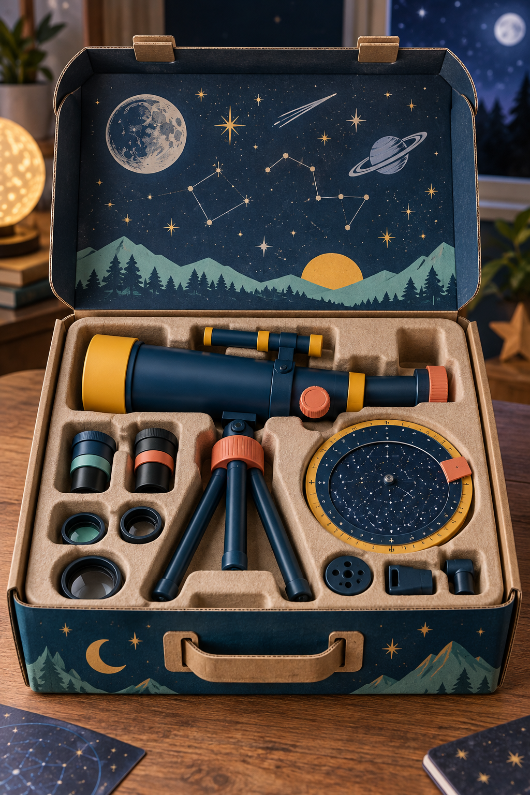</a> 
<strong>儿童天文实验套件包装</strong> 
以手提箱纸盒、安全分仓和可搭建器材建立教育玩具的完整包装体验。 
universal · gpt-image · midjourney · text-to-image 
<a href="../library/cases/packaging/astronomy-kit-packaging/prompt.md">查看提示词与变量</a>
</td>
<td width="33%" valign="top" align="center">
<a href="../library/cases/packaging/frozen-dumpling-carton/prompt.md">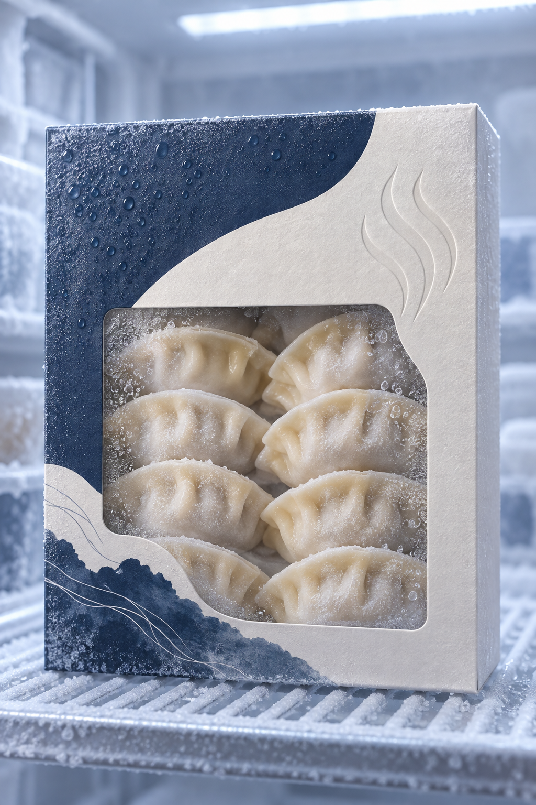</a> 
<strong>冷冻水饺纸盒包装</strong> 
通过冷链纸盒、可堆叠结构和透明窗口同时解决产品可见性与运输保护。 
universal · gpt-image · midjourney · text-to-image 
<a href="../library/cases/packaging/frozen-dumpling-carton/prompt.md">查看提示词与变量</a>
</td>
<td width="33%" valign="top" align="center">
 
<strong>安瓶精华保护包装</strong> 
以玻璃安瓶、纤维内托和防拆封套构成卫生、紧凑且可回收的护理包装。 
universal · gpt-image · midjourney · text-to-image 
<a href="../library/cases/packaging/cosmetic-ampoule-packaging/prompt.md">查看提示词与变量</a>
</td>
</tr>
<tr>
<td width="33%" valign="top" align="center">
<a href="../library/cases/packaging/pet-nutrition-packaging/prompt.md">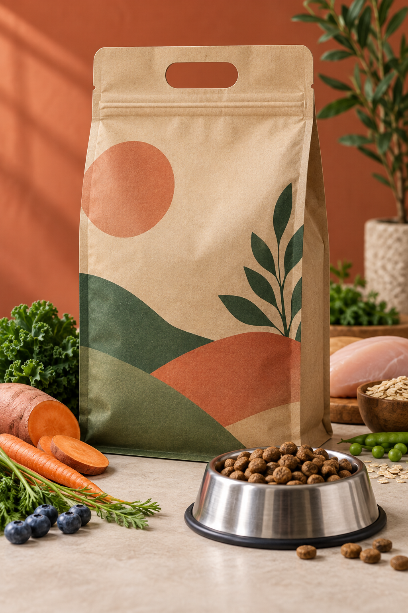</a> 
<strong>宠物营养食品包装</strong> 
以稳定底纸袋、可重复封口和真实食材关系构建亲和而专业的宠物食品包装。 
universal · gpt-image · midjourney · text-to-image 
<a href="../library/cases/packaging/pet-nutrition-packaging/prompt.md">查看提示词与变量</a>
</td>
<td width="33%" valign="top" align="center">
<a href="../library/cases/packaging/detergent-refill-packaging/prompt.md">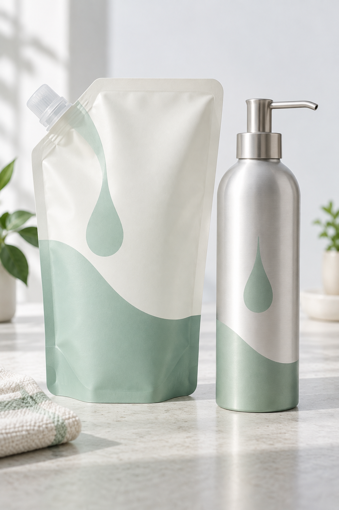</a> 
<strong>家清补充装包装系统</strong> 
用单一材料补充袋和可重复使用金属瓶建立清晰、可信的循环包装关系。 
universal · gpt-image · midjourney · text-to-image 
<a href="../library/cases/packaging/detergent-refill-packaging/prompt.md">查看提示词与变量</a>
</td>
<td width="33%" valign="top" align="center">
<a href="../library/cases/packaging/niche-fragrance-packaging/prompt.md">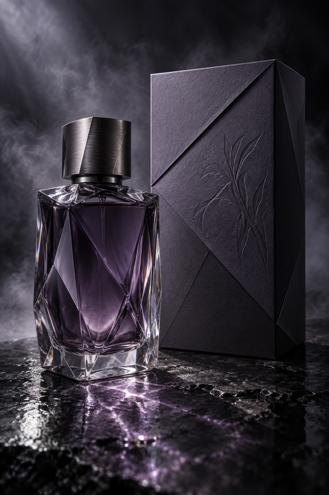</a> 
<strong>小众香氛瓶盒设计</strong> 
通过切面玻璃、结构折线与克制材质建立香氛瓶和外盒的一体化语言。 
universal · gpt-image · midjourney · text-to-image 
<a href="../library/cases/packaging/niche-fragrance-packaging/prompt.md">查看提示词与变量</a>
</td>
</tr>
<tr>
<td width="33%" valign="top" align="center">
<a href="../library/cases/packaging/tea-gift-box-system/prompt.md">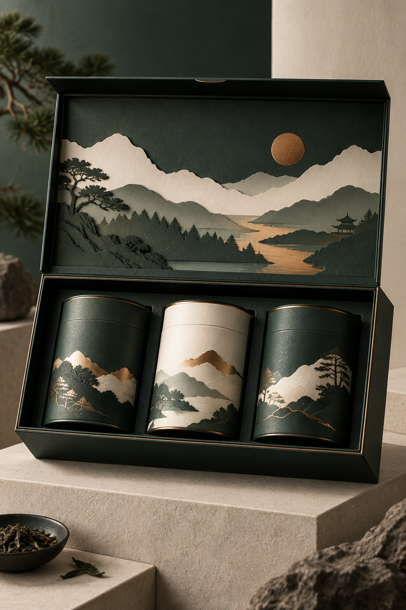</a> 
<strong>山水茶礼盒包装系统</strong> 
以三罐分仓、磁吸硬盒和层叠纸雕建立完整的高端茶礼赠开箱体验。 
universal · gpt-image · midjourney · text-to-image 
<a href="../library/cases/packaging/tea-gift-box-system/prompt.md">查看提示词与变量</a>
</td>
<td width="33%" valign="top" align="center">
 
<strong>珠宝折叠展示盒</strong> 
用八边形硬盒、隐藏铰链和分层软垫建立仪式感与运输保护兼具的珠宝包装。 
universal · gpt-image · midjourney · text-to-image 
<a href="../library/cases/packaging/jewelry-presentation-box/prompt.md">查看提示词与变量</a>
</td>
<td width="33%" valign="top" align="center">
<a href="../library/cases/packaging/craft-chocolate-collection/prompt.md">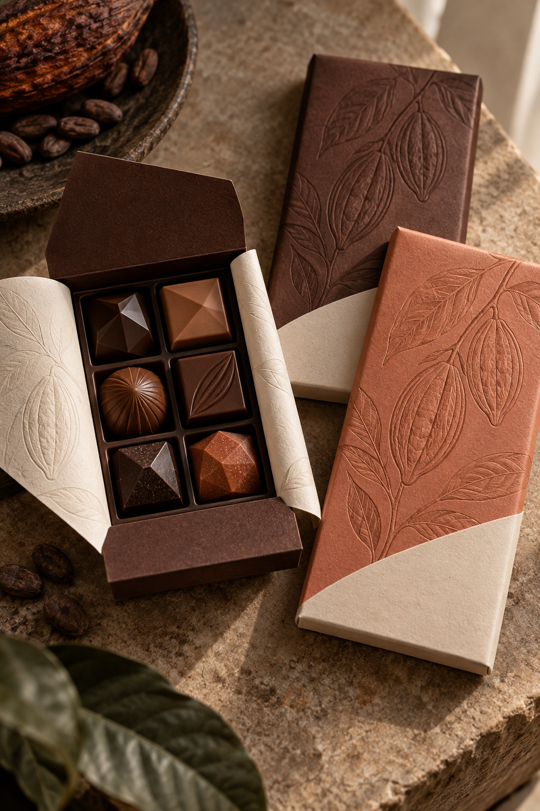</a> 
<strong>精品巧克力系列包装</strong> 
以纸套、内托和几何巧克力组合呈现清楚的口味分级与手工质感。 
universal · gpt-image · midjourney · text-to-image 
<a href="../library/cases/packaging/craft-chocolate-collection/prompt.md">查看提示词与变量</a>
</td>
</tr>
<tr>
<td width="33%" valign="top" align="center">
<a href="../library/cases/packaging/keyboard-switch-kit-packaging/prompt.md">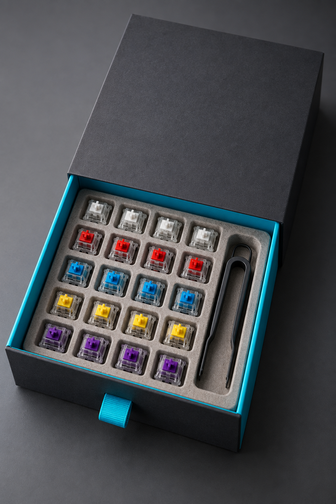</a> 
<strong>键盘轴体套件包装</strong> 
以抽屉盒、模塑纸浆内托和工具分仓呈现精密电子配件的开箱秩序。 
universal · gpt-image · midjourney · text-to-image 
<a href="../library/cases/packaging/keyboard-switch-kit-packaging/prompt.md">查看提示词与变量</a>
</td>
<td width="33%"></td>
<td width="33%"></td>
</tr>
</table>

[返回分类导航](#分类导航)

---

## 🍽️ 餐饮与美食视觉

> 10 个案例；点击封面进入对应提示词文件。

<table>
<tr>
<td width="33%" valign="top" align="center">
 
<strong>夏日茉莉气泡茶视觉</strong> 
以透明饮品、青梅与水光焦散建立清爽且产品结构可信的夏季饮品主视觉 
universal · gpt-image · midjourney · text-to-image 
<a href="../library/cases/culinary/summer-sparkling-tea-campaign/prompt.md">查看提示词与变量</a>
</td>
<td width="33%" valign="top" align="center">
<a href="../library/cases/culinary/sichuan-banquet-overhead/prompt.md">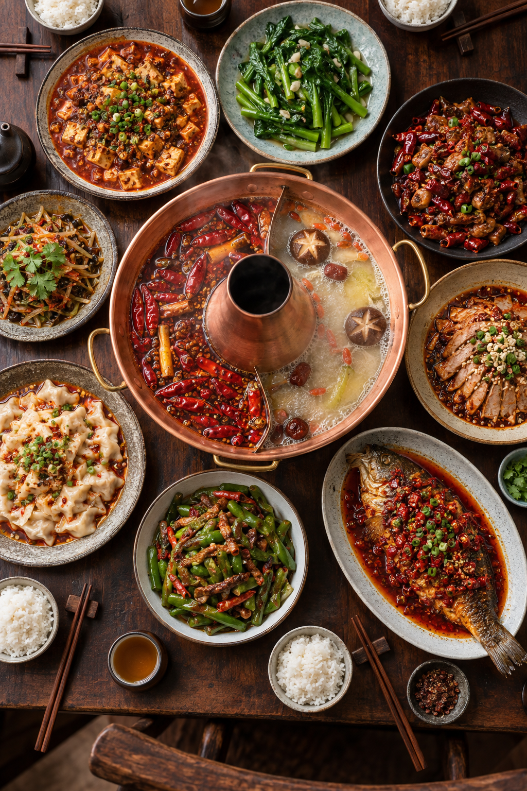</a> 
<strong>川味家宴俯拍视觉</strong> 
以八道不同菜品和中央鸳鸯铜锅建立真实、丰富且不重复的共享餐桌 
universal · gpt-image · midjourney · text-to-image 
<a href="../library/cases/culinary/sichuan-banquet-overhead/prompt.md">查看提示词与变量</a>
</td>
<td width="33%" valign="top" align="center">
<a href="../library/cases/culinary/fine-dining-scallop-plate/prompt.md">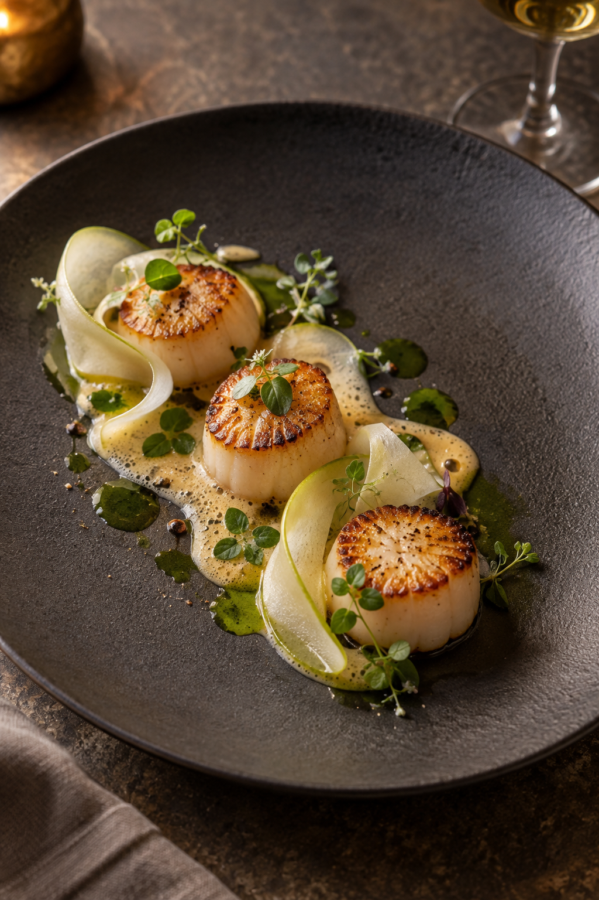</a> 
<strong>扇贝精致餐饮摆盘</strong> 
以三颗煎扇贝、梨片与香草油建立克制、可复刻的高端餐盘结构 
universal · gpt-image · midjourney · text-to-image 
<a href="../library/cases/culinary/fine-dining-scallop-plate/prompt.md">查看提示词与变量</a>
</td>
</tr>
<tr>
<td width="33%" valign="top" align="center">
<a href="../library/cases/culinary/artisan-bread-process/prompt.md">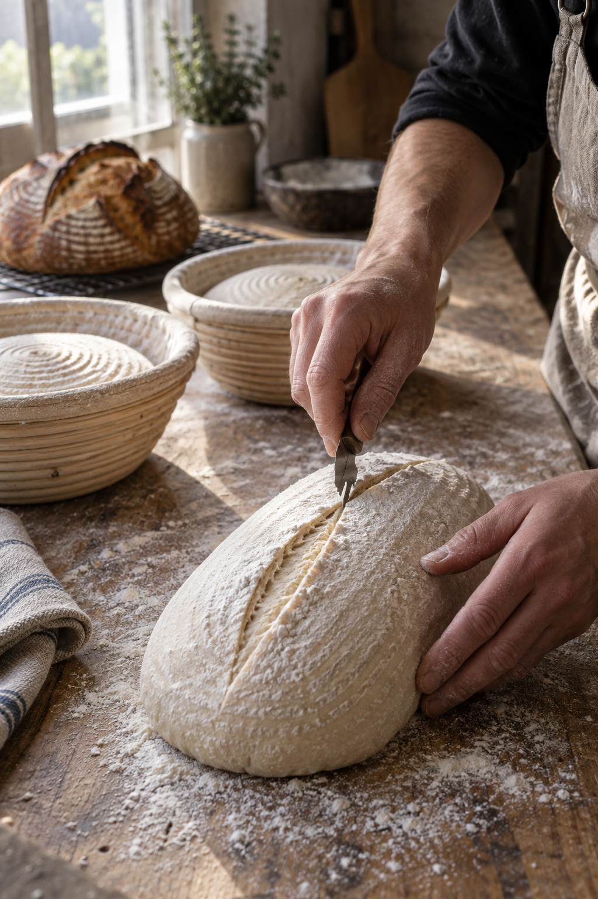</a> 
<strong>手工酸种面包制作过程</strong> 
以割包动作、发酵篮和成品面包清楚讲述烘焙生产节点 
universal · gpt-image · midjourney · text-to-image 
<a href="../library/cases/culinary/artisan-bread-process/prompt.md">查看提示词与变量</a>
</td>
<td width="33%" valign="top" align="center">
<a href="../library/cases/culinary/matcha-dessert-tasting-set/prompt.md">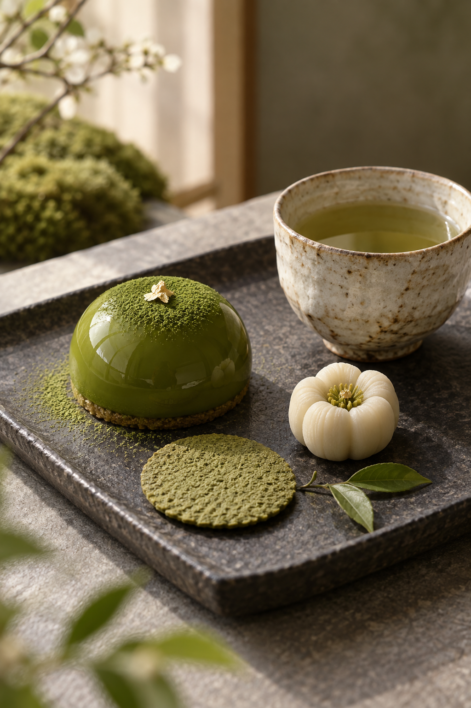</a> 
<strong>抹茶甜点品鉴组合</strong> 
以不同质地的抹茶甜点和手作茶杯建立精致但不繁复的品鉴视觉 
universal · gpt-image · midjourney · text-to-image 
<a href="../library/cases/culinary/matcha-dessert-tasting-set/prompt.md">查看提示词与变量</a>
</td>
<td width="33%" valign="top" align="center">
<a href="../library/cases/culinary/ramen-steam-editorial/prompt.md">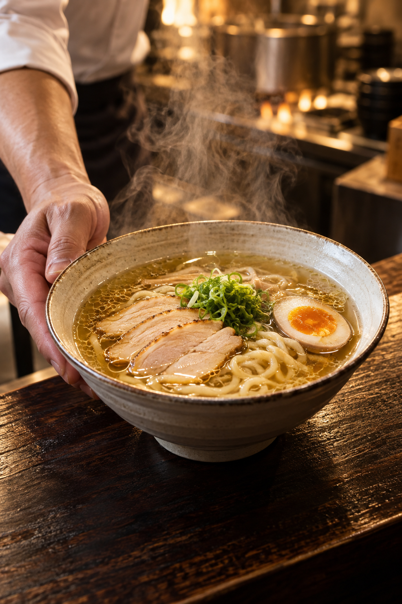</a> 
<strong>清汤拉面蒸汽特写</strong> 
通过清澈汤底、手切面条和自然蒸汽表现刚出锅的温度与餐厅现场感 
universal · gpt-image · midjourney · text-to-image 
<a href="../library/cases/culinary/ramen-steam-editorial/prompt.md">查看提示词与变量</a>
</td>
</tr>
<tr>
<td width="33%" valign="top" align="center">
<a href="../library/cases/culinary/coffee-roasting-process/prompt.md">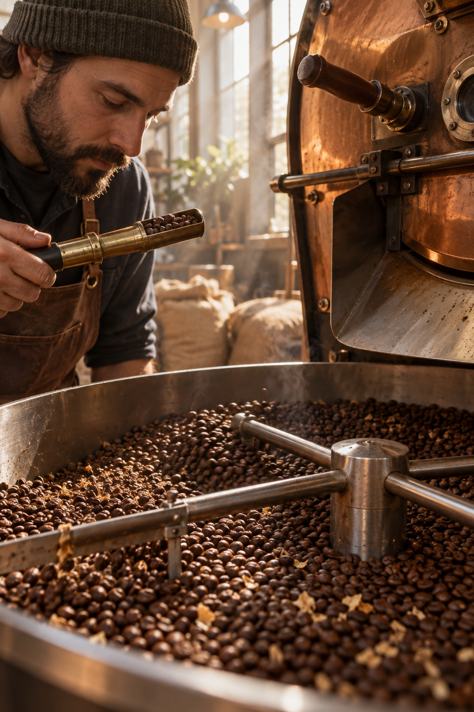</a> 
<strong>精品咖啡烘豆过程</strong> 
通过冷却盘、取样勺和铜制烘豆机呈现可理解的烘焙生产环节 
universal · gpt-image · midjourney · text-to-image 
<a href="../library/cases/culinary/coffee-roasting-process/prompt.md">查看提示词与变量</a>
</td>
<td width="33%" valign="top" align="center">
<a href="../library/cases/culinary/night-market-skewer-scene/prompt.md">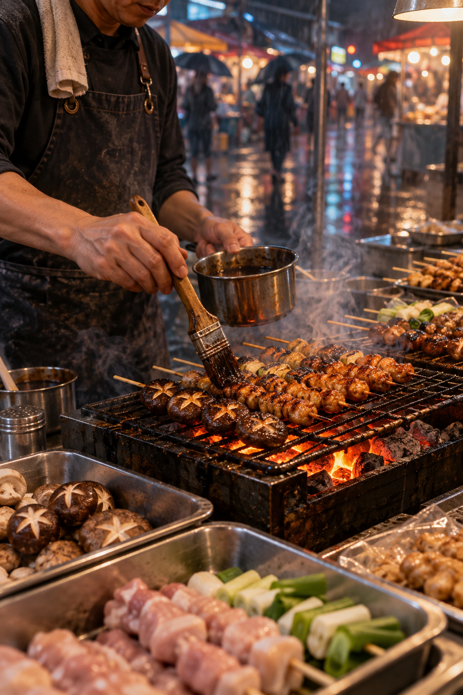</a> 
<strong>雨夜炭烤串制作现场</strong> 
以刷酱动作、炭火和雨夜市场背景呈现有温度的街头美食过程 
universal · gpt-image · midjourney · text-to-image 
<a href="../library/cases/culinary/night-market-skewer-scene/prompt.md">查看提示词与变量</a>
</td>
<td width="33%" valign="top" align="center">
<a href="../library/cases/culinary/zero-waste-vegetable-still-life/prompt.md">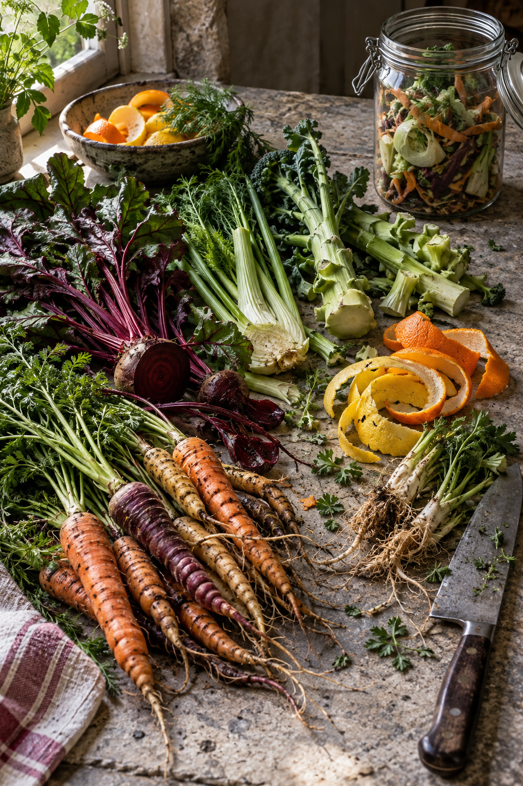</a> 
<strong>零浪费蔬菜食材视觉</strong> 
用根茎、菜叶与果皮的完整利用关系表达可持续厨房理念 
universal · gpt-image · midjourney · text-to-image 
<a href="../library/cases/culinary/zero-waste-vegetable-still-life/prompt.md">查看提示词与变量</a>
</td>
</tr>
<tr>
<td width="33%" valign="top" align="center">
<a href="../library/cases/culinary/black-sesame-gelato-macro/prompt.md">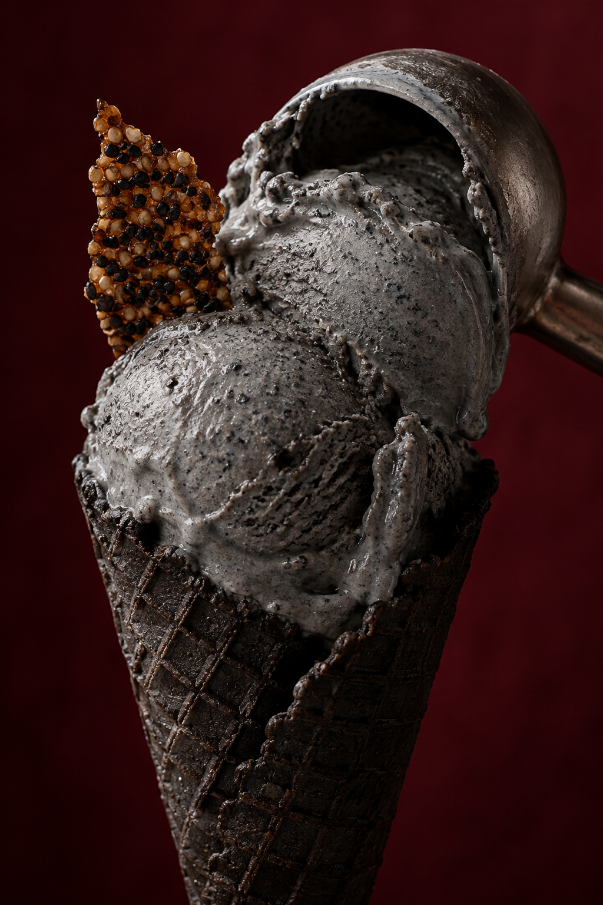</a> 
<strong>黑芝麻意式冰淇淋微距</strong> 
以舀取瞬间、芝麻颗粒与脆片表现浓郁、真实且可食用的冷冻甜品质感 
universal · gpt-image · midjourney · text-to-image 
<a href="../library/cases/culinary/black-sesame-gelato-macro/prompt.md">查看提示词与变量</a>
</td>
<td width="33%"></td>
<td width="33%"></td>
</tr>
</table>

[返回分类导航](#分类导航)

---

## 👗 时尚造型与编辑片

> 10 个案例；点击封面进入对应提示词文件。

<table>
<tr>
<td width="33%" valign="top" align="center">
 
<strong>先锋褶裥手袋静物</strong> 
以弧形皮革体量、黄铜脊骨和隐藏闭合结构建立原创奢华配饰形象 
universal · gpt-image · midjourney · text-to-image 
<a href="../library/cases/fashion-editorial/avant-garde-handbag-still-life/prompt.md">查看提示词与变量</a>
</td>
<td width="33%" valign="top" align="center">
<a href="../library/cases/fashion-editorial/recycled-denim-lookbook/prompt.md">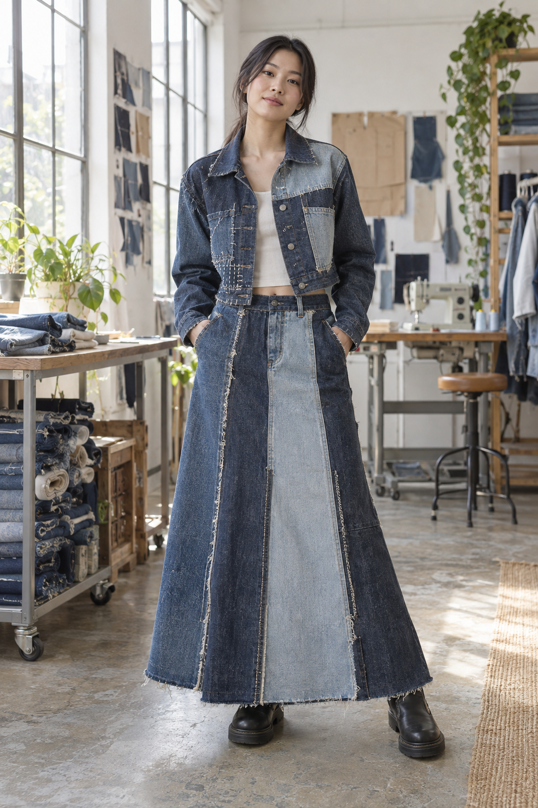</a> 
<strong>再生牛仔拼接造型册</strong> 
以三色旧牛仔、可见修补线和明亮工坊场景讲清服装循环设计 
universal · gpt-image · midjourney · text-to-image 
<a href="../library/cases/fashion-editorial/recycled-denim-lookbook/prompt.md">查看提示词与变量</a>
</td>
<td width="33%" valign="top" align="center">
<a href="../library/cases/fashion-editorial/urban-techwear-lookbook/prompt.md">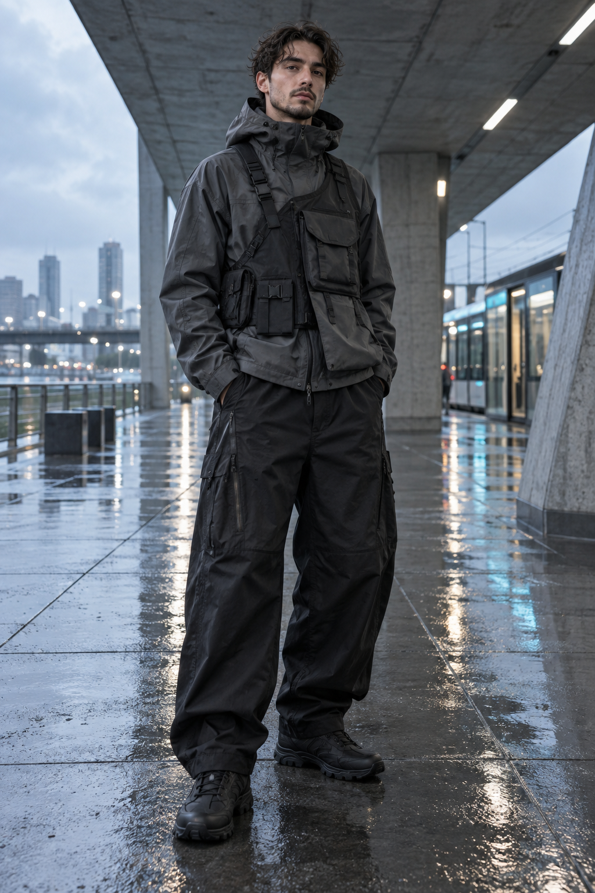</a> 
<strong>城市机能服造型册</strong> 
以模块化外套、层叠背心和雨后交通空间呈现完整可读的机能穿搭 
universal · gpt-image · midjourney · text-to-image 
<a href="../library/cases/fashion-editorial/urban-techwear-lookbook/prompt.md">查看提示词与变量</a>
</td>
</tr>
<tr>
<td width="33%" valign="top" align="center">
<a href="../library/cases/fashion-editorial/architectural-sneaker-material-shot/prompt.md">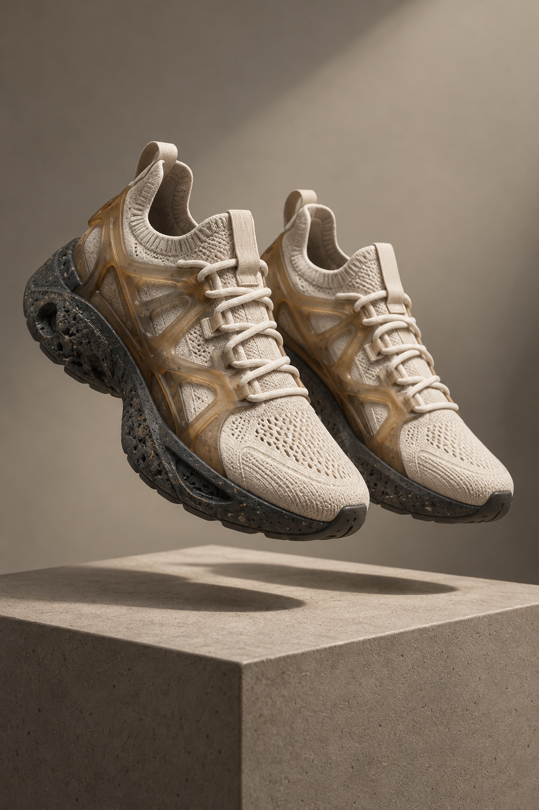</a> 
<strong>建筑感运动鞋材质视觉</strong> 
用再生针织、透明支撑笼和藻基泡棉展示原创鞋履的材料与受力结构 
universal · gpt-image · midjourney · text-to-image 
<a href="../library/cases/fashion-editorial/architectural-sneaker-material-shot/prompt.md">查看提示词与变量</a>
</td>
<td width="33%" valign="top" align="center">
 
<strong>现代东方晚装人像</strong> 
以非历史化立领、烟灰透明袖与梅枝刺绣建立现代东方晚装语言 
universal · gpt-image · midjourney · text-to-image 
<a href="../library/cases/fashion-editorial/modern-oriental-evening-look/prompt.md">查看提示词与变量</a>
</td>
<td width="33%" valign="top" align="center">
<a href="../library/cases/fashion-editorial/mens-tailoring-atelier-portrait/prompt.md">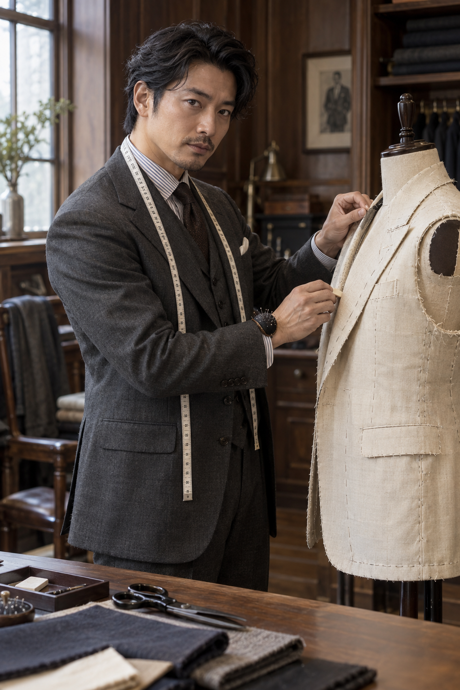</a> 
<strong>男装裁缝工坊人像</strong> 
以半成品西装、量体工具和清楚手部动作呈现专业定制男装过程 
universal · gpt-image · midjourney · text-to-image 
<a href="../library/cases/fashion-editorial/mens-tailoring-atelier-portrait/prompt.md">查看提示词与变量</a>
</td>
</tr>
<tr>
<td width="33%" valign="top" align="center">
<a href="../library/cases/fashion-editorial/runway-backstage-documentary/prompt.md">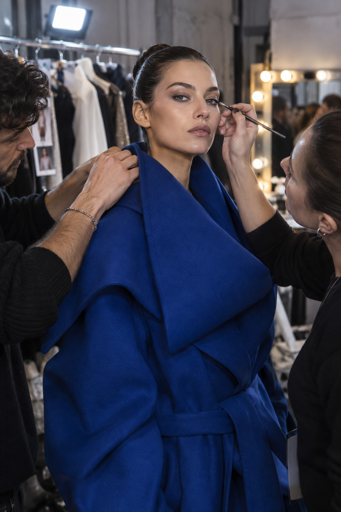</a> 
<strong>秀场后台准备纪实</strong> 
用造型师与化妆师的同步动作呈现走秀前一刻的真实工作张力 
universal · gpt-image · midjourney · text-to-image 
<a href="../library/cases/fashion-editorial/runway-backstage-documentary/prompt.md">查看提示词与变量</a>
</td>
<td width="33%" valign="top" align="center">
 
<strong>银饰美妆特写</strong> 
以真实深色皮肤、雕塑银饰和锐利眼神建立高端珠宝美妆视觉 
universal · gpt-image · midjourney · text-to-image 
<a href="../library/cases/fashion-editorial/silver-jewelry-beauty-editorial/prompt.md">查看提示词与变量</a>
</td>
<td width="33%" valign="top" align="center">
<a href="../library/cases/fashion-editorial/sculptural-couture-portrait/prompt.md">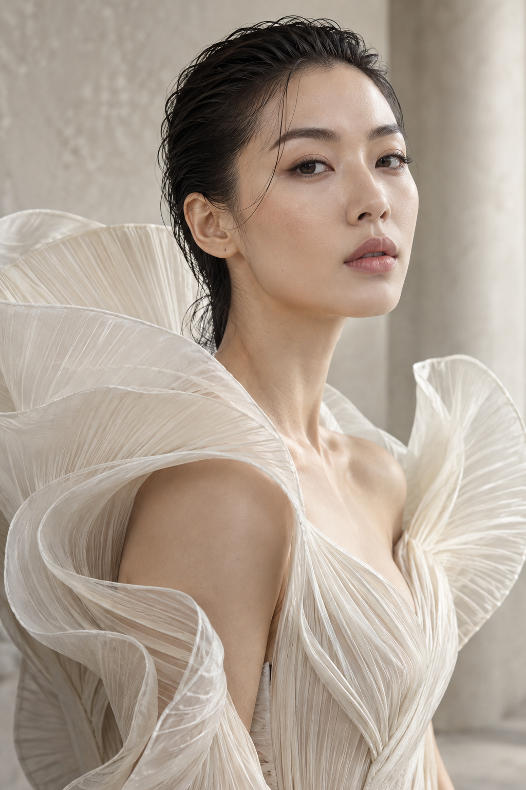</a> 
<strong>雕塑感高定人像</strong> 
用透明欧根纱褶裥和清晰面部建立克制而有结构张力的高定编辑片 
universal · gpt-image · midjourney · text-to-image 
<a href="../library/cases/fashion-editorial/sculptural-couture-portrait/prompt.md">查看提示词与变量</a>
</td>
</tr>
<tr>
<td width="33%" valign="top" align="center">
 
<strong>高山户外服装广告</strong> 
以清晰面部、结霜面料和真实攀登装备呈现极端环境中的服装性能 
universal · gpt-image · midjourney · text-to-image 
<a href="../library/cases/fashion-editorial/alpine-outerwear-campaign/prompt.md">查看提示词与变量</a>
</td>
<td width="33%"></td>
<td width="33%"></td>
</tr>
</table>

[返回分类导航](#分类导航)

---

## 🎬 场景与叙事

> 8 个案例；点击封面进入对应提示词文件。

<table>
<tr>
<td width="33%" valign="top" align="center">
 
<strong>儿童绘本跨页</strong> 
以可读动作与温暖环境讲述单一瞬间的绘本跨页。 
universal · midjourney · stable-diffusion · text-to-image · series-consistency 
<a href="../library/cases/storytelling/childrens-book-spread/prompt.md">查看提示词与变量</a>
</td>
<td width="33%" valign="top" align="center">
 
<strong>卡牌游戏卡组概念</strong> 
为原创卡牌游戏建立统一的稀有度与视觉系统。 
universal · midjourney · stable-diffusion · text-to-image · series-consistency 
<a href="../library/cases/game/card-game-deck-concept/prompt.md">查看提示词与变量</a>
</td>
<td width="33%" valign="top" align="center">
 
<strong>治愈游戏小屋</strong> 
强调日常细节与舒适节奏的治愈系游戏场景。 
universal · midjourney · stable-diffusion · text-to-image · series-consistency 
<a href="../library/cases/game/cozy-game-cabin/prompt.md">查看提示词与变量</a>
</td>
</tr>
<tr>
<td width="33%" valign="top" align="center">
 
<strong>电影故事板序列</strong> 
通过连续镜头建立动作与情绪节奏的故事板。 
universal · midjourney · stable-diffusion · text-to-image · series-consistency 
<a href="../library/cases/storytelling/cinematic-storyboard-sequence/prompt.md">查看提示词与变量</a>
</td>
<td width="33%" valign="top" align="center">
 
<strong>科幻生态场景</strong> 
为景深、尺度与环境叙事而设计的电影感世界观场景。 
universal · midjourney · stable-diffusion · text-to-image 
<a href="../library/cases/education/sci-fi-ecosystem-scene/prompt.md">查看提示词与变量</a>
</td>
<td width="33%" valign="top" align="center">
 
<strong>等距游戏场景</strong> 
展示可探索区域、地标与互动节奏的等距场景。 
universal · midjourney · stable-diffusion · text-to-image · series-consistency 
<a href="../library/cases/game/isometric-game-environment/prompt.md">查看提示词与变量</a>
</td>
</tr>
<tr>
<td width="33%" valign="top" align="center">
 
<strong>纪录片场景概念</strong> 
以真实环境细节和克制观察感建立纪录片气质。 
universal · midjourney · stable-diffusion · text-to-image · series-consistency 
<a href="../library/cases/storytelling/documentary-scene-concept/prompt.md">查看提示词与变量</a>
</td>
<td width="33%" valign="top" align="center">
 
<strong>赛车游戏车库</strong> 
呈现车辆定制、性能信息和沉浸氛围的游戏车库。 
universal · midjourney · stable-diffusion · text-to-image · series-consistency 
<a href="../library/cases/game/racing-game-garage/prompt.md">查看提示词与变量</a>
</td>
<td width="33%"></td>
</tr>
</table>

[返回分类导航](#分类导航)

---

## 🎨 插画与艺术实验

> 5 个案例；点击封面进入对应提示词文件。

<table>
<tr>
<td width="33%" valign="top" align="center">
 
<strong>动态文字海报概念</strong> 
以文字节奏和抽象运动形态表达活动能量。 
universal · midjourney · stable-diffusion · text-to-image 
<a href="../library/cases/creative/kinetic-typography-poster/prompt.md">查看提示词与变量</a>
</td>
<td width="33%" valign="top" align="center">
 
<strong>抽象材质研究</strong> 
探索玻璃、金属、液体等材质关系的抽象视觉研究。 
universal · midjourney · stable-diffusion · text-to-image 
<a href="../library/cases/creative/abstract-material-study/prompt.md">查看提示词与变量</a>
</td>
<td width="33%" valign="top" align="center">
 
<strong>自然微观抽象</strong> 
从自然微观结构中提取具有艺术感的抽象视觉。 
universal · midjourney · stable-diffusion · text-to-image 
<a href="../library/cases/creative/nature-macro-abstraction/prompt.md">查看提示词与变量</a>
</td>
</tr>
<tr>
<td width="33%" valign="top" align="center">
 
<strong>超现实时尚场景</strong> 
将时尚人物置入不合常理却统一的超现实空间。 
universal · midjourney · stable-diffusion · text-to-image 
<a href="../library/cases/creative/surreal-fashion-scene/prompt.md">查看提示词与变量</a>
</td>
<td width="33%" valign="top" align="center">
 
<strong>陶瓷雕塑研究</strong> 
用形体、釉色和光线呈现原创陶瓷雕塑系列。 
universal · midjourney · stable-diffusion · text-to-image 
<a href="../library/cases/creative/ceramic-sculpture-study/prompt.md">查看提示词与变量</a>
</td>
<td width="33%"></td>
</tr>
</table>

[返回分类导航](#分类导航)

---

## 📚 文档与出版

> 8 个案例；点击封面进入对应提示词文件。

<table>
<tr>
<td width="33%" valign="top" align="center">
 
<strong>可持续报告跨页</strong> 
以数据、图示与留白呈现企业可持续成果。 
universal · gpt-image · text-to-image 
<a href="../library/cases/business/sustainability-report-spread/prompt.md">查看提示词与变量</a>
</td>
<td width="33%" valign="top" align="center">
 
<strong>团队团建议程</strong> 
将目标、活动与休息节奏组织为一目了然的团队议程。 
universal · gpt-image · text-to-image 
<a href="../library/cases/business/team-offsite-agenda/prompt.md">查看提示词与变量</a>
</td>
<td width="33%" valign="top" align="center">
 
<strong>年度报告封面</strong> 
面向企业发布场景的克制专业年度报告封面。 
universal · gpt-image · text-to-image 
<a href="../library/cases/publishing/annual-report-cover/prompt.md">查看提示词与变量</a>
</td>
</tr>
<tr>
<td width="33%" valign="top" align="center">
 
<strong>招聘宣传页面</strong> 
以岗位价值、团队文化和真实氛围吸引候选人的招聘页。 
universal · gpt-image · text-to-image 
<a href="../library/cases/business/recruitment-campaign-page/prompt.md">查看提示词与变量</a>
</td>
<td width="33%" valign="top" align="center">
 
<strong>杂志编辑跨页</strong> 
在图像、标题与正文之间建立清晰节奏的杂志跨页。 
universal · gpt-image · text-to-image 
<a href="../library/cases/publishing/editorial-magazine-spread/prompt.md">查看提示词与变量</a>
</td>
<td width="33%" valign="top" align="center">
 
<strong>白皮书封面系统</strong> 
用理性图形与信息层级建立技术白皮书视觉系统。 
universal · gpt-image · text-to-image 
<a href="../library/cases/publishing/whitepaper-cover-system/prompt.md">查看提示词与变量</a>
</td>
</tr>
<tr>
<td width="33%" valign="top" align="center">
 
<strong>融资路演封面</strong> 
用强概念视觉与克制排版建立融资路演的第一印象。 
universal · gpt-image · text-to-image 
<a href="../library/cases/business/investor-pitch-deck-cover/prompt.md">查看提示词与变量</a>
</td>
<td width="33%" valign="top" align="center">
 
<strong>销售漏斗看板</strong> 
帮助销售团队跟进阶段、预测收入与重点客户。 
universal · gpt-image · text-to-image 
<a href="../library/cases/business/sales-pipeline-dashboard/prompt.md">查看提示词与变量</a>
</td>
<td width="33%"></td>
</tr>
</table>

[返回分类导航](#分类导航)

---

## 🧠 教育与知识视觉

> 10 个案例；点击封面进入对应提示词文件。

<table>
<tr>
<td width="33%" valign="top" align="center">
 
<strong>人体结构科普海报</strong> 
用清晰的层级与图示解释人体结构。 
universal · gpt-image · text-to-image 
<a href="../library/cases/health/medical-anatomy-poster/prompt.md">查看提示词与变量</a>
</td>
<td width="33%" valign="top" align="center">
 
<strong>健康习惯追踪器</strong> 
以可执行小目标和趋势反馈支持日常健康习惯。 
universal · gpt-image · text-to-image 
<a href="../library/cases/health/wellness-habit-tracker/prompt.md">查看提示词与变量</a>
</td>
<td width="33%" valign="top" align="center">
 
<strong>博物馆展陈信息板</strong> 
用展品图像与时间线讲述一段历史主题。 
universal · gpt-image · text-to-image 
<a href="../library/cases/education/museum-exhibit-panel/prompt.md">查看提示词与变量</a>
</td>
</tr>
<tr>
<td width="33%" valign="top" align="center">
 
<strong>学生作品集封面</strong> 
为创意专业学生建立克制有辨识度的作品集封面。 
universal · gpt-image · text-to-image 
<a href="../library/cases/education/student-portfolio-cover/prompt.md">查看提示词与变量</a>
</td>
<td width="33%" valign="top" align="center">
 
<strong>工作坊协作白板</strong> 
用于团队共创、观点收集与行动排序的协作板。 
universal · gpt-image · text-to-image 
<a href="../library/cases/education/interactive-workshop-board/prompt.md">查看提示词与变量</a>
</td>
<td width="33%" valign="top" align="center">
 
<strong>心理健康资源页</strong> 
为寻求支持的用户提供安全温和的资源导航界面。 
universal · gpt-image · text-to-image 
<a href="../library/cases/health/mental-health-resource-page/prompt.md">查看提示词与变量</a>
</td>
</tr>
<tr>
<td width="33%" valign="top" align="center">
 
<strong>患者照护看板</strong> 
帮助护理团队快速识别患者状态与待办事项。 
universal · gpt-image · text-to-image 
<a href="../library/cases/health/patient-care-dashboard/prompt.md">查看提示词与变量</a>
</td>
<td width="33%" valign="top" align="center">
 
<strong>数学概念图解</strong> 
将抽象数学关系转换为直观的视觉步骤。 
universal · gpt-image · text-to-image 
<a href="../library/cases/education/math-concept-explainer/prompt.md">查看提示词与变量</a>
</td>
<td width="33%" valign="top" align="center">
 
<strong>药品包装识别指南</strong> 
帮助用户区分药品包装信息层级与安全提醒。 
universal · gpt-image · text-to-image 
<a href="../library/cases/health/pharmacy-packaging-guide/prompt.md">查看提示词与变量</a>
</td>
</tr>
<tr>
<td width="33%" valign="top" align="center">
 
<strong>语言学习卡片</strong> 
将词汇、语境和记忆提示组织为成组学习卡片。 
universal · gpt-image · text-to-image 
<a href="../library/cases/education/language-learning-cards/prompt.md">查看提示词与变量</a>
</td>
<td width="33%"></td>
<td width="33%"></td>
</tr>
</table>

[返回分类导航](#分类导航)
